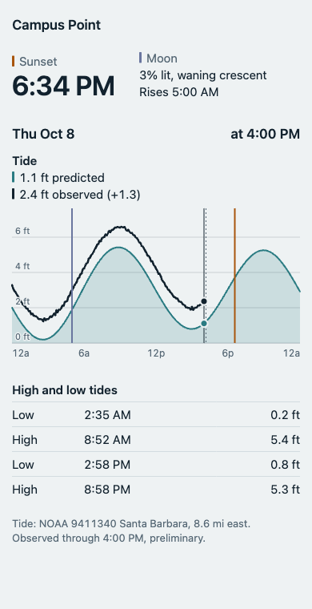
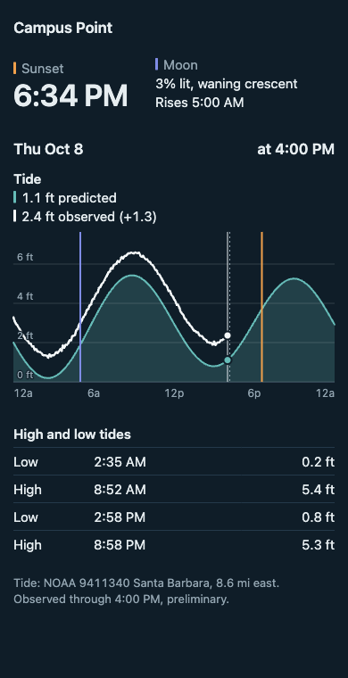

# Stage 1, Part 2: The Tide Screen Implementation Plan

> **For agentic workers:** REQUIRED SUB-SKILL: Use superpowers:subagent-driven-development (recommended) or superpowers:executing-plans to implement this plan task-by-task. Steps use checkbox (`- [ ]`) syntax for tracking.

**Goal:** Replace the placeholder page with the first real screen for Campus Point: tonight's sunset and moon, today's tide curve with the observed water level drawn over it and a cursor that reads both, and the high/low table.

**Architecture:** The screen is thin React components over plain modules. Everything that is arithmetic, a rule or wording is a plain function with tests: scales and paths, the values under the cursor, tap versus drag, captions, what the tide view shows, and a loader that decides when each source is fetched. One hook connects the loader to React and rechecks once a minute. The chart is hand-written SVG with no charting library.

**Tech Stack:** React 19, TypeScript 6.0, Vite 8, Vitest 5, oxlint, Prettier. No new dependencies.

**Spec:** `docs/superpowers/specs/2026-10-08-stage-1-campus-point-design.md`

**Scope:** Pull request 3 of the four in the spec's Delivery section. Pull request 4 (the three weather panels, the 14-day list, the manifest and icons) gets its own plan after this one ships.

## What it will look like

A throwaway prototype of this plan's code, running against live NOAA data on 8 October 2026 at iPhone width, in light and dark.

 

The teal shape is the predicted tide. The bold line riding above it is the observed water level, about 1.3 ft higher at that moment. The vertical lines are moonrise, the current time (dashed) and sunset; the coloured bars beside "Sunset" and "Moon" at the top are their key. The solid line with two dots is the cursor.

## How this plan was checked

Every code block below was built and run as a throwaway prototype before this plan was written, and the blocks are copied from it by script, not retyped.

- **Tests:** 251 pass in the prototype: the 150 already on `main` and the 101 this plan adds. Lint with warnings denied, the type check and the build are clean.
- **In a browser at 390 px, with touch emulated:** a swipe up that starts on the chart scrolled the page and left the cursor alone; a tap moved the cursor; a sideways drag moved it; a mouse moved it only while pressed; the arrow keys, Home and End moved it.
- **With a fake clock:** left open from 11:58 PM to 12:01 AM, the date, the sunset time and the 14-day window moved on to the next day and the tide predictions were fetched for the new window. With NOAA failing and nothing saved, each source was asked once at open and about once a minute after, the screen said "Tide data unavailable", and it recovered when NOAA came back.
- **Independent review:** a fresh reviewer read the first draft of this code before execution, ran 46 deliberate breakages against the tests, and drove the page in a browser. It found one critical defect and four important ones, all fixed here:
  - A swipe up or down that started on the chart moved the cursor. A finger now moves nothing until it has travelled sideways.
  - The three numbers in the readout could disagree one step past the last reading. A reading now counts only at the cursor's own step.
  - A request that never answered stopped its source refreshing until a reload. Requests are now given up on after 20 seconds.
  - A cursor put somewhere by hand never went back to rest. It now does when the page is put away and brought back, and when the day changes.
  - The hook's logic had no tests. It now lives in a plain loader with tests, and the hook is a few lines of wiring.
- **Not checked:** touch on a real phone, and a screen reader. The first is the owner's check on the preview, in Task 10.

## Global Constraints

- **Node 24 for every `npm`, `npx` and `node` command.** In a fresh shell run `source ~/.nvm/nvm.sh && nvm use` first.
- **Public repo, no personal details.** Tracked files, commit messages and pull requests never name people. Write "the first user". Never copy anything out of `private/`.
- **Commit identity.** `git config user.email` must end in `users.noreply.github.com`.
- **Commit trailer.** End every commit message with `Co-Authored-By: Claude Opus 5.5 <noreply@anthropic.com>`.
- **Code style is the Vite template's:** no semicolons, single quotes, relative imports carry their `.ts` or `.tsx` extension, type-only imports use `import type`, no enums. Run `npm run format` before every commit.
- **Lint must print no problems.** Once the lint-gate pull request has merged, warnings fail it; write as if they already do.
- **No new dependencies.** Not d3, not a charting library, not a date library.
- **Times:** every stored or computed time is a UTC instant in epoch milliseconds. Only `src/time.ts` converts to a zone. Nothing reads the viewer's zone.
- **Components hold no arithmetic, no rules and no wording.** Those live in plain modules with tests. If a component needs an `if` about data, the decision belongs in a plain function first.
- **Units:** feet above MLLW to one decimal, 12-hour clock.
- **Data, not a verdict.** No scores, no go/no-go, no alerts.

## Review Focus

Conditions the spec implies but does not list as tests. Each has a test in the task named. Where a test cannot reach, a hand check is named instead.

1. **A swipe up or down that starts on the chart.** Expected: the page scrolls and the cursor does not move. In pull request 4 the panels fill most of the screen, so most scrolls will start on one. Task 6 tests the rule; Task 10 checks it with emulated touch and, on the preview, on a real phone.
2. **NOAA's readings arrive about ten minutes late.** Expected: the default view still shows the latest reading and how far it is from the prediction. Task 5, `restingCursor` tests; Task 9, "at rest it sits on the latest reading".
3. **A request fails, or never answers.** Expected: what was on screen stays, the caption says so, and the source is tried again about a minute later, neither at once nor never. Task 3, `refresh` and `createLoader` tests.
4. **A phone left open past midnight.** Expected: the date, the window, the sun and moon and the cursor all move on to the new day, and predictions are fetched for the new window. Task 8, `frameFor`; Task 3, "when the window moves"; Task 9, "it goes back to rest when the day changes"; Task 10, a fake-clock check.
5. **The gauge has an outage, the day has no readings yet, or storage is disabled.** Expected: the observed line breaks across the gap, the caption says there are no readings, and the screen works without a cache. Tasks 4, 7 and 3.

## File Structure

Created:

- `src/data/load.ts` — cache-first loading rules and the loader for one source
- `src/data/useSpotData.ts` — what to load for the spot, and the hook that loads it
- `src/chart/scales.ts` — scales, bounds and SVG paths
- `src/chart/readout.ts` — the values under the cursor and how they are worded
- `src/chart/gesture.ts` — telling a tap and a sideways drag from a scroll
- `src/chart/Panel.tsx` — one chart on the shared time axis
- `src/chart/PanelStack.tsx` — the shared axis, the cursor, touch and keyboard
- `src/ui/captions.ts` — the small print under the panels
- `src/ui/tideView.ts` — what the tide part of the screen shows
- `src/ui/TonightStrip.tsx` — sunset and moon for today
- `src/ui/HiLoTable.tsx` — the day's highs and lows
- A `*.test.ts` beside each plain module

Modified: `src/time.ts`, `src/time.test.ts`, `src/data/noaa.ts`, `src/data/noaa.test.ts`, `src/App.tsx`, `src/styles.css`, `CLAUDE.md`.

`Panel` and `PanelStack` are written for four panels although this plan draws one, so that the weather panels in pull request 4 can reuse them.

Work on branch `stage-1/tide-screen`, created from `main`:

```bash
git switch main && git pull && git switch -c stage-1/tide-screen
source ~/.nvm/nvm.sh && nvm use
```

---

### Task 1: Hours, hour marks and day names in `src/time.ts`

**Files:**
- Modify: `src/time.ts` (the end of the file, from `formatTime` on)
- Test: `src/time.test.ts`

**Interfaces:**
- Consumes: the existing private helpers `wallClock` and `parseDate` in `src/time.ts`.
- Produces:
  - `localHour(t: number, timeZone: string): number` — 0 to 23
  - `hourMarks(start: number, end: number, timeZone: string, every: number): { t: number; hour: number }[]` — both ends included
  - `formatDay(date: string): string` — for example `'Thu Oct 8'`
  - `formatTime` is unchanged in behaviour.

- [ ] **Step 1: Write the failing tests**

In `src/time.test.ts`, replace the import of `./time.ts` with:

```ts
import {
  addDays,
  formatDay,
  formatTime,
  hourMarks,
  localDate,
  localDayStart,
  localHour,
} from './time.ts'
```

Then add to the end of the file:

```ts
describe('localHour', () => {
  test('the hour of the day in the given zone', () => {
    expect(localHour(Date.UTC(2026, 9, 9, 1, 33), LA)).toBe(18)
    expect(localHour(Date.UTC(2026, 9, 8, 7, 0), LA)).toBe(0)
    expect(localHour(Date.UTC(2026, 9, 9, 1, 33), 'America/New_York')).toBe(21)
  })
})

describe('hourMarks', () => {
  test('every six local hours on an ordinary day, both ends included', () => {
    const start = localDayStart('2026-10-08', LA)
    const end = localDayStart('2026-10-09', LA)
    expect(hourMarks(start, end, LA, 6)).toEqual([
      { t: start, hour: 0 },
      { t: start + 6 * HOUR, hour: 6 },
      { t: start + 12 * HOUR, hour: 12 },
      { t: start + 18 * HOUR, hour: 18 },
      { t: end, hour: 0 },
    ])
  })

  test('on the 25-hour day the marks follow the clock, not a fixed spacing', () => {
    const start = localDayStart('2026-11-01', LA)
    const end = localDayStart('2026-11-02', LA)
    const hoursIn = hourMarks(start, end, LA, 6).map(
      (m) => (m.t - start) / HOUR,
    )
    // 6 AM comes seven hours after midnight, because 1 AM happens twice.
    expect(hoursIn).toEqual([0, 7, 13, 19, 25])
  })

  test('on the 23-hour day 6 AM comes five hours after midnight', () => {
    const start = localDayStart('2027-03-14', LA)
    const end = localDayStart('2027-03-15', LA)
    const hoursIn = hourMarks(start, end, LA, 6).map(
      (m) => (m.t - start) / HOUR,
    )
    expect(hoursIn).toEqual([0, 5, 11, 17, 23])
  })
})

describe('formatDay', () => {
  test('weekday, month and day of the month', () => {
    expect(formatDay('2026-10-08')).toBe('Thu Oct 8')
    expect(formatDay('2026-11-01')).toBe('Sun Nov 1')
    expect(formatDay('2027-01-01')).toBe('Fri Jan 1')
  })
})
```

- [ ] **Step 2: Run the tests and watch them fail**

Run: `npx vitest run src/time.test.ts`
Expected: FAIL. The 5 new tests fail because `localHour`, `hourMarks` and `formatDay` do not exist yet. The 11 existing tests pass.

- [ ] **Step 3: Write the implementation**

In `src/time.ts`, replace everything from the comment `/** A 12-hour clock time in a zone, such as '6:33 PM'. */` to the end of the file with:

```ts
/** The hour of the day, 0 to 23, in a zone at instant t. */
export function localHour(t: number, timeZone: string): number {
  return wallClock(t, timeZone).hour
}

/**
 * The instants between start and end, inclusive, that fall on a local hour
 * divisible by `every`. Stepping hour by hour keeps this right on days when
 * the clocks change.
 */
export function hourMarks(
  start: number,
  end: number,
  timeZone: string,
  every: number,
): { t: number; hour: number }[] {
  const marks: { t: number; hour: number }[] = []
  for (let t = start; t <= end; t += 3_600_000) {
    const hour = localHour(t, timeZone)
    if (hour % every === 0) marks.push({ t, hour })
  }
  return marks
}

/** Looks up one named part of a formatted date, or '' if it is absent. */
function partReader(
  format: Intl.DateTimeFormat,
  t: number,
): (type: Intl.DateTimeFormatPartTypes) => string {
  const parts = format.formatToParts(t)
  return (type) => parts.find((p) => p.type === type)?.value ?? ''
}

/** A 12-hour clock time in a zone, such as '6:33 PM'. */
export function formatTime(t: number, timeZone: string): string {
  const part = partReader(
    new Intl.DateTimeFormat('en-US', {
      timeZone,
      hour: 'numeric',
      minute: '2-digit',
      hour12: true,
    }),
    t,
  )
  // Assembled from parts, because browsers disagree on which kind of space
  // goes before AM/PM, and some use one that is invisible in source code.
  return `${part('hour')}:${part('minute')} ${part('dayPeriod')}`
}

/** A calendar date for display, such as 'Thu Oct 8'. No zone is involved. */
export function formatDay(date: string): string {
  const [year, month, day] = parseDate(date)
  const part = partReader(
    new Intl.DateTimeFormat('en-US', {
      timeZone: 'UTC',
      weekday: 'short',
      month: 'short',
      day: 'numeric',
    }),
    Date.UTC(year, month - 1, day, 12),
  )
  return `${part('weekday')} ${part('month')} ${part('day')}`
}
```

- [ ] **Step 4: Run the tests and watch them pass**

Run: `npx vitest run src/time.test.ts`
Expected: PASS, 16 tests.

- [ ] **Step 5: Format, check, commit**

```bash
npm run format && npm run lint && npm run build && npm test
git add src/time.ts src/time.test.ts
git commit -m "Add local hours, hour marks and day names" -m "Hour marks step hour by hour, so they stay on the clock on days when the clocks change." -m "Co-Authored-By: Claude Opus 5.5 <noreply@anthropic.com>"
```

### Task 2: Shape checks for saved tide data in `src/data/noaa.ts`

**Files:**
- Modify: `src/data/noaa.ts` (append), `src/data/noaa.test.ts`

**Interfaces:**
- Consumes: `TidePoint`, `TideExtreme` from the same file.
- Produces:
  - `isTidePoints(data: unknown): data is TidePoint[]`
  - `isTideExtremes(data: unknown): data is TideExtreme[]`

  These are what `readCache` needs as its third argument.

- [ ] **Step 1: Write the failing tests**

In `src/data/noaa.test.ts`, add `isTideExtremes` and `isTidePoints` to the names imported from `./noaa.ts`, keeping the list in alphabetical order. Then add to the end of the file:

```ts
describe('shape checks for saved data', () => {
  test('a parsed curve passes, and so does an empty one', () => {
    expect(isTidePoints(parsePredictions(curve))).toBe(true)
    expect(isTidePoints([])).toBe(true)
  })

  test.each([
    ['null', null],
    ['text', 'oops'],
    ['an object', {}],
    ['a point with no height', [{ t: 1 }]],
    ['a time that is text', [{ t: '1', ft: 2 }]],
    ['an older shape', [{ time: 1, feet: 2 }]],
    // What a NaN height turns into once it has been saved as JSON.
    ['a height that is null', [{ t: 1, ft: null }]],
  ])('%s is not a curve', (_name, bad) => {
    expect(isTidePoints(bad)).toBe(false)
  })

  test('highs and lows must each say which they are', () => {
    expect(isTideExtremes(parseHiLo(hilo))).toBe(true)
    expect(isTideExtremes(parsePredictions(curve))).toBe(false)
    expect(isTideExtremes([{ t: 1, ft: 2, type: 'X' }])).toBe(false)
  })
})
```

- [ ] **Step 2: Run the tests and watch them fail**

Run: `npx vitest run src/data/noaa.test.ts`
Expected: FAIL. The 9 new tests fail because `isTidePoints` and `isTideExtremes` do not exist yet. The existing tests pass.

- [ ] **Step 3: Write the implementation**

Add to the end of `src/data/noaa.ts`:

```ts
function isTidePoint(value: unknown): value is TidePoint {
  return (
    typeof value === 'object' &&
    value !== null &&
    't' in value &&
    typeof value.t === 'number' &&
    'ft' in value &&
    typeof value.ft === 'number'
  )
}

/** Whether saved data has the shape of a tide curve. For the cache. */
export function isTidePoints(data: unknown): data is TidePoint[] {
  return Array.isArray(data) && data.every(isTidePoint)
}

/** Whether saved data has the shape of a list of highs and lows. */
export function isTideExtremes(data: unknown): data is TideExtreme[] {
  return (
    Array.isArray(data) &&
    data.every(
      (value) =>
        isTidePoint(value) &&
        'type' in value &&
        (value.type === 'H' || value.type === 'L'),
    )
  )
}
```

- [ ] **Step 4: Run the tests and watch them pass**

Run: `npx vitest run src/data/noaa.test.ts`
Expected: PASS. 9 more tests than before this task.

- [ ] **Step 5: Format, check, commit**

```bash
npm run format && npm run lint && npm run build && npm test
git add src/data/noaa.ts src/data/noaa.test.ts
git commit -m "Add shape checks for saved tide data" -m "The cache hands these to readCache so an entry saved in another shape is treated as nothing saved." -m "Co-Authored-By: Claude Opus 5.5 <noreply@anthropic.com>"
```

### Task 3: Loading rules and the loader in `src/data/load.ts`

**Files:**
- Create: `src/data/load.ts`
- Test: `src/data/load.test.ts`

**Interfaces:**
- Consumes: `isStale`, `readCache`, `writeCache`, `Source`, `Span` from `src/data/cache.ts`.
- Produces:
  - `type Status = 'loading' | 'ready' | 'stale' | 'unavailable'`
  - `interface Loaded<T> { data: T | null; fetchedAt: number | null; span: Span | null; status: Status }`
  - `interface SourceSpec<T> { spotId: string; source: Source; isData: (data: unknown) => data is T; needed: Span; fetch: (needed: Span) => Promise<T>; isEmpty: (data: T) => boolean }`
  - `TIMEOUT: number` (20 seconds) and `RETRY_AFTER: number` (55 seconds), in ms
  - `fromCache<T>(spec: SourceSpec<T>, now: number): Loaded<T>`
  - `needsFetch<T>(spec: SourceSpec<T>, loaded: Loaded<T>, now: number): boolean`
  - `refresh<T>(spec: SourceSpec<T>, previous: Loaded<T>, clock?: () => number): Promise<Loaded<T>>` — never rejects, always settles within `TIMEOUT`
  - `interface Loader<T> { current: () => Loaded<T>; check: (spec: SourceSpec<T>, now: number) => void; subscribe: (listener: () => void) => () => void }`
  - `createLoader<T>(initial: SourceSpec<T>, now: number, clock?: () => number): Loader<T>`

  `status` is `'loading'` both when nothing is saved and when saved data is being shown while a request is on its way; `data` tells the two apart. `check` is safe to call on every render: it does nothing while a request is in flight or within `RETRY_AFTER` of a failure.

- [ ] **Step 1: Write the failing tests**

`src/data/load.test.ts`:

```ts
import { afterEach, beforeEach, describe, expect, test, vi } from 'vitest'
import { writeCache } from './cache.ts'
import {
  RETRY_AFTER,
  TIMEOUT,
  createLoader,
  fromCache,
  needsFetch,
  refresh,
} from './load.ts'
import type { Loaded, SourceSpec } from './load.ts'

const MINUTE = 60_000
const DAY = 24 * 60 * MINUTE
const NOW = Date.UTC(2026, 9, 8, 17)
const WINDOW = { start: Date.UTC(2026, 9, 8, 7), end: Date.UTC(2026, 9, 22, 7) }
const NOTHING: Loaded<number[]> = {
  data: null,
  fetchedAt: null,
  span: null,
  status: 'loading',
}

const isNumbers = (data: unknown): data is number[] =>
  Array.isArray(data) && data.every((n) => typeof n === 'number')

function spec(
  overrides: Partial<SourceSpec<number[]>> = {},
): SourceSpec<number[]> {
  return {
    spotId: 'campus-point',
    source: 'forecast',
    isData: isNumbers,
    needed: WINDOW,
    fetch: async () => [1, 2, 3],
    isEmpty: (data) => data.length === 0,
    ...overrides,
  }
}

beforeEach(() => {
  const items = new Map<string, string>()
  vi.stubGlobal('localStorage', {
    getItem: (key: string) => items.get(key) ?? null,
    setItem: (key: string, value: string) => void items.set(key, value),
  })
})
afterEach(() => vi.unstubAllGlobals())

describe('fromCache', () => {
  test('with nothing saved there is nothing to show yet', () => {
    expect(fromCache(spec(), NOW)).toEqual(NOTHING)
  })

  test('a fresh saved entry is ready to show', () => {
    const entry = { fetchedAt: NOW - 10 * MINUTE, span: WINDOW, data: [7] }
    writeCache('campus-point', 'forecast', entry)
    expect(fromCache(spec(), NOW)).toEqual({ ...entry, status: 'ready' })
  })

  test('a stale saved entry is shown while a request is on its way', () => {
    const entry = { fetchedAt: NOW - 90 * MINUTE, span: WINDOW, data: [7] }
    writeCache('campus-point', 'forecast', entry)
    expect(fromCache(spec(), NOW)).toEqual({ ...entry, status: 'loading' })
  })

  test('a saved entry in the wrong shape counts as nothing saved', () => {
    writeCache('campus-point', 'forecast', {
      fetchedAt: NOW,
      span: WINDOW,
      data: 'not numbers',
    })
    expect(fromCache(spec(), NOW)).toEqual(NOTHING)
  })
})

describe('needsFetch', () => {
  const shown = (fetchedAt: number): Loaded<number[]> => ({
    data: [7],
    fetchedAt,
    span: WINDOW,
    status: 'ready',
  })

  test('nothing on screen always needs fetching', () => {
    expect(needsFetch(spec(), NOTHING, NOW)).toBe(true)
  })

  test('a forecast needs fetching again after an hour', () => {
    expect(needsFetch(spec(), shown(NOW - 59 * MINUTE), NOW)).toBe(false)
    expect(needsFetch(spec(), shown(NOW - 61 * MINUTE), NOW)).toBe(true)
  })

  test('predictions need fetching again only when the window moves', () => {
    const predictions = spec({ source: 'predictions' })
    expect(needsFetch(predictions, shown(NOW - 5 * DAY), NOW)).toBe(false)
    const tomorrow = { start: WINDOW.start + DAY, end: WINDOW.end + DAY }
    expect(
      needsFetch(
        spec({ source: 'predictions', needed: tomorrow }),
        shown(NOW),
        NOW,
      ),
    ).toBe(true)
  })
})

describe('refresh', () => {
  const clock = () => NOW

  test('a good answer is shown, stamped, and saved', async () => {
    const next = await refresh(spec(), NOTHING, clock)
    expect(next).toEqual({
      data: [1, 2, 3],
      fetchedAt: NOW,
      span: WINDOW,
      status: 'ready',
    })
    expect(fromCache(spec(), NOW)).toEqual(next)
  })

  test('the request is told which window is needed', async () => {
    const fetch = vi.fn(async () => [1])
    await refresh(spec({ fetch }), NOTHING, clock)
    expect(fetch).toHaveBeenCalledWith(WINDOW)
  })

  test('a failure keeps what was on screen and marks it stale', async () => {
    const before: Loaded<number[]> = {
      data: [7],
      fetchedAt: NOW - 90 * MINUTE,
      span: WINDOW,
      status: 'loading',
    }
    const failing = spec({
      fetch: async () => {
        throw new Error('NWS: HTTP 503')
      },
    })
    expect(await refresh(failing, before, clock)).toEqual({
      ...before,
      status: 'stale',
    })
  })

  test('a failure with nothing on screen is unavailable', async () => {
    const failing = spec({
      fetch: async () => {
        throw new Error('NWS: HTTP 503')
      },
    })
    expect(await refresh(failing, NOTHING, clock)).toEqual({
      ...NOTHING,
      status: 'unavailable',
    })
  })

  test('an empty answer is a failure and is never saved', async () => {
    const empty = spec({ fetch: async () => [] })
    expect((await refresh(empty, NOTHING, clock)).status).toBe('unavailable')
    expect(fromCache(spec(), NOW)).toEqual(NOTHING)
  })

  test('an empty answer is fine for a source that allows it', async () => {
    const allowed = spec({ fetch: async () => [], isEmpty: () => false })
    expect(await refresh(allowed, NOTHING, clock)).toEqual({
      data: [],
      fetchedAt: NOW,
      span: WINDOW,
      status: 'ready',
    })
  })

  test('with no storage at all, loading still works, just without saving', async () => {
    vi.unstubAllGlobals()
    expect(fromCache(spec(), NOW)).toEqual(NOTHING)
    const next = await refresh(spec(), NOTHING, clock)
    expect(next.status).toBe('ready')
    expect(next.data).toEqual([1, 2, 3])
  })
})

describe('a request that never answers', () => {
  beforeEach(() => vi.useFakeTimers())
  afterEach(() => vi.useRealTimers())

  test('is given up on, so the source is not stuck waiting for ever', async () => {
    const hanging = spec({ fetch: () => new Promise<number[]>(() => {}) })
    const result = refresh(hanging, NOTHING, () => NOW)
    await vi.advanceTimersByTimeAsync(TIMEOUT)
    expect((await result).status).toBe('unavailable')
  })

  test('an answer that comes in time is not affected', async () => {
    const slow = spec({
      fetch: () =>
        new Promise<number[]>((resolve) =>
          setTimeout(() => resolve([5]), TIMEOUT - 1000),
        ),
    })
    const result = refresh(slow, NOTHING, () => NOW)
    await vi.advanceTimersByTimeAsync(TIMEOUT - 1000)
    expect((await result).data).toEqual([5])
  })
})

describe('createLoader', () => {
  // A clock the test moves by hand, and a way to let pending work finish.
  let time = NOW
  const clock = () => time
  const settle = () => vi.advanceTimersByTimeAsync(0)

  beforeEach(() => {
    time = NOW
    vi.useFakeTimers()
  })
  afterEach(() => vi.useRealTimers())

  test('starts with whatever is saved', () => {
    const entry = { fetchedAt: NOW - 10 * MINUTE, span: WINDOW, data: [7] }
    writeCache('campus-point', 'forecast', entry)
    const loader = createLoader(spec(), NOW, clock)
    expect(loader.current()).toEqual({ ...entry, status: 'ready' })
  })

  test('fetches when what is on screen is stale, and tells its listeners', async () => {
    const fetch = vi.fn(async () => [1, 2, 3])
    const loader = createLoader(spec({ fetch }), NOW, clock)
    const heard = vi.fn()
    loader.subscribe(heard)

    loader.check(spec({ fetch }), NOW)
    await settle()

    expect(fetch).toHaveBeenCalledTimes(1)
    expect(loader.current().status).toBe('ready')
    expect(loader.current().data).toEqual([1, 2, 3])
    expect(heard).toHaveBeenCalledTimes(1)
  })

  test('does not fetch while what is on screen is fresh', async () => {
    const fetch = vi.fn(async () => [1, 2, 3])
    const loader = createLoader(spec({ fetch }), NOW, clock)
    loader.check(spec({ fetch }), NOW)
    await settle()

    time = NOW + 30 * MINUTE
    loader.check(spec({ fetch }), time)
    await settle()
    expect(fetch).toHaveBeenCalledTimes(1)

    time = NOW + 61 * MINUTE
    loader.check(spec({ fetch }), time)
    await settle()
    expect(fetch).toHaveBeenCalledTimes(2)
  })

  test('makes one request however often it is checked while waiting', async () => {
    let answer: (data: number[]) => void = () => {}
    const fetch = vi.fn(
      () => new Promise<number[]>((resolve) => (answer = resolve)),
    )
    const loader = createLoader(spec({ fetch }), NOW, clock)
    for (let i = 0; i < 5; i++) loader.check(spec({ fetch }), NOW)
    expect(fetch).toHaveBeenCalledTimes(1)

    answer([9])
    await settle()
    expect(loader.current().data).toEqual([9])
  })

  test('after a failure it leaves the source alone before trying again', async () => {
    const fetch = vi.fn(async (): Promise<number[]> => {
      throw new Error('NOAA: HTTP 503')
    })
    const loader = createLoader(spec({ fetch }), NOW, clock)
    loader.check(spec({ fetch }), NOW)
    await settle()
    expect(loader.current().status).toBe('unavailable')

    // Checked again at once, as a re-render would: no second request.
    for (let i = 0; i < 5; i++) loader.check(spec({ fetch }), time)
    time = NOW + RETRY_AFTER - 1000
    loader.check(spec({ fetch }), time)
    await settle()
    expect(fetch).toHaveBeenCalledTimes(1)

    time = NOW + RETRY_AFTER
    loader.check(spec({ fetch }), time)
    await settle()
    expect(fetch).toHaveBeenCalledTimes(2)
  })

  test('a failure after a success keeps the data and tries again later', async () => {
    let fail = false
    const fetch = vi.fn(async () => {
      if (fail) throw new Error('NOAA: HTTP 503')
      return [1]
    })
    const loader = createLoader(spec({ fetch }), NOW, clock)
    loader.check(spec({ fetch }), NOW)
    await settle()

    fail = true
    time = NOW + 61 * MINUTE
    loader.check(spec({ fetch }), time)
    await settle()
    expect(loader.current()).toMatchObject({ data: [1], status: 'stale' })

    fail = false
    time += RETRY_AFTER
    loader.check(spec({ fetch }), time)
    await settle()
    expect(loader.current()).toMatchObject({ data: [1], status: 'ready' })
    expect(fetch).toHaveBeenCalledTimes(3)
  })

  test('a request that never answers does not block later checks', async () => {
    const fetch = vi.fn(() => new Promise<number[]>(() => {}))
    const loader = createLoader(spec({ fetch }), NOW, clock)
    loader.check(spec({ fetch }), NOW)

    time = NOW + TIMEOUT
    await vi.advanceTimersByTimeAsync(TIMEOUT)
    expect(loader.current().status).toBe('unavailable')

    time += RETRY_AFTER
    loader.check(spec({ fetch }), time)
    expect(fetch).toHaveBeenCalledTimes(2)
  })

  test('when the window moves, the next check fetches the new window', async () => {
    const fetch = vi.fn(async () => [1])
    const today = spec({ source: 'predictions', fetch })
    const loader = createLoader(today, NOW, clock)
    loader.check(today, NOW)
    await settle()

    const moved = { start: WINDOW.start + DAY, end: WINDOW.end + DAY }
    time = NOW + DAY
    loader.check(spec({ source: 'predictions', fetch, needed: moved }), time)
    await settle()
    expect(fetch).toHaveBeenLastCalledWith(moved)
    expect(loader.current().span).toEqual(moved)
  })

  test('a listener that has stopped listening hears nothing more', async () => {
    const loader = createLoader(spec(), NOW, clock)
    const heard = vi.fn()
    const stop = loader.subscribe(heard)
    stop()
    loader.check(spec(), NOW)
    await settle()
    expect(heard).not.toHaveBeenCalled()
  })
})
```

- [ ] **Step 2: Run the tests and watch them fail**

Run: `npx vitest run src/data/load.test.ts`
Expected: FAIL, because `./load.ts` does not exist.

- [ ] **Step 3: Write the implementation**

`src/data/load.ts`:

```ts
// Cache-first loading for one source: what to show before any request
// returns, when to fetch, and what to show afterwards. No React here.

import { isStale, readCache, writeCache } from './cache.ts'
import type { Source, Span } from './cache.ts'

/**
 * - loading: a request is on its way. `data` may hold saved data to draw
 *   in the meantime.
 * - ready: `data` is current.
 * - stale: the last request failed, and `data` is what was saved before it.
 * - unavailable: the last request failed and nothing is saved.
 */
export type Status = 'loading' | 'ready' | 'stale' | 'unavailable'

export interface Loaded<T> {
  data: T | null
  /** When `data` was fetched. Null when there is no data. */
  fetchedAt: number | null
  /** The window of time `data` was requested for. */
  span: Span | null
  status: Status
}

export interface SourceSpec<T> {
  spotId: string
  source: Source
  /** What this source's data looks like, for checking saved entries. */
  isData: (data: unknown) => data is T
  /** The window of time the screen needs from this source right now. */
  needed: Span
  fetch: (needed: Span) => Promise<T>
  /**
   * An answer that arrived but cannot be right, such as a tide curve with no
   * points. It is treated as a failed request and is never saved.
   */
  isEmpty: (data: T) => boolean
}

/** How long to wait for an answer before giving up on a request. */
export const TIMEOUT = 20_000
/** How long to leave a source alone after a request for it has failed. */
export const RETRY_AFTER = 55_000

const NOTHING = { data: null, fetchedAt: null, span: null } as const

/** What to show before any request returns: whatever is saved. */
export function fromCache<T>(spec: SourceSpec<T>, now: number): Loaded<T> {
  const entry = readCache(spec.spotId, spec.source, spec.isData)
  if (!entry) return { ...NOTHING, status: 'loading' }
  const stale = isStale(spec.source, entry, now, spec.needed)
  return { ...entry, status: stale ? 'loading' : 'ready' }
}

/** Whether what is on screen needs fetching again. */
export function needsFetch<T>(
  spec: SourceSpec<T>,
  loaded: Loaded<T>,
  now: number,
): boolean {
  if (loaded.fetchedAt === null) return true
  const entry = { fetchedAt: loaded.fetchedAt, span: loaded.span, data: null }
  return isStale(spec.source, entry, now, spec.needed)
}

/** The request's answer, or a rejection if none comes within TIMEOUT. */
function orGiveUp<T>(request: Promise<T>): Promise<T> {
  return new Promise<T>((resolve, reject) => {
    const timer = setTimeout(() => reject(new Error('no answer')), TIMEOUT)
    request.then(
      (value) => {
        clearTimeout(timer)
        resolve(value)
      },
      (error: unknown) => {
        clearTimeout(timer)
        reject(error)
      },
    )
  })
}

/**
 * Fetch a source, save it, and say what to show. Never rejects, and always
 * settles: a failure, or no answer at all, keeps whatever was on screen.
 */
export async function refresh<T>(
  spec: SourceSpec<T>,
  previous: Loaded<T>,
  clock: () => number = Date.now,
): Promise<Loaded<T>> {
  try {
    const data = await orGiveUp(spec.fetch(spec.needed))
    if (spec.isEmpty(data)) throw new Error('empty answer')
    const entry = { fetchedAt: clock(), span: spec.needed, data }
    writeCache(spec.spotId, spec.source, entry)
    return { ...entry, status: 'ready' }
  } catch {
    if (previous.data === null) return { ...NOTHING, status: 'unavailable' }
    return { ...previous, status: 'stale' }
  }
}

export interface Loader<T> {
  /** What to show now. The same object until something changes. */
  current: () => Loaded<T>
  /**
   * Fetch if what is on screen needs it. Safe to call as often as you like:
   * it does nothing while a request is in flight, and after a failure it
   * leaves the source alone for RETRY_AFTER before trying again.
   */
  check: (spec: SourceSpec<T>, now: number) => void
  /** Calls `listener` whenever `current()` changes. Returns how to stop. */
  subscribe: (listener: () => void) => () => void
}

/**
 * One source's loading, over time. It starts from whatever is saved and
 * fetches when `check` finds that what is on screen has gone stale.
 */
export function createLoader<T>(
  initial: SourceSpec<T>,
  now: number,
  clock: () => number = Date.now,
): Loader<T> {
  let loaded = fromCache(initial, now)
  let busy = false
  let failedAt: number | null = null
  const listeners = new Set<() => void>()

  return {
    current: () => loaded,
    subscribe(listener) {
      listeners.add(listener)
      return () => {
        listeners.delete(listener)
      }
    },
    check(spec, now) {
      if (busy || !needsFetch(spec, loaded, now)) return
      if (failedAt !== null && now - failedAt < RETRY_AFTER) return
      busy = true
      void refresh(spec, loaded, clock).then((next) => {
        busy = false
        failedAt = next.status === 'ready' ? null : clock()
        loaded = next
        for (const listener of listeners) listener()
      })
    },
  }
}
```

- [ ] **Step 4: Run the tests and watch them pass**

Run: `npx vitest run src/data/load.test.ts`
Expected: PASS, 25 tests.

- [ ] **Step 5: Format, check, commit**

```bash
npm run format && npm run lint && npm run build && npm test
git add src/data/load.ts src/data/load.test.ts
git commit -m "Add cache-first loading and a loader for one source" -m "What to show before a request returns, when to fetch, and what to show after. A failure keeps what was on screen and is retried about a minute later; a request with no answer is given up on after 20 seconds; an empty answer counts as a failure and is never saved." -m "Co-Authored-By: Claude Opus 5.5 <noreply@anthropic.com>"
```

### Task 4: Scales and paths in `src/chart/scales.ts`

**Files:**
- Create: `src/chart/scales.ts`
- Test: `src/chart/scales.test.ts`

**Interfaces:**
- Consumes: nothing.
- Produces:
  - `interface Scale { (value: number): number; invert(position: number): number }`
  - `interface Point { t: number; v: number }`
  - `linearScale(domain: [number, number], range: [number, number]): Scale`
  - `wholeBounds(values: number[]): [number, number]`
  - `wholeSteps(low: number, high: number, step: number): number[]`
  - `linePath(points: Point[], x: Scale, y: Scale, maxGap?: number): string`
  - `areaPath(points: Point[], x: Scale, y: Scale, floor: number): string`

- [ ] **Step 1: Write the failing tests**

`src/chart/scales.test.ts`:

```ts
import { describe, expect, test } from 'vitest'
import {
  areaPath,
  linePath,
  linearScale,
  wholeBounds,
  wholeSteps,
} from './scales.ts'

describe('linearScale', () => {
  test('maps the ends of the domain to the ends of the range', () => {
    const scale = linearScale([100, 200], [0, 360])
    expect(scale(100)).toBe(0)
    expect(scale(200)).toBe(360)
    expect(scale(150)).toBe(180)
  })

  test('works upside down, as a vertical axis needs', () => {
    const scale = linearScale([0, 6], [168, 12])
    expect(scale(0)).toBe(168)
    expect(scale(6)).toBe(12)
  })

  test('invert undoes the mapping', () => {
    const scale = linearScale([100, 200], [0, 360])
    expect(scale.invert(90)).toBe(125)
    expect(scale.invert(scale(173))).toBeCloseTo(173, 9)
  })

  test('invert works when the range does not start at zero', () => {
    const scale = linearScale([0, 6], [168, 14])
    expect(scale.invert(168)).toBe(0)
    expect(scale.invert(14)).toBe(6)
    expect(scale.invert(91)).toBeCloseTo(3, 9)
  })
})

describe('wholeBounds', () => {
  test('rounds outward to whole numbers', () => {
    expect(wholeBounds([0.189, 5.449, 3.1])).toEqual([0, 6])
  })

  test('goes below zero for a tide below the datum', () => {
    expect(wholeBounds([-0.3, 4.2])).toEqual([-1, 5])
  })

  test('is never zero tall', () => {
    expect(wholeBounds([2, 2])).toEqual([2, 3])
  })

  test('has a fallback when there are no values', () => {
    expect(wholeBounds([])).toEqual([0, 1])
  })
})

describe('wholeSteps', () => {
  test('lists the multiples of the step inside the bounds', () => {
    expect(wholeSteps(0, 6, 2)).toEqual([0, 2, 4, 6])
    expect(wholeSteps(-1, 7, 2)).toEqual([0, 2, 4, 6])
    expect(wholeSteps(-2, 1, 2)).toEqual([-2, 0])
  })
})

describe('paths', () => {
  const x = linearScale([0, 10], [0, 10])
  const y = linearScale([0, 10], [10, 0])
  const points = [
    { t: 0, v: 0 },
    { t: 5, v: 5 },
    { t: 10, v: 10 },
  ]

  test('a line goes through the points in order', () => {
    expect(linePath(points, x, y)).toBe('M0.0,10.0L5.0,5.0L10.0,0.0')
  })

  test('a line breaks where neighbours are too far apart', () => {
    const gapped = [...points, { t: 30, v: 0 }, { t: 35, v: 5 }]
    expect(linePath(gapped, x, y, 5)).toBe(
      'M0.0,10.0L5.0,5.0L10.0,0.0M30.0,10.0L35.0,5.0',
    )
  })

  test('an area is the line closed down to the floor', () => {
    expect(areaPath(points, x, y, 10)).toBe(
      'M0.0,10.0L5.0,5.0L10.0,0.0L10.0,10L0.0,10Z',
    )
  })

  test('no points means no path', () => {
    expect(linePath([], x, y)).toBe('')
    expect(areaPath([], x, y, 10)).toBe('')
  })
})
```

- [ ] **Step 2: Run the tests and watch them fail**

Run: `npx vitest run src/chart/scales.test.ts`
Expected: FAIL, because `./scales.ts` does not exist.

- [ ] **Step 3: Write the implementation**

`src/chart/scales.ts`:

```ts
// The arithmetic behind the panels: where an instant or a value falls on
// screen, and the SVG paths through a list of points. No SVG elements and
// no React here.

export interface Scale {
  (value: number): number
  /** The value at a screen position. */
  invert(position: number): number
}

export interface Point {
  /** UTC instant, epoch ms. */
  t: number
  v: number
}

/** A straight-line mapping from a range of values onto a range of pixels. */
export function linearScale(
  domain: [number, number],
  range: [number, number],
): Scale {
  const [d0, d1] = domain
  const [r0, r1] = range
  const slope = (r1 - r0) / (d1 - d0)
  const scale = (value: number) => r0 + (value - d0) * slope
  scale.invert = (position: number) => d0 + (position - r0) / slope
  return scale
}

/** Whole-number bounds that contain every value and are at least 1 apart. */
export function wholeBounds(values: number[]): [number, number] {
  let low = Infinity
  let high = -Infinity
  for (const value of values) {
    if (value < low) low = value
    if (value > high) high = value
  }
  if (low > high) return [0, 1]
  const floor = Math.floor(low)
  return [floor, Math.max(Math.ceil(high), floor + 1)]
}

/** The multiples of `step` from low to high, both included. */
export function wholeSteps(low: number, high: number, step: number): number[] {
  const steps: number[] = []
  // Adding 0 turns the -0 that a negative `low` can produce into 0.
  const first = Math.ceil(low / step) * step + 0
  for (let value = first; value <= high; value += step) steps.push(value)
  return steps
}

function at(point: Point, x: Scale, y: Scale): string {
  return `${x(point.t).toFixed(1)},${y(point.v).toFixed(1)}`
}

/**
 * An SVG path through the points in order. Where two neighbours are further
 * apart in time than `maxGap`, the line breaks instead of bridging the gap.
 */
export function linePath(
  points: Point[],
  x: Scale,
  y: Scale,
  maxGap = Infinity,
): string {
  let path = ''
  points.forEach((point, i) => {
    const joined = i > 0 && point.t - points[i - 1].t <= maxGap
    path += `${joined ? 'L' : 'M'}${at(point, x, y)}`
  })
  return path
}

/** The same line, closed down to `floor` so it can be filled. */
export function areaPath(
  points: Point[],
  x: Scale,
  y: Scale,
  floor: number,
): string {
  if (points.length === 0) return ''
  const first = x(points[0].t).toFixed(1)
  const last = x(points[points.length - 1].t).toFixed(1)
  return `${linePath(points, x, y)}L${last},${floor}L${first},${floor}Z`
}
```

- [ ] **Step 4: Run the tests and watch them pass**

Run: `npx vitest run src/chart/scales.test.ts`
Expected: PASS, 13 tests.

- [ ] **Step 5: Format, check, commit**

```bash
npm run format && npm run lint && npm run build && npm test
git add src/chart/scales.ts src/chart/scales.test.ts
git commit -m "Add the chart's scales and paths" -m "About 90 lines of arithmetic, which is all the chart needs from a charting library. A line breaks across a gap in time instead of bridging it." -m "Co-Authored-By: Claude Opus 5.5 <noreply@anthropic.com>"
```

### Task 5: The values under the cursor in `src/chart/readout.ts`

**Files:**
- Create: `src/chart/readout.ts`
- Test: `src/chart/readout.test.ts`

**Interfaces:**
- Consumes: `TidePoint` from `src/data/noaa.ts`.
- Produces:
  - `STEP: number` — 6 minutes in ms
  - `snap(t: number): number`
  - `restingCursor(now: number, observed: TidePoint[]): number` — `observed` is one day's readings in order
  - `interface TideReadout { predictedFt: number | null; observedFt: number | null; aboveFt: number | null }`
  - `tideReadout(predicted: TidePoint[], observed: TidePoint[], t: number): TideReadout`
  - `feet(ft: number): string` — `'0.8 ft'`
  - `signedFeet(ft: number): string` — `'+1.1'`, `'-0.4'`, `'0.0'`
  - `tideWords(readout: TideReadout): { predicted: string; observed: string | null }`

- [ ] **Step 1: Write the failing tests**

`src/chart/readout.test.ts`:

```ts
import { describe, expect, test } from 'vitest'
import {
  STEP,
  feet,
  restingCursor,
  signedFeet,
  snap,
  tideReadout,
  tideWords,
} from './readout.ts'

const MINUTE = 60_000
const NOON = Date.UTC(2026, 9, 8, 19) // 12:00 PM Pacific

// A rising tide at 6-minute steps, and readings that stop at 12:12.
const predicted = [0, 1, 2, 3, 4].map((i) => ({
  t: NOON + i * STEP,
  ft: 0.86 + i * 0.1,
}))
const observed = [0, 1, 2].map((i) => ({
  t: NOON + i * STEP,
  ft: 2.04 + i * 0.1,
}))

describe('snap', () => {
  test('goes to the nearest 6-minute step', () => {
    expect(snap(NOON + 2 * MINUTE)).toBe(NOON)
    expect(snap(NOON + 4 * MINUTE)).toBe(NOON + STEP)
    expect(snap(NOON)).toBe(NOON)
  })
})

describe('restingCursor', () => {
  test('sits on the latest reading when it is from the past hour', () => {
    expect(restingCursor(NOON + 25 * MINUTE, observed)).toBe(NOON + 2 * STEP)
  })

  test('sits on the clock when the latest reading is over an hour old', () => {
    expect(restingCursor(NOON + 2 * STEP + 61 * MINUTE, observed)).toBe(
      snap(NOON + 2 * STEP + 61 * MINUTE),
    )
  })

  test('sits on the clock when there are no readings', () => {
    expect(restingCursor(NOON + 2 * MINUTE, [])).toBe(NOON)
  })

  test('ignores a reading stamped later than the clock', () => {
    expect(restingCursor(NOON, observed)).toBe(NOON)
  })
})

describe('tideReadout', () => {
  test('gives the prediction and the reading at the cursor', () => {
    const readout = tideReadout(predicted, observed, NOON)
    expect(readout.predictedFt).toBeCloseTo(0.86, 5)
    expect(readout.observedFt).toBeCloseTo(2.04, 5)
  })

  test('the difference agrees with the two numbers as they are shown', () => {
    // 2.04 - 0.86 is 1.18, which would show as +1.2 beside "2.0" and "0.9".
    expect(tideReadout(predicted, observed, NOON).aboveFt).toBe(1.1)
  })

  test('past the last reading there is a prediction but no reading', () => {
    const readout = tideReadout(predicted, observed, NOON + 4 * STEP)
    expect(readout.predictedFt).toBeCloseTo(1.26, 5)
    expect(readout.observedFt).toBeNull()
    expect(readout.aboveFt).toBeNull()
  })

  test('a reading from the step before the cursor does not count', () => {
    const readout = tideReadout(predicted, observed, NOON + 3 * STEP)
    expect(readout.predictedFt).toBeCloseTo(1.16, 5)
    expect(readout.observedFt).toBeNull()
    expect(readout.aboveFt).toBeNull()
  })

  test('wherever the cursor is, the difference equals the two numbers as shown', () => {
    const tenths = (ft: number) => Math.round(ft * 10)
    for (let i = 0; i <= 4; i++) {
      const readout = tideReadout(predicted, observed, NOON + i * STEP)
      if (readout.aboveFt === null) continue
      expect(tenths(readout.aboveFt)).toBe(
        tenths(readout.observedFt!) - tenths(readout.predictedFt!),
      )
    }
  })

  test('a prediction far from the cursor does not count either', () => {
    expect(tideReadout(predicted, observed, NOON + 20 * STEP)).toEqual({
      predictedFt: null,
      observedFt: null,
      aboveFt: null,
    })
  })

  test('with no predictions everything is null', () => {
    expect(tideReadout([], [], NOON)).toEqual({
      predictedFt: null,
      observedFt: null,
      aboveFt: null,
    })
  })
})

describe('wording', () => {
  test('feet has one decimal and its unit', () => {
    expect(feet(0.849)).toBe('0.8 ft')
    expect(feet(5.449)).toBe('5.4 ft')
    expect(feet(-0.3)).toBe('-0.3 ft')
  })

  test('feet never shows a negative zero', () => {
    expect(feet(-0.04)).toBe('0.0 ft')
  })

  test('a difference is signed unless it is zero', () => {
    expect(signedFeet(1.1)).toBe('+1.1')
    expect(signedFeet(-0.4)).toBe('-0.4')
    expect(signedFeet(0.04)).toBe('0.0')
    expect(signedFeet(-0.04)).toBe('0.0')
  })

  test('the readout in words, with and without a reading', () => {
    expect(
      tideWords({ predictedFt: 0.86, observedFt: 2.04, aboveFt: 1.1 }),
    ).toEqual({
      predicted: '0.9 ft predicted',
      observed: '2.0 ft observed (+1.1)',
    })
    expect(
      tideWords({ predictedFt: 0.86, observedFt: null, aboveFt: null }),
    ).toEqual({ predicted: '0.9 ft predicted', observed: null })
    expect(
      tideWords({ predictedFt: null, observedFt: null, aboveFt: null }),
    ).toEqual({ predicted: 'No prediction here', observed: null })
  })
})
```

- [ ] **Step 2: Run the tests and watch them fail**

Run: `npx vitest run src/chart/readout.test.ts`
Expected: FAIL, because `./readout.ts` does not exist.

- [ ] **Step 3: Write the implementation**

`src/chart/readout.ts`:

```ts
// The values under the cursor, and how they are worded. Plain functions.

import type { TidePoint } from '../data/noaa.ts'

/** NOAA's tide points sit on 6-minute steps, and so does the cursor. */
export const STEP = 6 * 60_000

/** The nearest 6-minute step to an instant. */
export function snap(t: number): number {
  return Math.round(t / STEP) * STEP
}

function nearest(
  points: TidePoint[],
  t: number,
  within: number,
): TidePoint | null {
  let best: TidePoint | null = null
  let bestDistance = Infinity
  for (const point of points) {
    const distance = Math.abs(point.t - t)
    if (distance <= within && distance < bestDistance) {
      best = point
      bestDistance = distance
    }
  }
  return best
}

const HOUR = 3_600_000

/**
 * Where the cursor sits until someone moves it: on the latest observed
 * reading, if there is one from the past hour, and otherwise on the current
 * time. NOAA publishes readings some minutes late, so a cursor resting on the
 * current time would never have a reading under it.
 */
export function restingCursor(now: number, observed: TidePoint[]): number {
  const latest = observed[observed.length - 1]
  return latest && latest.t <= now && now - latest.t <= HOUR
    ? latest.t
    : snap(now)
}

export interface TideReadout {
  predictedFt: number | null
  /** The reading at the cursor's own 6-minute step, if there is one. */
  observedFt: number | null
  /**
   * Observed minus predicted, both rounded to the tenth they are shown at, so
   * that the three numbers on screen always agree with each other.
   */
  aboveFt: number | null
}

function tenth(value: number): number {
  return Math.round(value * 10) / 10
}

/**
 * The prediction and the reading at the cursor. A reading counts only if it
 * is at the cursor's own step: one from the step before would be compared
 * with a prediction for a different moment.
 */
export function tideReadout(
  predicted: TidePoint[],
  observed: TidePoint[],
  t: number,
): TideReadout {
  const prediction = nearest(predicted, t, STEP / 2)
  const reading = nearest(observed, t, STEP / 2)
  return {
    predictedFt: prediction ? prediction.ft : null,
    observedFt: reading ? reading.ft : null,
    aboveFt:
      prediction && reading
        ? tenth(tenth(reading.ft) - tenth(prediction.ft))
        : null,
  }
}

/** One decimal place. Rounding first is what stops -0.04 showing as '-0.0'. */
function oneDecimal(value: number): string {
  return tenth(value).toFixed(1)
}

/** A height for display, such as '0.8 ft' or '-0.3 ft'. */
export function feet(ft: number): string {
  return `${oneDecimal(ft)} ft`
}

/** A difference for display, always signed unless zero: '+1.1', '-0.4', '0.0'. */
export function signedFeet(ft: number): string {
  const text = oneDecimal(ft)
  return text.startsWith('-') || text === '0.0' ? text : `+${text}`
}

/**
 * The readout in words: the prediction, and the reading if there is one at
 * the cursor. Shared by what is drawn and what a screen reader is told.
 */
export function tideWords(readout: TideReadout): {
  predicted: string
  observed: string | null
} {
  const { predictedFt, observedFt, aboveFt } = readout
  const above = aboveFt === null ? '' : ` (${signedFeet(aboveFt)})`
  return {
    predicted:
      predictedFt === null
        ? 'No prediction here'
        : `${feet(predictedFt)} predicted`,
    observed:
      observedFt === null ? null : `${feet(observedFt)} observed${above}`,
  }
}
```

- [ ] **Step 4: Run the tests and watch them pass**

Run: `npx vitest run src/chart/readout.test.ts`
Expected: PASS, 16 tests.

- [ ] **Step 5: Format, check, commit**

```bash
npm run format && npm run lint && npm run build && npm test
git add src/chart/readout.ts src/chart/readout.test.ts
git commit -m "Add the tide readout and where the cursor rests" -m "The cursor rests on the latest reading, because NOAA publishes readings late. A reading counts only at the cursor's own step, and the difference is taken between the two numbers as shown, so the three on screen agree." -m "Co-Authored-By: Claude Opus 5.5 <noreply@anthropic.com>"
```

### Task 6: Tap, drag or scroll in `src/chart/gesture.ts`

**Files:**
- Create: `src/chart/gesture.ts`
- Test: `src/chart/gesture.test.ts`

**Interfaces:**
- Consumes: nothing.
- Produces:
  - `SLOP: number` — 6 CSS pixels
  - `isSideways(dx: number, dy: number): boolean`
  - `isTap(dx: number, dy: number): boolean`

- [ ] **Step 1: Write the failing tests**

`src/chart/gesture.test.ts`:

```ts
import { describe, expect, test } from 'vitest'
import { SLOP, isSideways, isTap } from './gesture.ts'

describe('isSideways', () => {
  test('a clear sideways movement is a drag', () => {
    expect(isSideways(20, 2)).toBe(true)
    expect(isSideways(-20, 2)).toBe(true)
  })

  test('a movement that is mostly up or down is not', () => {
    expect(isSideways(8, 30)).toBe(false)
    expect(isSideways(8, -30)).toBe(false)
  })

  test('nothing counts until the finger has travelled the slop distance', () => {
    expect(isSideways(SLOP - 1, 0)).toBe(false)
    expect(isSideways(SLOP, 0)).toBe(true)
  })

  test('an exact diagonal is treated as a scroll', () => {
    expect(isSideways(10, 10)).toBe(false)
  })
})

describe('isTap', () => {
  test('a finger that barely moved was a tap', () => {
    expect(isTap(0, 0)).toBe(true)
    expect(isTap(3, -3)).toBe(true)
  })

  test('a finger that moved the slop distance or more was not', () => {
    expect(isTap(SLOP, 0)).toBe(false)
    expect(isTap(5, 5)).toBe(false)
  })
})
```

- [ ] **Step 2: Run the tests and watch them fail**

Run: `npx vitest run src/chart/gesture.test.ts`
Expected: FAIL, because `./gesture.ts` does not exist.

- [ ] **Step 3: Write the implementation**

`src/chart/gesture.ts`:

```ts
// Telling a tap and a sideways drag apart from the start of a scroll.
// Plain functions; PanelStack applies them to pointer events.

/** How far, in CSS pixels, a finger may wander and still count as a tap. */
export const SLOP = 6

/**
 * Whether a finger that has moved this far from where it went down is
 * dragging sideways. Until it is, the cursor is left alone, because the
 * touch may be the start of a scroll.
 */
export function isSideways(dx: number, dy: number): boolean {
  return Math.abs(dx) >= SLOP && Math.abs(dx) > Math.abs(dy)
}

/** Whether a finger lifted this far from where it went down was a tap. */
export function isTap(dx: number, dy: number): boolean {
  return Math.hypot(dx, dy) < SLOP
}
```

- [ ] **Step 4: Run the tests and watch them pass**

Run: `npx vitest run src/chart/gesture.test.ts`
Expected: PASS, 6 tests.

- [ ] **Step 5: Format, check, commit**

```bash
npm run format && npm run lint && npm run build && npm test
git add src/chart/gesture.ts src/chart/gesture.test.ts
git commit -m "Add the rule that tells a drag of the cursor from a scroll" -m "A finger moves nothing until it has travelled sideways, so a swipe up or down that starts on the chart scrolls the page." -m "Co-Authored-By: Claude Opus 5.5 <noreply@anthropic.com>"
```

### Task 7: Captions in `src/ui/captions.ts`

**Files:**
- Create: `src/ui/captions.ts`
- Test: `src/ui/captions.test.ts`

**Interfaces:**
- Consumes: `Loaded` from `src/data/load.ts` (Task 3); `TidePoint` from `src/data/noaa.ts`; `Spot`, `CAMPUS_POINT` from `src/spot.ts`; `formatDay`, `formatTime`, `localDate` from `src/time.ts` (Task 1).
- Produces:
  - `tideCaption(spot: Spot, predictions: Loaded<TidePoint[]>, observed: Loaded<TidePoint[]>, observedToday: TidePoint[], today: string): string`

- [ ] **Step 1: Write the failing tests**

`src/ui/captions.test.ts`:

```ts
import { describe, expect, test } from 'vitest'
import { tideCaption } from './captions.ts'
import type { Loaded } from '../data/load.ts'
import type { TidePoint } from '../data/noaa.ts'
import { CAMPUS_POINT } from '../spot.ts'

const TODAY = '2026-10-08'
const STATION = 'Tide: NOAA 9411340 Santa Barbara, 8.6 mi east.'
// 2:00 PM and 2:06 PM Pacific on 8 October 2026.
const EARLIER = { t: Date.UTC(2026, 9, 8, 21, 0), ft: 2.4 }
const READING = { t: Date.UTC(2026, 9, 8, 21, 6), ft: 2.3 }
// 2:05 PM that day, and 1:33 AM three days before.
const FETCHED = Date.UTC(2026, 9, 8, 21, 5)
const DAYS_AGO = Date.UTC(2026, 9, 5, 8, 33)

function loaded(
  status: Loaded<TidePoint[]>['status'],
  data: TidePoint[] | null = [EARLIER, READING],
  fetchedAt: number = FETCHED,
): Loaded<TidePoint[]> {
  return { data, fetchedAt: data ? fetchedAt : null, span: null, status }
}

function caption(
  predictions: Loaded<TidePoint[]>,
  observed: Loaded<TidePoint[]>,
  observedToday: TidePoint[],
): string {
  return tideCaption(CAMPUS_POINT, predictions, observed, observedToday, TODAY)
}

describe('tideCaption', () => {
  test('names the station and gives the time of the last reading', () => {
    expect(caption(loaded('ready'), loaded('ready'), [EARLIER, READING])).toBe(
      `${STATION} Observed through 2:06 PM, preliminary.`,
    )
  })

  test('says so when the readings could not be refreshed', () => {
    expect(caption(loaded('ready'), loaded('stale'), [READING])).toBe(
      `${STATION} Observed through 2:06 PM, preliminary. Couldn't refresh the observed level.`,
    )
  })

  test('says so when there are no readings to show at all', () => {
    expect(caption(loaded('ready'), loaded('unavailable', null), [])).toBe(
      `${STATION} Observed level unavailable.`,
    )
  })

  test('says so when the day has no readings yet', () => {
    expect(caption(loaded('ready'), loaded('ready', []), [])).toBe(
      `${STATION} No observed readings yet today.`,
    )
  })

  test('says nothing about readings while the first request is on its way', () => {
    expect(caption(loaded('ready'), loaded('loading', null), [])).toBe(STATION)
  })

  test('says when the predictions on screen are old ones', () => {
    expect(caption(loaded('stale'), loaded('ready'), [READING])).toBe(
      `${STATION} Couldn't refresh. Showing predictions from 2:05 PM. Observed through 2:06 PM, preliminary.`,
    )
  })

  test('names the day when the old predictions are not from today', () => {
    const old = loaded('stale', [READING], DAYS_AGO)
    expect(caption(old, loaded('unavailable', null), [])).toBe(
      `${STATION} Couldn't refresh. Showing predictions from Mon Oct 5, 1:33 AM. Observed level unavailable.`,
    )
  })
})
```

- [ ] **Step 2: Run the tests and watch them fail**

Run: `npx vitest run src/ui/captions.test.ts`
Expected: FAIL, because `./captions.ts` does not exist.

- [ ] **Step 3: Write the implementation**

`src/ui/captions.ts`:

```ts
// The small print under the panels: where the data comes from, how recent it
// is, and what went wrong if something did. Plain functions.

import type { Loaded } from '../data/load.ts'
import type { TidePoint } from '../data/noaa.ts'
import type { Spot } from '../spot.ts'
import { formatDay, formatTime, localDate } from '../time.ts'

/** A time, with its day in front when that day is not today. */
function when(t: number, today: string, timeZone: string): string {
  const day = localDate(t, timeZone)
  const time = formatTime(t, timeZone)
  return day === today ? time : `${formatDay(day)}, ${time}`
}

/**
 * The tide caption. `observedToday` is the readings that fall in the day on
 * screen, in order, and `today` is that day's date at the spot.
 */
export function tideCaption(
  spot: Spot,
  predictions: Loaded<TidePoint[]>,
  observed: Loaded<TidePoint[]>,
  observedToday: TidePoint[],
  today: string,
): string {
  const zone = spot.timeZone
  const { id, name, distanceMi, direction } = spot.tideStation
  const parts = [`Tide: NOAA ${id} ${name}, ${distanceMi} mi ${direction}.`]

  if (predictions.status === 'stale' && predictions.fetchedAt !== null) {
    const saved = when(predictions.fetchedAt, today, zone)
    parts.push(`Couldn't refresh. Showing predictions from ${saved}.`)
  }

  const last = observedToday[observedToday.length - 1]
  if (last) {
    const through = formatTime(last.t, zone)
    parts.push(`Observed through ${through}, preliminary.`)
  }
  if (observed.status === 'stale') {
    parts.push("Couldn't refresh the observed level.")
  } else if (observed.status === 'unavailable') {
    parts.push('Observed level unavailable.')
  } else if (!last && observed.status === 'ready') {
    parts.push('No observed readings yet today.')
  }

  return parts.join(' ')
}
```

- [ ] **Step 4: Run the tests and watch them pass**

Run: `npx vitest run src/ui/captions.test.ts`
Expected: PASS, 7 tests.

- [ ] **Step 5: Format, check, commit**

```bash
npm run format && npm run lint && npm run build && npm test
git add src/ui/captions.ts src/ui/captions.test.ts
git commit -m "Add the tide caption" -m "Names the station, says how recent the readings are, and says so when something could not be refreshed." -m "Co-Authored-By: Claude Opus 5.5 <noreply@anthropic.com>"
```

### Task 8: What to load, and the hook, in `src/data/useSpotData.ts`

**Files:**
- Create: `src/data/useSpotData.ts`
- Test: `src/data/useSpotData.test.ts`

**Interfaces:**
- Consumes: `createLoader`, `Loaded`, `SourceSpec` from `src/data/load.ts` (Task 3); `isTidePoints`, `isTideExtremes` (Task 2) and `fetchPredictions`, `fetchHiLo`, `fetchWaterLevel` from `src/data/noaa.ts`; `astroForDays`, `DayAstro` from `src/data/astro.ts`; `Span` from `src/data/cache.ts`; `addDays`, `localDate`, `localDayStart` from `src/time.ts`.
- Produces:
  - `interface SpotData { now: number; shown: number; today: string; day: Span; window: Span; days: DayAstro[]; predictions: Loaded<TidePoint[]>; hilo: Loaded<TideExtreme[]>; observed: Loaded<TidePoint[]> }`
  - `frameFor(spot: Spot, today: string): { day: Span; window: Span; days: DayAstro[] }`
  - `tideSpecs(spot: Spot, frame: { day: Span; window: Span }): { predictions: SourceSpec<TidePoint[]>; hilo: SourceSpec<TideExtreme[]>; observed: SourceSpec<TidePoint[]> }`
  - `useSpotData(spot: Spot): SpotData`

  `shown` counts how many times the page has come back into view; the tide view uses it to send the cursor back to rest.

**On testing.** `frameFor` and `tideSpecs` decide what is loaded, and they are tested. The three small hooks under them (`useClock`, `useLoaded`, `useSpotData`) are wiring: a timer, a visibility listener, and a call to the loader. They have no unit tests; Task 10 checks them in a browser with a fake clock.

- [ ] **Step 1: Write the failing tests**

`src/data/useSpotData.test.ts`:

```ts
import { afterEach, describe, expect, test, vi } from 'vitest'
import { frameFor, tideSpecs } from './useSpotData.ts'
import { CAMPUS_POINT } from '../spot.ts'

const HOUR = 3_600_000

describe('frameFor', () => {
  test('today, the 14-day window, and one sun-and-moon entry per day', () => {
    const frame = frameFor(CAMPUS_POINT, '2026-10-08')
    expect(frame.day).toEqual({
      start: Date.UTC(2026, 9, 8, 7),
      end: Date.UTC(2026, 9, 9, 7),
    })
    expect(frame.window).toEqual({
      start: Date.UTC(2026, 9, 8, 7),
      end: Date.UTC(2026, 9, 22, 7),
    })
    expect(frame.days).toHaveLength(14)
    expect(frame.days[0].date).toBe('2026-10-08')
    expect(frame.days[13].date).toBe('2026-10-21')
  })

  test('the day after is a different frame, which is what moves a phone left open past midnight on to the new day', () => {
    const before = frameFor(CAMPUS_POINT, '2026-10-08')
    const after = frameFor(CAMPUS_POINT, '2026-10-09')
    expect(after.day.start).toBe(before.day.end)
    expect(after.window.end).toBeGreaterThan(before.window.end)
    expect(after.days[0].date).toBe('2026-10-09')
  })

  test('on the day the clocks go back, today is 25 hours long', () => {
    const frame = frameFor(CAMPUS_POINT, '2026-11-01')
    expect((frame.day.end - frame.day.start) / HOUR).toBe(25)
  })

  test('a window that spans the clock change still ends on a local midnight', () => {
    // 14 days from 25 October ends on 8 November, which is in standard time.
    const frame = frameFor(CAMPUS_POINT, '2026-10-25')
    expect(frame.window.end).toBe(Date.UTC(2026, 10, 8, 8))
  })
})

describe('tideSpecs', () => {
  const frame = frameFor(CAMPUS_POINT, '2026-10-08')
  const specs = tideSpecs(CAMPUS_POINT, frame)

  afterEach(() => vi.unstubAllGlobals())

  test('predictions and highs and lows are needed for all 14 days', () => {
    expect(specs.predictions.needed).toEqual(frame.window)
    expect(specs.hilo.needed).toEqual(frame.window)
  })

  test('readings are needed for today only', () => {
    expect(specs.observed.needed).toEqual(frame.day)
  })

  test('an empty curve or table is a failure, but a day with no readings yet is not', () => {
    expect(specs.predictions.isEmpty([])).toBe(true)
    expect(specs.hilo.isEmpty([])).toBe(true)
    expect(specs.observed.isEmpty([])).toBe(false)
  })

  test("each source asks NOAA for its own product at the spot's station", async () => {
    const fetchMock = vi.fn(
      async (_url: string) => new Response('{"predictions":[],"data":[]}'),
    )
    vi.stubGlobal('fetch', fetchMock)

    await specs.predictions.fetch(frame.day)
    await specs.hilo.fetch(frame.day)
    await specs.observed.fetch(frame.day)

    const urls = fetchMock.mock.calls.map((call) => call[0])
    expect(urls[0]).toContain('product=predictions&interval=6&')
    expect(urls[1]).toContain('product=predictions&interval=hilo&')
    expect(urls[2]).toContain('product=water_level&')
    for (const url of urls) {
      expect(url).toContain('station=9411340')
      expect(url).toContain('begin_date=20261008&end_date=20261009')
    }
  })
})
```

- [ ] **Step 2: Run the tests and watch them fail**

Run: `npx vitest run src/data/useSpotData.test.ts`
Expected: FAIL, because `./useSpotData.ts` does not exist.

- [ ] **Step 3: Write the implementation**

`src/data/useSpotData.ts`:

```ts
// Everything the screen needs for one spot, loaded cache-first. This is the
// only place React meets the data layer. The rules are in load.ts, and what
// to load is decided by the two plain functions below.

import { useEffect, useMemo, useState, useSyncExternalStore } from 'react'
import { astroForDays } from './astro.ts'
import type { DayAstro } from './astro.ts'
import type { Span } from './cache.ts'
import { createLoader } from './load.ts'
import type { Loaded, SourceSpec } from './load.ts'
import {
  fetchHiLo,
  fetchPredictions,
  fetchWaterLevel,
  isTideExtremes,
  isTidePoints,
} from './noaa.ts'
import type { TideExtreme, TidePoint } from './noaa.ts'
import type { Spot } from '../spot.ts'
import { addDays, localDate, localDayStart } from '../time.ts'

const DAYS = 14
const MINUTE = 60_000

export interface SpotData {
  /** The current instant. Advances every minute and when the page is shown. */
  now: number
  /** How many times the page has come back into view since it was opened. */
  shown: number
  /** Today's date at the spot, and the instants it starts and ends. */
  today: string
  day: Span
  /** The 14 local days starting today. */
  window: Span
  days: DayAstro[]
  predictions: Loaded<TidePoint[]>
  hilo: Loaded<TideExtreme[]>
  observed: Loaded<TidePoint[]>
}

/** The spans of time, and the sun and moon, for the 14 days from `today`. */
export function frameFor(
  spot: Spot,
  today: string,
): Pick<SpotData, 'day' | 'window' | 'days'> {
  const start = localDayStart(today, spot.timeZone)
  return {
    day: { start, end: localDayStart(addDays(today, 1), spot.timeZone) },
    window: { start, end: localDayStart(addDays(today, DAYS), spot.timeZone) },
    days: astroForDays(spot, today, DAYS),
  }
}

/** What to load for the tide: which source, for which span, and how. */
export function tideSpecs(
  spot: Spot,
  frame: Pick<SpotData, 'day' | 'window'>,
): {
  predictions: SourceSpec<TidePoint[]>
  hilo: SourceSpec<TideExtreme[]>
  observed: SourceSpec<TidePoint[]>
} {
  const station = spot.tideStation.id
  const noPoints = (data: unknown[]) => data.length === 0
  return {
    predictions: {
      spotId: spot.id,
      source: 'predictions',
      isData: isTidePoints,
      needed: frame.window,
      fetch: (needed) => fetchPredictions(station, needed.start, needed.end),
      isEmpty: noPoints,
    },
    hilo: {
      spotId: spot.id,
      source: 'hilo',
      isData: isTideExtremes,
      needed: frame.window,
      fetch: (needed) => fetchHiLo(station, needed.start, needed.end),
      isEmpty: noPoints,
    },
    observed: {
      spotId: spot.id,
      source: 'observed',
      isData: isTidePoints,
      // Readings are only drawn for today, so only today is asked for.
      needed: frame.day,
      fetch: (needed) => fetchWaterLevel(station, needed.start, needed.end),
      // Just after midnight there are no readings yet, and that is fine.
      isEmpty: () => false,
    },
  }
}

function useClock(): Pick<SpotData, 'now' | 'shown'> {
  const [clock, setClock] = useState(() => ({ now: Date.now(), shown: 0 }))
  useEffect(() => {
    const timer = setInterval(() => {
      // No point rechecking a page nobody can see.
      if (document.visibilityState !== 'visible') return
      setClock((was) => ({ ...was, now: Date.now() }))
    }, MINUTE)
    const onVisible = () => {
      if (document.visibilityState !== 'visible') return
      setClock((was) => ({ now: Date.now(), shown: was.shown + 1 }))
    }
    document.addEventListener('visibilitychange', onVisible)
    return () => {
      clearInterval(timer)
      document.removeEventListener('visibilitychange', onVisible)
    }
  }, [])
  return clock
}

function useLoaded<T>(spec: SourceSpec<T>, now: number): Loaded<T> {
  const [loader] = useState(() => createLoader(spec, now))
  // After every render. The loader decides whether anything needs fetching,
  // and guards against asking twice or retrying a failure too soon.
  useEffect(() => loader.check(spec, now))
  return useSyncExternalStore(loader.subscribe, loader.current)
}

export function useSpotData(spot: Spot): SpotData {
  const { now, shown } = useClock()
  const today = localDate(now, spot.timeZone)
  // Recomputed only when the date at the spot changes, such as at midnight
  // on a phone left open.
  const frame = useMemo(() => frameFor(spot, today), [spot, today])
  const specs = tideSpecs(spot, frame)

  const predictions = useLoaded(specs.predictions, now)
  const hilo = useLoaded(specs.hilo, now)
  const observed = useLoaded(specs.observed, now)

  return { now, shown, today, ...frame, predictions, hilo, observed }
}
```

- [ ] **Step 4: Run the tests and watch them pass**

Run: `npx vitest run src/data/useSpotData.test.ts`
Expected: PASS, 8 tests.

- [ ] **Step 5: Format, check, commit**

```bash
npm run format && npm run lint && npm run build && npm test
git add src/data/useSpotData.ts src/data/useSpotData.test.ts
git commit -m "Add what to load for the spot, and the hook that loads it" -m "Predictions and highs and lows for 14 days, readings for today. The hook rechecks once a minute while the page is in view." -m "Co-Authored-By: Claude Opus 5.5 <noreply@anthropic.com>"
```

### Task 9: What the tide view shows, in `src/ui/tideView.ts`

**Files:**
- Create: `src/ui/tideView.ts`
- Test: `src/ui/tideView.test.ts`

**Interfaces:**
- Consumes: `restingCursor`, `tideReadout`, `TideReadout` from `src/chart/readout.ts` (Task 5); `wholeBounds` from `src/chart/scales.ts` (Task 4); `SpotData` from `src/data/useSpotData.ts` (Task 8); `Loaded` from `src/data/load.ts`; `TidePoint`, `TideExtreme` from `src/data/noaa.ts`.
- Produces:
  - `interface CursorPick { t: number; day: string; shown: number }`
  - `interface TideView { predicted: TidePoint[]; observed: TidePoint[]; events: TideExtreme[]; cursor: number; bounds: [number, number]; readout: TideReadout; notice: string | null }`
  - `tideView(data: Pick<SpotData, 'now' | 'shown' | 'today' | 'day' | 'predictions' | 'hilo' | 'observed'>, pick: CursorPick | null): TideView`

- [ ] **Step 1: Write the failing tests**

`src/ui/tideView.test.ts`:

```ts
import { describe, expect, test } from 'vitest'
import { tideView } from './tideView.ts'
import type { Loaded } from '../data/load.ts'
import type { TideExtreme, TidePoint } from '../data/noaa.ts'

const MINUTE = 60_000
const HOUR = 60 * MINUTE
// Local 8 October 2026 at the spot, Pacific daylight time.
const START = Date.UTC(2026, 9, 8, 7)
const END = Date.UTC(2026, 9, 9, 7)
const NOW = START + 15 * HOUR + 36 * MINUTE // 3:36 PM

function ready<T>(data: T): Loaded<T> {
  return { data, fetchedAt: NOW, span: null, status: 'ready' }
}

function none<T>(status: Loaded<T>['status']): Loaded<T> {
  return { data: null, fetchedAt: null, span: null, status }
}

// A flat 3 ft curve every 6 minutes from the day before to the day after,
// with one 6.5 ft point a week on.
const curve: TidePoint[] = []
for (let t = START - HOUR; t <= END + HOUR; t += 6 * MINUTE) {
  curve.push({ t, ft: 3 })
}
curve.push({ t: START + 7 * 24 * HOUR, ft: 6.5 })

// Readings until 3:24 PM, running 1 ft above the curve.
const readings: TidePoint[] = []
for (let t = START; t <= START + 15 * HOUR + 24 * MINUTE; t += 6 * MINUTE) {
  readings.push({ t, ft: 4 })
}

const events: TideExtreme[] = [
  { t: START - 2 * HOUR, ft: 5, type: 'H' },
  { t: START, ft: 0.2, type: 'L' },
  { t: START + 6 * HOUR, ft: 5.4, type: 'H' },
  { t: END, ft: 0.8, type: 'L' },
]

function data(overrides = {}) {
  return {
    now: NOW,
    shown: 0,
    today: '2026-10-08',
    day: { start: START, end: END },
    predictions: ready(curve),
    hilo: ready(events),
    observed: ready(readings),
    ...overrides,
  }
}

describe('what is drawn', () => {
  test('the curve covers the day and reaches both edges of the plot', () => {
    const { predicted } = tideView(data(), null)
    expect(predicted[0].t).toBe(START)
    expect(predicted.at(-1)!.t).toBe(END)
    expect(predicted).toHaveLength(241)
  })

  test('a high or low at midnight belongs to the day it starts', () => {
    const view = tideView(data(), null)
    expect(view.events.map((event) => event.t)).toEqual([
      START,
      START + 6 * HOUR,
    ])
  })

  test("the vertical range covers all 14 days and today's readings", () => {
    // The curve is 3 ft today but reaches 6.5 ft next week.
    expect(tideView(data(), null).bounds).toEqual([3, 7])
    const high = [...readings, { t: NOW, ft: 8.2 }]
    expect(tideView(data({ observed: ready(high) }), null).bounds).toEqual([
      3, 9,
    ])
  })
})

describe('where the cursor is', () => {
  test('at rest it sits on the latest reading', () => {
    const view = tideView(data(), null)
    expect(view.cursor).toBe(START + 15 * HOUR + 24 * MINUTE)
    expect(view.readout).toEqual({ predictedFt: 3, observedFt: 4, aboveFt: 1 })
  })

  test('it stays where it was put', () => {
    const pick = { t: START + 9 * HOUR, day: '2026-10-08', shown: 0 }
    expect(tideView(data(), pick).cursor).toBe(START + 9 * HOUR)
  })

  test('it goes back to rest when the page is put away and brought back', () => {
    const pick = { t: START + 9 * HOUR, day: '2026-10-08', shown: 0 }
    const view = tideView(data({ shown: 1 }), pick)
    expect(view.cursor).toBe(START + 15 * HOUR + 24 * MINUTE)
  })

  test('it goes back to rest when the day changes', () => {
    const pick = { t: END, day: '2026-10-08', shown: 0 }
    const tomorrow = data({
      now: END + 5 * MINUTE,
      today: '2026-10-09',
      day: { start: END, end: END + 24 * HOUR },
      observed: ready([]),
    })
    // 12:05 AM with no readings yet: the clock, to the nearest step.
    expect(tideView(tomorrow, pick).cursor).toBe(END + 6 * MINUTE)
  })

  test('it cannot be put outside the day', () => {
    const pick = { t: END + 3 * HOUR, day: '2026-10-08', shown: 0 }
    expect(tideView(data(), pick).cursor).toBe(END)
  })
})

describe('when there is no curve to draw', () => {
  test('nothing saved and a request on its way: loading', () => {
    const view = tideView(data({ predictions: none('loading') }), null)
    expect(view.notice).toBe('Loading tides')
    expect(view.predicted).toEqual([])
  })

  test('nothing saved and the request failed: unavailable', () => {
    const view = tideView(data({ predictions: none('unavailable') }), null)
    expect(view.notice).toBe('Tide data unavailable')
  })

  test('saved data that does not reach today, and no way to refresh it: unavailable, not loading for ever', () => {
    const old: Loaded<TidePoint[]> = {
      data: [{ t: START - 20 * 24 * HOUR, ft: 3 }],
      fetchedAt: START - 20 * 24 * HOUR,
      span: null,
      status: 'stale',
    }
    expect(tideView(data({ predictions: old }), null).notice).toBe(
      'Tide data unavailable',
    )
  })

  test('with a curve there is no notice', () => {
    expect(tideView(data(), null).notice).toBeNull()
  })
})
```

- [ ] **Step 2: Run the tests and watch them fail**

Run: `npx vitest run src/ui/tideView.test.ts`
Expected: FAIL, because `./tideView.ts` does not exist.

- [ ] **Step 3: Write the implementation**

`src/ui/tideView.ts`:

```ts
// What the tide part of the screen shows, worked out from what is loaded and
// where the cursor was last put. A plain function, so the rules have tests
// and App.tsx only arranges the result.

import { restingCursor, tideReadout } from '../chart/readout.ts'
import type { TideReadout } from '../chart/readout.ts'
import { wholeBounds } from '../chart/scales.ts'
import type { TideExtreme, TidePoint } from '../data/noaa.ts'
import type { SpotData } from '../data/useSpotData.ts'

/** Where the cursor was put by hand, and when. */
export interface CursorPick {
  t: number
  /** The date at the spot when it was put there. */
  day: string
  /** How many times the page had come back into view by then. */
  shown: number
}

export interface TideView {
  /** The day's predicted curve, reaching both edges of the plot. */
  predicted: TidePoint[]
  /** The day's readings, in order. */
  observed: TidePoint[]
  /** The day's highs and lows. */
  events: TideExtreme[]
  cursor: number
  /** The plot's vertical range, in whole feet. */
  bounds: [number, number]
  readout: TideReadout
  /** What to say where the plot would be, when there is no curve to draw. */
  notice: string | null
}

type Inputs = Pick<
  SpotData,
  'now' | 'shown' | 'today' | 'day' | 'predictions' | 'hilo' | 'observed'
>

export function tideView(data: Inputs, pick: CursorPick | null): TideView {
  const { day } = data
  // Both ends are included, so the curve reaches the right edge of the plot
  // by using the first point of the next day.
  const ofDay = (points: TidePoint[] | null) =>
    (points ?? []).filter((point) => point.t >= day.start && point.t <= day.end)
  const predicted = ofDay(data.predictions.data)
  const observed = ofDay(data.observed.data)
  // A high or low at midnight belongs to the day it starts, not both.
  const events = (data.hilo.data ?? []).filter(
    (event) => event.t >= day.start && event.t < day.end,
  )

  // A pick lasts until the day changes or the page is put away and brought
  // back. After that the cursor goes back to rest, so reopening the app shows
  // the latest reading and not wherever the cursor was left.
  const held =
    pick !== null && pick.day === data.today && pick.shown === data.shown
  const cursor = held
    ? Math.min(Math.max(pick.t, day.start), day.end)
    : restingCursor(data.now, observed)

  // One vertical range for all 14 days, so one day can be compared with
  // another, widened if needed to fit today's readings.
  const bounds = wholeBounds(
    [...(data.predictions.data ?? []), ...observed].map((point) => point.ft),
  )

  let notice: string | null = null
  if (predicted.length === 0) {
    notice =
      data.predictions.status === 'loading'
        ? 'Loading tides'
        : 'Tide data unavailable'
  }

  return {
    predicted,
    observed,
    events,
    cursor,
    bounds,
    readout: tideReadout(predicted, observed, cursor),
    notice,
  }
}
```

- [ ] **Step 4: Run the tests and watch them pass**

Run: `npx vitest run src/ui/tideView.test.ts`
Expected: PASS, 12 tests.

- [ ] **Step 5: Format, check, commit**

```bash
npm run format && npm run lint && npm run build && npm test
git add src/ui/tideView.ts src/ui/tideView.test.ts
git commit -m "Add what the tide view shows" -m "The day's curve, readings and highs and lows, the vertical range, where the cursor is, and what to say when there is no curve. A cursor put somewhere by hand goes back to rest when the page is put away and brought back, or the day changes." -m "Co-Authored-By: Claude Opus 5.5 <noreply@anthropic.com>"
```

### Task 10: The components and the page, then open the pull request

**Files:**
- Create: `src/chart/Panel.tsx`, `src/chart/PanelStack.tsx`, `src/ui/TonightStrip.tsx`, `src/ui/HiLoTable.tsx`
- Modify: `src/App.tsx` (replace), `src/styles.css` (replace), `CLAUDE.md`

**Interfaces:**
- Consumes: everything Tasks 1 to 9 produce.
- Produces: the React components `Panel`, `PanelStack`, `TonightStrip` and `HiLoTable`, and the page.
  - `PanelStack` props: `start`, `end`, `timeZone`, `cursor`, `cursorText`, `onCursor`, and `children` as a function of `{ width, x }`.
  - `Panel` props: `title`, `readout`, `width`, `height`, `x`, `y`, `rules`, `series`, `markers`, `cursor`, `dots`.

**On testing.** These files have no unit tests. They hold no arithmetic, no rules and no wording; all of that is in the modules from Tasks 1 to 9, which have 101 tests between them. The components are checked in a browser in Steps 3 to 5 against exact expected values, and on a real phone by the owner.

- [ ] **Step 1: Write the components**

`src/chart/Panel.tsx`:

```tsx
import type { ReactNode } from 'react'
import { areaPath, linePath } from './scales.ts'
import type { Point, Scale } from './scales.ts'

export interface Series {
  /** Names the series for styling: its class is `series-<name>`. */
  name: string
  points: Point[]
  /** Fill down to the bottom of the panel as well as drawing the line. */
  filled?: boolean
  /** Break the line where neighbours are further apart in time than this. */
  maxGap?: number
}

export interface Marker {
  /** Names the marker for styling: its class is `marker-<name>`. */
  name: string
  t: number
}

interface PanelProps {
  title: string
  /** The values under the cursor, in words. */
  readout: ReactNode
  width: number
  height: number
  x: Scale
  y: Scale
  /** Values to draw a horizontal rule and a label at. */
  rules: { v: number; label: string }[]
  series: Series[]
  /** Vertical lines at instants that matter, such as sunset. */
  markers: Marker[]
  cursor: number
  /** A dot is drawn where the cursor meets each of these values. */
  dots: { name: string; v: number }[]
}

/** One chart on the shared time axis: a title, a readout, and a plot. */
export function Panel({
  title,
  readout,
  width,
  height,
  x,
  y,
  rules,
  series,
  markers,
  cursor,
  dots,
}: PanelProps) {
  const cursorX = x(cursor)
  return (
    <section className="panel">
      <h3 className="panel-title">{title}</h3>
      <div className="panel-readout">{readout}</div>
      {/* The readout says everything the plot shows at the cursor. */}
      <svg
        className="panel-plot"
        width={width}
        height={height}
        viewBox={`0 0 ${width} ${height}`}
        aria-hidden="true"
      >
        {series.map((one) => (
          <g key={one.name} className={`series series-${one.name}`}>
            {one.filled && (
              <path className="fill" d={areaPath(one.points, x, y, height)} />
            )}
            <path className="line" d={linePath(one.points, x, y, one.maxGap)} />
          </g>
        ))}
        {rules.map((rule) => (
          <g key={rule.v} className="rule">
            <line x1={0} x2={width} y1={y(rule.v)} y2={y(rule.v)} />
            <text x={4} y={y(rule.v) - 4}>
              {rule.label}
            </text>
          </g>
        ))}
        {markers.map((marker) => (
          <line
            key={marker.name}
            className={`marker marker-${marker.name}`}
            x1={x(marker.t)}
            x2={x(marker.t)}
            y1={0}
            y2={height}
          />
        ))}
        <line className="cursor" x1={cursorX} x2={cursorX} y1={0} y2={height} />
        {dots.map((dot) => (
          <circle
            key={dot.name}
            className={`dot dot-${dot.name}`}
            cx={cursorX}
            cy={y(dot.v)}
            r={4.5}
          />
        ))}
      </svg>
    </section>
  )
}
```

`src/chart/PanelStack.tsx`:

```tsx
import { useLayoutEffect, useRef, useState } from 'react'
import type { KeyboardEvent, PointerEvent, ReactNode } from 'react'
import { isSideways, isTap } from './gesture.ts'
import { STEP, snap } from './readout.ts'
import { linearScale } from './scales.ts'
import type { Scale } from './scales.ts'
import { hourMarks } from '../time.ts'

const MINUTE = 60_000
const HOUR = 60 * MINUTE
const HOUR_LABELS: Record<number, string> = {
  0: '12a',
  6: '6a',
  12: '12p',
  18: '6p',
}

interface PanelStackProps {
  /** The instants the shared time axis starts and ends at. */
  start: number
  end: number
  timeZone: string
  cursor: number
  /** The cursor's time and the values under it, in words. */
  cursorText: string
  onCursor: (t: number) => void
  /** Draws the panels, given the width to fill and the shared time scale. */
  children: (frame: { width: number; x: Scale }) => ReactNode
}

/**
 * The panels for one day, stacked on one time axis with one cursor. A tap or
 * a sideways drag anywhere in the stack moves the cursor, and so do the arrow
 * keys. A swipe up or down scrolls the page and leaves the cursor alone.
 */
export function PanelStack({
  start,
  end,
  timeZone,
  cursor,
  cursorText,
  onCursor,
  children,
}: PanelStackProps) {
  const box = useRef<HTMLDivElement>(null)
  const [width, setWidth] = useState(0)
  // The press in progress: where it began, and whether it is moving the cursor.
  const press = useRef<{
    id: number
    x: number
    y: number
    dragging: boolean
  } | null>(null)

  // Measured before the first paint, so the page does not jump when the
  // panels appear.
  useLayoutEffect(() => {
    const element = box.current
    if (!element) return
    const measure = () => setWidth(element.clientWidth)
    measure()
    const observer = new ResizeObserver(measure)
    observer.observe(element)
    return () => observer.disconnect()
  }, [])

  const x = linearScale([start, end], [0, width])
  const moveTo = (t: number) =>
    onCursor(Math.min(Math.max(snap(t), start), end))
  const moveToPointer = (event: PointerEvent<HTMLDivElement>) => {
    const left = event.currentTarget.getBoundingClientRect().left
    moveTo(x.invert(event.clientX - left))
  }

  const onDown = (event: PointerEvent<HTMLDivElement>) => {
    // A mouse press means "here". A finger may be starting a scroll, so it
    // moves nothing until it has shown which way it is going.
    const dragging = event.pointerType !== 'touch'
    press.current = {
      id: event.pointerId,
      x: event.clientX,
      y: event.clientY,
      dragging,
    }
    if (dragging) {
      event.currentTarget.setPointerCapture(event.pointerId)
      moveToPointer(event)
    }
  }

  const onMove = (event: PointerEvent<HTMLDivElement>) => {
    const began = press.current
    if (!began || began.id !== event.pointerId) return
    const dx = event.clientX - began.x
    const dy = event.clientY - began.y
    if (!began.dragging && isSideways(dx, dy)) {
      began.dragging = true
      // Keep receiving the drag even if the finger leaves the stack.
      event.currentTarget.setPointerCapture(event.pointerId)
    }
    if (began.dragging) moveToPointer(event)
  }

  const onUp = (event: PointerEvent<HTMLDivElement>) => {
    const began = press.current
    press.current = null
    if (!began || began.id !== event.pointerId || began.dragging) return
    const dx = event.clientX - began.x
    const dy = event.clientY - began.y
    if (isTap(dx, dy)) moveToPointer(event)
  }

  const onKey = (event: KeyboardEvent<HTMLDivElement>) => {
    const jump = event.shiftKey ? HOUR : STEP
    const targets: Record<string, number> = {
      ArrowRight: cursor + jump,
      ArrowUp: cursor + jump,
      ArrowLeft: cursor - jump,
      ArrowDown: cursor - jump,
      Home: start,
      End: end,
    }
    if (!(event.key in targets)) return
    event.preventDefault()
    moveTo(targets[event.key])
  }

  return (
    <div
      className="stack"
      ref={box}
      role="slider"
      tabIndex={0}
      aria-label="Time of day"
      aria-orientation="horizontal"
      // In minutes since the day began. Epoch milliseconds are too large for
      // some browsers' accessibility trees to carry exactly.
      aria-valuemin={0}
      aria-valuemax={Math.round((end - start) / MINUTE)}
      aria-valuenow={Math.round((cursor - start) / MINUTE)}
      aria-valuetext={cursorText}
      onPointerDown={onDown}
      onPointerMove={onMove}
      onPointerUp={onUp}
      // The browser has taken the touch over to scroll the page. The cursor
      // was never moved, so there is nothing to undo.
      onPointerCancel={() => {
        press.current = null
      }}
      onKeyDown={onKey}
    >
      {width > 0 && children({ width, x })}
      {width > 0 && (
        <div className="hours" aria-hidden="true">
          {hourMarks(start, end, timeZone, 6).map((mark) => (
            <span key={mark.t} style={{ left: x(mark.t) }}>
              {HOUR_LABELS[mark.hour]}
            </span>
          ))}
        </div>
      )}
    </div>
  )
}
```

`src/ui/TonightStrip.tsx`:

```tsx
import type { DayAstro } from '../data/astro.ts'
import { formatTime } from '../time.ts'

interface TonightStripProps {
  /** Today at the spot. */
  day: DayAstro
  timeZone: string
}

/**
 * Tonight at a glance: sunset and the moon. The coloured bars beside "Sunset"
 * and "Moon" are the key to the vertical lines of the same colours in the
 * panels below.
 */
export function TonightStrip({ day, timeZone }: TonightStripProps) {
  const lit = Math.round(day.illumination * 100)
  return (
    <section className="tonight" aria-label="Tonight">
      <div className="tonight-sun">
        <h2 className="key key-sunset">Sunset</h2>
        <p className="tonight-time">
          {day.sunset === null
            ? 'None today'
            : formatTime(day.sunset, timeZone)}
        </p>
      </div>
      <div className="tonight-moon">
        <h2 className="key key-moonrise">Moon</h2>
        <p>
          {lit}% lit, {day.phase.toLowerCase()}
        </p>
        <p>
          {day.moonrise === null
            ? 'No moonrise today'
            : `Rises ${formatTime(day.moonrise, timeZone)}`}
        </p>
      </div>
      {day.moonriseNearSunset !== null && (
        <p className="tonight-flag">
          Moonrise near sunset: {formatTime(day.moonriseNearSunset, timeZone)}
        </p>
      )}
    </section>
  )
}
```

`src/ui/HiLoTable.tsx`:

```tsx
import { feet } from '../chart/readout.ts'
import type { TideExtreme } from '../data/noaa.ts'
import { formatTime } from '../time.ts'

interface HiLoTableProps {
  /** One day's highs and lows, in order. */
  events: TideExtreme[]
  timeZone: string
}

/** NOAA's own times and heights, so it matches the station page. */
export function HiLoTable({ events, timeZone }: HiLoTableProps) {
  return (
    <table className="hilo">
      <caption>High and low tides</caption>
      <tbody>
        {events.map((event) => (
          <tr key={event.t}>
            <th scope="row">{event.type === 'H' ? 'High' : 'Low'}</th>
            <td>{formatTime(event.t, timeZone)}</td>
            <td>{feet(event.ft)}</td>
          </tr>
        ))}
      </tbody>
    </table>
  )
}
```

- [ ] **Step 2: Replace the page and its styles**

`src/App.tsx` (replace the whole file):

```tsx
import { useState } from 'react'
import { Panel } from './chart/Panel.tsx'
import { PanelStack } from './chart/PanelStack.tsx'
import { tideWords } from './chart/readout.ts'
import { linearScale, wholeSteps } from './chart/scales.ts'
import { useSpotData } from './data/useSpotData.ts'
import { CAMPUS_POINT } from './spot.ts'
import { formatDay, formatTime } from './time.ts'
import { tideCaption } from './ui/captions.ts'
import { HiLoTable } from './ui/HiLoTable.tsx'
import { tideView } from './ui/tideView.ts'
import type { CursorPick } from './ui/tideView.ts'
import { TonightStrip } from './ui/TonightStrip.tsx'

const TIDE_HEIGHT = 168
/** Room above the highest tide for a rule's label. */
const HEADROOM = 14
/** Readings come every 6 minutes. A longer gap is an outage. */
const OBSERVED_GAP = 13 * 60_000

export default function App() {
  const spot = CAMPUS_POINT
  const zone = spot.timeZone
  const data = useSpotData(spot)
  const today = data.days[0]

  const [pick, setPick] = useState<CursorPick | null>(null)
  const view = tideView(data, pick)
  const [low, high] = view.bounds
  const words = tideWords(view.readout)
  const cursorTime = formatTime(view.cursor, zone)

  const markers = [{ name: 'now', t: data.now }]
  if (today.sunset !== null) markers.push({ name: 'sunset', t: today.sunset })
  if (today.moonrise !== null) {
    markers.push({ name: 'moonrise', t: today.moonrise })
  }

  const dots: { name: string; v: number }[] = []
  if (view.readout.predictedFt !== null) {
    dots.push({ name: 'predicted', v: view.readout.predictedFt })
  }
  if (view.readout.observedFt !== null) {
    dots.push({ name: 'observed', v: view.readout.observedFt })
  }

  return (
    <main>
      <h1>{spot.name}</h1>
      <TonightStrip day={today} timeZone={zone} />

      <section className="day">
        <header className="day-head">
          <h2>{formatDay(data.today)}</h2>
          <p className="day-cursor">at {cursorTime}</p>
        </header>

        {view.notice !== null ? (
          <p className="notice">{view.notice}</p>
        ) : (
          <PanelStack
            start={data.day.start}
            end={data.day.end}
            timeZone={zone}
            cursor={view.cursor}
            cursorText={[cursorTime, words.predicted, words.observed]
              .filter(Boolean)
              .join(', ')}
            onCursor={(t) => setPick({ t, day: data.today, shown: data.shown })}
          >
            {({ width, x }) => (
              <Panel
                title="Tide"
                readout={
                  <>
                    <span className="key key-predicted">{words.predicted}</span>
                    {words.observed !== null && (
                      <span className="key key-observed">{words.observed}</span>
                    )}
                  </>
                }
                width={width}
                height={TIDE_HEIGHT}
                x={x}
                y={linearScale([low, high], [TIDE_HEIGHT, HEADROOM])}
                rules={wholeSteps(low, high, 2).map((v) => ({
                  v,
                  label: `${v} ft`,
                }))}
                series={[
                  {
                    name: 'predicted',
                    filled: true,
                    points: view.predicted.map((p) => ({ t: p.t, v: p.ft })),
                  },
                  {
                    name: 'observed',
                    maxGap: OBSERVED_GAP,
                    points: view.observed.map((p) => ({ t: p.t, v: p.ft })),
                  },
                ]}
                markers={markers}
                cursor={view.cursor}
                dots={dots}
              />
            )}
          </PanelStack>
        )}

        {view.events.length > 0 && (
          <HiLoTable events={view.events} timeZone={zone} />
        )}

        <p className="caption">
          {tideCaption(
            spot,
            data.predictions,
            data.observed,
            view.observed,
            data.today,
          )}
        </p>
      </section>
    </main>
  )
}
```

`src/styles.css` (replace the whole file):

```css
/*
  Colours come from the place: fog and ink by day, the channel after dark,
  sea-green for the tide, ember for sunset, a cool grey-blue for the moon.
  The tide curve is the picture; everything around it stays quiet.
*/
:root {
  color-scheme: light dark;

  --ground: #eef2f3;
  --ink: #12222e;
  --muted: #566875;
  --rule: #d3dce0;
  --sea: #2a7b82;
  --sea-fill: rgb(42 123 130 / 0.18);
  --observed: #12222e;
  --ember: #a8550c;
  --moon: #6a769f;

  /* Numbers are set in the rounded system face where there is one. */
  --numerals: ui-rounded, 'SF Pro Rounded', system-ui, sans-serif;

  font-family:
    system-ui,
    -apple-system,
    sans-serif;
  font-size: 15px;
  line-height: 1.4;
  /* Stops iOS enlarging the text when the phone is turned on its side. */
  -webkit-text-size-adjust: 100%;
  text-size-adjust: 100%;
  font-variant-numeric: tabular-nums;
  background: var(--ground);
  color: var(--ink);
}

@media (prefers-color-scheme: dark) {
  :root {
    --ground: #0f1d28;
    --ink: #e6edf0;
    --muted: #93a5b1;
    --rule: #24394a;
    --sea: #66bcb8;
    --sea-fill: rgb(102 188 184 / 0.22);
    --observed: #f4f8f9;
    --ember: #f0a04b;
    --moon: #7f8ce6;
  }
}

body {
  margin: 0;
}

main {
  max-width: 30rem;
  margin: 0 auto;
  padding: 1.25rem max(1rem, env(safe-area-inset-right)) 2.5rem
    max(1rem, env(safe-area-inset-left));
}

h1,
h2,
h3,
p {
  margin: 0;
}

h1 {
  font-size: 1.1333rem;
  font-weight: 600;
}

/* A short bar in a series' or a marker's colour, in front of its name. */
.key::before {
  content: '';
  display: inline-block;
  width: 0.2rem;
  height: 0.9em;
  margin-right: 0.4em;
  border-radius: 1px;
  vertical-align: -0.08em;
  background: var(--key, currentColor);
}
.key-sunset {
  --key: var(--ember);
}
.key-moonrise {
  --key: var(--moon);
}
.key-predicted {
  --key: var(--sea);
}
.key-observed {
  --key: var(--observed);
}

/* Tonight */
.tonight {
  display: grid;
  grid-template-columns: auto 1fr;
  column-gap: 2rem;
  row-gap: 0.75rem;
  align-items: end;
  margin-top: 1.25rem;
}
.tonight h2 {
  font-size: 1rem;
  font-weight: 400;
  color: var(--muted);
}
.tonight-time {
  font-family: var(--numerals);
  font-size: 2.2667rem;
  font-weight: 600;
  line-height: 1.1;
  letter-spacing: -0.01em;
}
.tonight-flag {
  grid-column: 1 / -1;
  padding-left: 0.6rem;
  border-left: 0.2rem solid var(--moon);
  font-weight: 600;
}

/* The day and its panels */
.day {
  margin-top: 2rem;
}
.day-head {
  display: flex;
  justify-content: space-between;
  align-items: baseline;
}
.day-head h2 {
  font-size: 1.1333rem;
  font-weight: 600;
}
.day-cursor {
  font-family: var(--numerals);
  font-size: 1.1333rem;
  font-weight: 600;
}

.stack {
  position: relative;
  margin-top: 0.75rem;
  /* The browser scrolls the page for an up-and-down drag and zooms for a
     pinch. A sideways drag is left to the stack, to move the cursor. */
  touch-action: pan-y pinch-zoom;
  user-select: none;
  -webkit-user-select: none;
  cursor: crosshair;
}
.stack:focus-visible {
  outline: 2px solid var(--sea);
  outline-offset: 4px;
}

.panel-title {
  font-size: 1rem;
  font-weight: 600;
}
.panel-readout {
  /* Always two lines tall, so the plot does not move when the second value
     comes and goes as the cursor crosses the last reading. */
  display: grid;
  grid-template-rows: 1.4em 1.4em;
  font-family: var(--numerals);
}
.panel-plot {
  display: block;
  margin-top: 0.5rem;
  border-bottom: 1px solid var(--rule);
  overflow: visible;
}

.series .line {
  fill: none;
  stroke-width: 2;
  stroke-linejoin: round;
  stroke-linecap: round;
}
.series-predicted .line {
  stroke: var(--sea);
}
.series-predicted .fill {
  fill: var(--sea-fill);
}
/* What the water actually did rides on top, in the strongest colour. */
.series-observed .line {
  stroke: var(--observed);
  stroke-width: 2.5;
}

/* Drawn in the text colour at low strength, so the rules show over both the
   background and the filled curve. */
.rule line {
  stroke: var(--ink);
  stroke-opacity: 0.16;
  stroke-width: 1;
}
.rule text {
  fill: var(--muted);
  font-size: 0.7333rem;
  /* A halo in the background colour keeps labels legible over the curves. */
  paint-order: stroke;
  stroke: var(--ground);
  stroke-width: 3px;
  stroke-linejoin: round;
}

.marker {
  stroke-width: 2;
}
.marker-sunset {
  stroke: var(--ember);
}
.marker-moonrise {
  stroke: var(--moon);
}
.marker-now {
  stroke: var(--muted);
  stroke-width: 1;
  stroke-dasharray: 2 3;
}

.cursor {
  stroke: var(--ink);
  stroke-width: 1;
}
.dot {
  stroke: var(--ground);
  stroke-width: 2;
}
.dot-predicted {
  fill: var(--sea);
}
.dot-observed {
  fill: var(--observed);
}

.hours {
  position: relative;
  height: 1.4rem;
  margin-top: 0.25rem;
  color: var(--muted);
  font-size: 0.8rem;
}
.hours span {
  position: absolute;
  transform: translateX(-50%);
}
.hours span:first-child {
  transform: none;
}
.hours span:last-child {
  transform: translateX(-100%);
}

/* Highs and lows */
.hilo {
  width: 100%;
  margin-top: 1.5rem;
  border-collapse: collapse;
  font-family: var(--numerals);
}
.hilo caption {
  padding-bottom: 0.25rem;
  text-align: left;
  font-family:
    system-ui,
    -apple-system,
    sans-serif;
  font-weight: 600;
}
.hilo th,
.hilo td {
  padding: 0.3rem 0;
  border-top: 1px solid var(--rule);
  text-align: left;
  font-weight: 400;
}
.hilo td:last-child {
  text-align: right;
}

.notice {
  margin-top: 0.75rem;
  color: var(--muted);
}
.caption {
  margin-top: 1.25rem;
  color: var(--muted);
  font-size: 0.8667rem;
}
```

Then:

```bash
npm run format && npm run lint && npm run build && npm test
```

Expected: lint prints no problems; build ends with `✓ built`; every test passes, 101 more than before this plan.

- [ ] **Step 3: Check the screen in a browser**

Run `npm run dev`. Open the URL it prints (normally http://localhost:5173; it picks another port if that one is taken) in a browser window about 390 px wide, and confirm the page title is "Tideline".

Pass, all of:
1. The page shows "Campus Point", then "Sunset" with a time, then "Moon" with a percentage, a phase and a rise time.
2. The sunset time equals today's sunset for Santa Barbara at https://aa.usno.navy.mil/data/RS_OneDay to the minute.
3. Under today's date there is a "Tide" panel with a filled curve and, once the day has readings, a bolder line for the observed level.
4. Above the plot are two lines like "1.1 ft predicted" and "2.4 ft observed (+1.3)", and the third number equals the second minus the first.
5. At the right of the date line is "at" and a time: the time of the latest reading, some minutes behind the clock.
6. Clicking near the middle of the plot changes that time to about 12:00 PM and the two lines change with it. Moving the mouse over the plot without pressing changes nothing.
7. With the plot focused: Home gives 12:00 AM, then Right gives 12:06 AM, then Shift+Up gives 1:06 AM, and End gives 12:00 AM with only a predicted value.
8. The rows of the high/low table are today's highs and lows at https://tidesandcurrents.noaa.gov/noaatidepredictions.html?id=9411340 with the same times. Heights agree to within 0.1 ft; NOAA shows two decimals and this shows one.
9. The caption reads "Tide: NOAA 9411340 Santa Barbara, 8.6 mi east. Observed through …, preliminary."
10. Reloading the page draws the curve at once, with no "Loading tides" in between and no jump in the layout.
11. With the system set to dark, the page is dark, and the cursor, the moonrise line and the sunset line are three clearly different colours.
12. At 320 px and at 800 px wide the plot fills the column, the five hour labels are evenly spaced under it with the first at the left edge and the last at the right, and the page does not scroll sideways.
13. The browser console has no errors or warnings.

Fail: any of these not holding. Fix the cause, not the symptom, and re-run from the top.

- [ ] **Step 4: Check touch, with the browser's device emulation set to a phone**

Pass, all of:
1. A swipe up that starts on the plot scrolls the page, and the time beside the date does not change.
2. A tap on the plot moves the cursor to where the tap was.
3. A sideways drag across the plot moves the cursor with the finger.

- [ ] **Step 5: Check failure and midnight**

These need the browser's tools; do them last, because blocked requests log errors to the console.

Pass, all of:
1. With requests to `api.tidesandcurrents.noaa.gov` blocked and the site's saved data cleared, a reload shows "Tide data unavailable" and the caption ends "Observed level unavailable." The network panel shows each of the three requests tried about once a minute, not in a stream.
2. Unblocking the requests brings the curve back within about a minute, without a reload.
3. With saved data and the requests blocked again, a reload still draws the curve. Once the saved readings are more than six minutes old the caption adds "Couldn't refresh the observed level."
4. If the browser's tools can fake the clock: opened at 11:58 PM Pacific and left for three minutes, the date beside the plot moves on to the next day, the sunset time changes, and the network panel shows the predictions requested for the new 14 days.

Stop the dev server.

- [ ] **Step 6: Update `CLAUDE.md`**

In the `## Status` section, replace the three bullets with:

```markdown
- Built: the scaffold, tooling and CI; the data layer; and the first screen, which shows tonight's sunset and moon, today's tide curve with the observed level and a cursor, and the high/low table.
- Not built: the three weather panels, the 14-day list, and the manifest and icons. They are pull request 4 of Stage 1 and need their own plan.
```

In the `## Stack` section, replace the bullet that begins "Charts are hand-written SVG" with:

```markdown
- Charts are hand-written SVG: stacked panels on one time axis with one shared cursor. The arithmetic is in `src/chart/scales.ts`. No charting library and no d3.
- Components hold no arithmetic, no rules and no wording. Those live in plain modules with tests (`src/chart/`, `src/ui/captions.ts`, `src/ui/tideView.ts`, `src/data/load.ts`), and the components are checked in a browser.
```

- [ ] **Step 7: Commit**

```bash
git add src/chart/Panel.tsx src/chart/PanelStack.tsx src/ui/TonightStrip.tsx src/ui/HiLoTable.tsx src/App.tsx src/styles.css CLAUDE.md
git status --short
```

Expected: nothing left unstaged except files this plan did not create. Then:

```bash
git commit -m "Show tonight, the tide curve and the high/low table" -m "The first real screen. The tide panel draws the prediction with the observed level over it, and a cursor moved by a tap, a sideways drag, a mouse or the arrow keys reads both. A swipe up or down scrolls the page." -m "Co-Authored-By: Claude Opus 5.5 <noreply@anthropic.com>"
```

- [ ] **Step 8: Push and open the pull request**

```bash
git push -u origin stage-1/tide-screen
gh pr create --title "Stage 1 (3/4): tonight, the tide curve, highs and lows" --body "$(cat <<'EOF'
Third of four pull requests for Stage 1. Spec: `docs/superpowers/specs/2026-10-08-stage-1-campus-point-design.md`. Plan: `docs/superpowers/plans/2026-10-08-stage-1-tide-screen.md`.

The placeholder page becomes the first real screen for Campus Point:

- Tonight: sunset, moon phase and moonrise, with a marked line when moonrise is within 2 hours of sunset
- Today's tide: the predicted curve, the observed water level drawn over it, and a cursor that reads both
- The day's highs and lows, as NOAA gives them
- Saved data draws at once on a repeat open, then refreshes behind it

## Checking it on a phone

Open the Vercel preview link on this pull request on an iPhone, signed in to Vercel.

Pass, all of:
1. The tide curve is there, with a bolder line above or below it for the observed level.
2. Dragging a finger sideways across the chart moves the vertical cursor, and the two lines of numbers above the chart follow it.
3. Tapping the chart moves the cursor to the tap.
4. Dragging a finger up or down, starting on the chart, scrolls the page and does not move the cursor.
5. The sunset time matches the weather site you normally use, to the minute.
6. The high and low times match https://tidesandcurrents.noaa.gov/noaatidepredictions.html?id=9411340 for today.
7. Closing the tab and opening the link again draws the curve at once.

Fail: any of these not holding. Say which.

🤖 Generated with [Claude Code](https://claude.com/claude-code)
EOF
)"
gh pr checks --watch
```

Expected: the `check` job passes and a Vercel preview appears. Open the preview and run Step 3's conditions 1 to 9 against it. Report the pull request URL and the preview URL to the owner, then wait for review. Do not merge.

---

## After this plan

Pull request 4 adds the three weather panels on the same stack, the 14-day list with day selection, the forecast source in the hook, and the manifest and icons. It gets its own plan, written against this screen once the first user has seen it.

Carried into that plan, in addition to the list at the end of the data-layer plan:

- `Panel` takes any number of series, markers and dots, and `PanelStack` any number of panels. The weather panels should need no changes to either.
- On a day other than today the cursor should rest at sunset, as the spec says. `tideView` only knows about today.
- A failed request for the highs and lows is silent: the table is simply absent. It needs its own line in the caption.
- The fetch functions still take no `AbortSignal`. A request given up on after 20 seconds keeps running in the background until the browser drops it.
- Nothing listens for the browser coming back online; a source that failed while offline waits for the next one-minute check.
- The top and bottom of the page do not yet allow for the safe areas of a phone in home-screen mode.
- A screen reader has not been tried on the cursor. It is exposed as a slider whose value text is the time and the readout.

Found by the review of the finished branch and not fixed:

- Any mouse button moves the cursor, and a mouse release the page never hears leaves the cursor following the mouse. `PanelStack` should ignore buttons other than the first and drop a press when a move arrives with no button held.
- The arrow keys move the cursor even with Cmd, Ctrl or Alt held, which swallows the browser's Back shortcut while the chart has focus.
- With saved predictions too old to reach today and no way to refresh, the plot says "Tide data unavailable" while the caption says "Showing predictions from" an old date.
- The last step of the day reads "at 12:00 AM" under the old date, both at 11:57 PM with no recent reading and after the End key.
- "Rises 5:00 AM" in the tonight strip reads as upcoming when it is this morning's moonrise. Whether to reword it or show the next moonrise is a question for the first user.
- `TonightStrip` words its own labels and rounds the moon's illumination, although components are meant to hold no wording and no arithmetic.
- A reading with a gap on both sides draws nothing but the cursor's dot, because a line needs two points.
- `refresh` swallows every error, so a parsing bug looks like an outage and leaves nothing in the console.
- `formatTime` and `formatDay` build a new formatter on every call. That will cost more once the 14-day list is on the page.
- Not confirmed on a phone: whether iOS Safari, like Chromium, sends the page a touch's first moves before it claims the touch for a scroll or a pinch; what a pen does; and whether a fetch fired the moment the page comes back fails before the network is up.

### What changed after this plan was executed

An independent review of the finished branch led to two changes, so the code blocks above for `gesture.ts`, `PanelStack.tsx`, `App.tsx` and `load.ts` are not the final code. The repository is.

- A press is now followed by plain functions in `gesture.ts` (`pressDown`, `pressMove`, `pressUp`, `pressCancel`), with tests, and `PanelStack` applies what they decide. When the browser takes a touch over after it has begun to move the cursor, as it does when a swipe starts sideways and then turns up, or when a second finger goes down, the cursor goes back to where it was. Before, it stayed where the stray touch had left it.
- The loader counts the wait after a failure from the check that made the request, not from when the request gave up. Before, a request that took more than five seconds to fail was retried after two minutes instead of one.

The test totals above are also three higher than written, because a fix to `noaa.ts` merged to `main` after this plan was written and before it was executed. With the review's tests the suite is 268.
