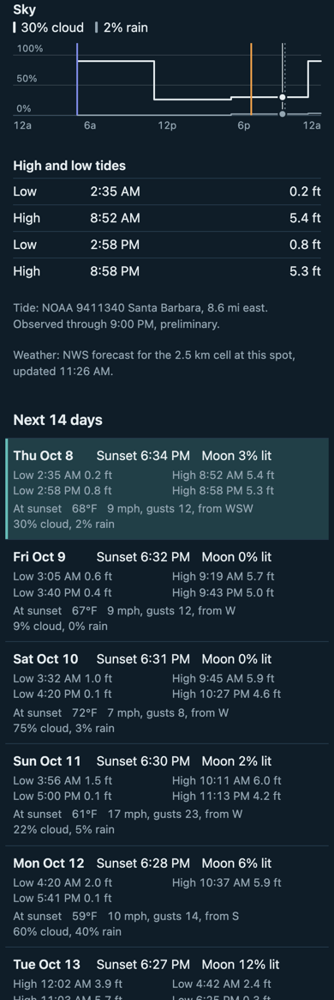
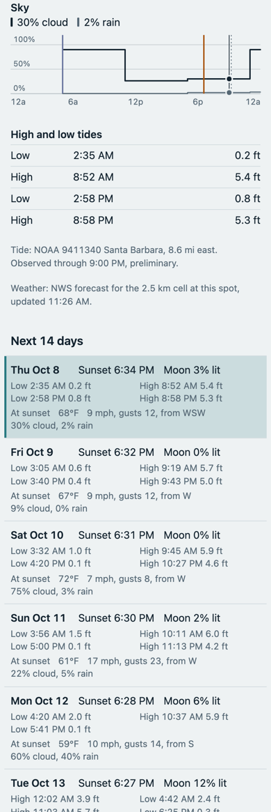
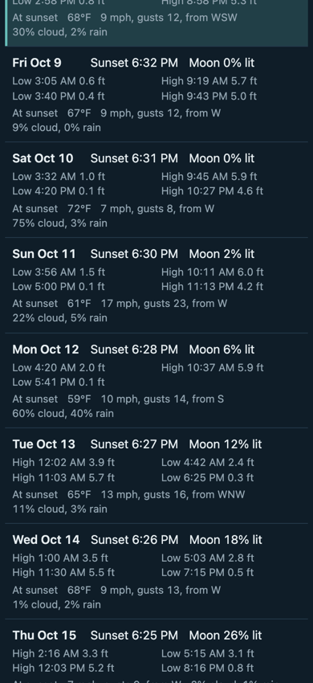
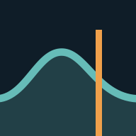

# Stage 1, Part 3: Weather, the 14 Days and the Home Screen Implementation Plan

> **For agentic workers:** REQUIRED SUB-SKILL: Use superpowers:subagent-driven-development (recommended) or superpowers:executing-plans to implement this plan task-by-task. Steps use checkbox (`- [ ]`) syntax for tracking.

**Goal:** Finish Stage 1 for Campus Point: wind, temperature and sky panels under the tide on the same time axis and cursor, a 14-day list that puts any of its days on screen, a line for every way a source can fail, and the manifest and icons that make the page work from an iPhone home screen.

**Architecture:** The same as the tide screen. Thin React components over plain modules, with every rule, every piece of arithmetic and every word in a plain function that has tests. This plan adds the forecast as a fourth source in the loading hook, a plain function that says which day is on screen, one that says what the weather panels show, and one that words the rows of the list. `Panel` and `PanelStack` are reused; `Panel` learns to draw a staircase.

**Tech Stack:** React 19, TypeScript 6.0, Vite 8, Vitest 5, oxlint, Prettier. No new dependencies.

**Spec:** `docs/superpowers/specs/2026-10-08-stage-1-campus-point-design.md`

**Scope:** Pull request 4 of the four in the spec's Delivery section, and the last of Stage 1.

## What it will look like

A throwaway prototype of this plan's code, running against live NOAA and NWS data on the evening of 8 October 2026 at iPhone width.

  

The three weather panels sit under the tide on the same axis, crossed by the same moonrise, sunset and current-time lines and the same cursor. Each weather value is drawn as a staircase, level across the hour it is forecast for. The list has a row for each of the 14 days: its sunset and moon, its highs and lows, and, as far as the forecast reaches, the forecast for the hour of sunset. The marked row is the day in the panels above.

The icon, at the size an Android home screen uses: 

## Decisions this plan makes that the spec leaves open

The owner should read these before approving. Each is one line to change now and a rework to change later.

1. **Weather is drawn as staircases, not as lines from point to point.** The spec says the readout uses the forecast hour that contains the cursor. A line sloping from one hour's value to the next would put the cursor's dot somewhere the words do not say. With a staircase the dot, the line and the words always agree, and a value NWS gives for a six-hour block looks like what it is.
2. **Weather uses no new colours.** The first value in each panel is in the text colour and the second in the muted one, with a bar of the same colour beside each in the readout. Sea-green stays the tide's, ember the sunset's and grey-blue the moon's.
3. **A chosen day stays chosen** until it drops out of the 14 days, which is what happens to yesterday at midnight. Putting the page away and bringing it back does not go back to today, although it does put the cursor back to rest.
4. **Tapping a row scrolls up to the panels.** They are above the list and usually off screen, so without this a tap seems to do nothing.
5. **The third line of a row starts "At sunset".** Without it nobody could tell that 68°F is the temperature at 6 PM and not the day's high.
6. **A day is inside the forecast if the forecast reaches the hour of its sunset.** The spec says "has a record for that day's sunset hour". Read literally, that would hide today's panels every evening that NWS issues a forecast starting after sunset.
7. **At the right-hand edge of a day the weather reads the last hour drawn,** not the first hour of the next day.
8. **The tide panel keeps room for its second readout line on every day,** so the plot does not move when a day with no readings is chosen.
9. **A saved forecast or reading stamped more than 5 minutes into the future is not believed.** Less than that is allowed for, because the page reads the clock once a minute and an answer is stamped when it arrives.
10. **The manifest's colours are the dark ground,** and the icons are not declared maskable.
11. **The tonight strip's wording is unchanged.** It now comes from a plain function with tests instead of from the component.

## Questions for the first user, for the owner to relay

None of these blocks the build.

1. The third line of each row gives the forecast at the hour of sunset, not the day's high and low. Is that the right moment?
2. "Rises 5:00 AM" in the tonight strip is this morning's moonrise by evening. Reword it, or show the next moonrise?
3. The strip at the top always describes today, with nothing on screen that says so. With another day in the panels, is that confusing?

## How this plan was checked

Every code block below was built and run as a throwaway prototype before this plan was written, and the blocks are copied from it by script, not retyped.

- **Tests:** 367 pass in the prototype: the 268 on `main` and the 99 this plan adds. Lint with warnings denied, the type check and the build are clean.
- **Each task on its own:** the prototype's files were laid onto a clean copy of `main` one task at a time, in the order below. Lint, the build and the tests were green after every task, with the totals each task states.
- **Each test against its guard:** 27 rules were broken one at a time, and the tests were run. 26 were caught. The one that was not turned out to be a guard that did nothing (`String` already turns a negative zero into "0"), and it was removed.
- **In a browser at 390 px, with touch emulated,** against live data: 37 checks, all passing. The four panels and their readouts; a sideways drag on a weather panel moving the cursor; a swipe up on a weather panel scrolling the page and leaving the cursor alone; a tapped row putting its day on screen, marking itself, bringing the panels into view and resting the cursor at sunset with no current-time line and no observed reading; a day past the forecast saying so; the forecast failing with nothing saved while the tide draws; NOAA failing with nothing saved while the weather draws and the cursor still works; and a reopen with no network drawing all four panels from what was saved.
- **Not checked:** anything on a real phone, including the home-screen icon and whether the page clears the status bar and the home indicator there; a screen reader; and a fake clock run past midnight with another day chosen, which only the tests of `selectedDay` cover.
## Global Constraints

- **Node 24 for every `npm`, `npx` and `node` command.** In a fresh shell run `source ~/.nvm/nvm.sh && nvm use` first.
- **Public repo, no personal details.** Tracked files, commit messages and pull requests never name people. Write "the first user" and "the owner". Never copy anything out of `private/`.
- **Commit identity.** `git config user.email` must end in `users.noreply.github.com`.
- **Commit trailer.** End every commit message with `Co-Authored-By: Claude Opus 5.5 <noreply@anthropic.com>`.
- **Code style is the Vite template's:** no semicolons, single quotes, relative imports carry their `.ts` or `.tsx` extension, type-only imports use `import type`, no enums. Run `npm run format` before every commit.
- **Lint must print no problems.** Warnings fail it.
- **No new dependencies.** Not d3, not a charting library, not a date library.
- **Times:** every stored or computed time is a UTC instant in epoch milliseconds. Only `src/time.ts` converts to a zone. Nothing reads the viewer's zone. Tests run with the device in Tokyo.
- **Components hold no arithmetic, no rules and no wording.** Those live in plain modules with tests. If a component needs an `if` about data, the decision belongs in a plain function first.
- **Units:** feet above MLLW to one decimal; °F, mph and percent as whole numbers; 12-hour clock.
- **Data, not a verdict.** No scores, no go/no-go, no alerts.
- **Applying a change shown as a diff.** Where a step shows a ```` ```diff ```` block, make exactly that change to the file it names. Saving the block to a file and running `git apply` on it is the surest way. If it does not apply, stop and say so; do not improvise a different change.
- **Do not merge.** The last task opens the pull request and stops.

## Review Focus

Conditions the spec implies but does not list as tests. Each has a test in the task named. Where a test cannot reach, a hand check is named instead.

1. **A forecast hour that has only some of its values.** On the last day the forecast reaches, the hour of sunset has had wind and cloud but no temperature. Expected: every readout and every row says what there is and leaves out what there is not, with no "null" and no "NaN". Task 3, the `windParts`, `tempParts` and `skyParts` tests; Task 5, "an hour with only some values"; Task 7, "an hour with only some values gives those".
2. **Where the forecast starts and stops.** It starts partway through today, and after an evening update it can start after sunset. It stops partway through its last day. Expected: today always keeps its panels, drawn from where the forecast starts; the last day has panels only if the forecast reaches its sunset; later days say "No forecast this far out." Task 5, the tests under "when the panels are not drawn".
3. **A swipe up or down that starts on a weather panel.** The panels now fill most of the screen, so most scrolls start on one. Expected: the page scrolls and the cursor does not move. The rule is in `gesture.ts` and already tested; Task 8 checks it on the new panels with emulated touch, and the owner checks it on a phone.
4. **A phone left open past midnight with another day chosen, and a chosen day that drops out of the 14.** Expected: a day still among the 14 stays on screen; one that is not means today. Task 4, the `selectedDay` tests.
5. **One source down while the others are up, and a saved forecast too old to use.** Expected: the tide draws without the forecast and the forecast without the tide; the cursor works either way; missing highs and lows get a line in the caption; a saved forecast whose every hour has passed reads "Forecast unavailable", not "No forecast this far out." Task 5 and Task 6 for the rules; Task 8 for the screen.

## File Structure

Created:

- `src/ui/selection.ts` — which of the 14 days is on screen, and the vertical lines across its panels
- `src/ui/weatherView.ts` — what the three weather panels show
- `src/ui/dayList.ts` — the words for the tonight strip and for each row of the list
- `src/ui/WeatherPanels.tsx` — the three weather panels, or the line that stands in for them
- `src/ui/DayList.tsx` — the 14 rows
- A `*.test.ts` beside each plain module
- `public/icon.svg`, `public/icon-192.png`, `public/icon-512.png`, `public/apple-touch-icon.png`, `public/manifest.webmanifest`

Modified: `src/time.ts`, `src/data/cache.ts`, `src/data/nws.ts`, `src/data/useSpotData.ts`, `src/chart/scales.ts`, `src/chart/readout.ts`, `src/chart/Panel.tsx`, `src/ui/tideView.ts`, `src/ui/captions.ts`, `src/ui/TonightStrip.tsx`, `src/App.tsx`, `src/styles.css`, their tests, `src/data/load.test.ts`, `index.html`, `CLAUDE.md`, `README.md`.

Not touched: `src/chart/PanelStack.tsx`, `src/chart/gesture.ts`, `src/data/load.ts`, `src/data/noaa.ts`, `src/data/astro.ts`, `src/ui/HiLoTable.tsx`.

Work on branch `stage-1/weather-and-days`, which already exists and holds this plan:

```bash
git switch stage-1/weather-and-days
source ~/.nvm/nvm.sh && nvm use
npm test
```

Expected: 268 tests pass.

---

### Task 1: Two fixes carried from the last review, in `src/time.ts` and `src/data/cache.ts`

**Files:**
- Modify: `src/time.ts`, `src/time.test.ts`, `src/data/cache.ts`, `src/data/cache.test.ts`, `src/data/load.test.ts`

**Interfaces:**
- Consumes: nothing new.
- Produces: no new names. `formatTime` and `formatDay` keep their signatures and results and stop building a formatter on every call. `isStale` keeps its signature; for `'forecast'` and `'observed'` it now also returns `true` when the entry's `fetchedAt` is more than 5 minutes after `now`.

**Why.** The day list calls `formatTime` about a hundred times on every draw, and the page draws again on every move of the cursor. And a device whose clock was ahead when it saved, and was put right afterwards, would otherwise never refresh the forecast or the readings until the clock caught up with the stamp.

- [ ] **Step 1: Write the failing test for the formatters**

Apply to `src/time.test.ts`:

```diff
--- a/src/time.test.ts
+++ b/src/time.test.ts
@@ -1,4 +1,4 @@
-import { describe, expect, test } from 'vitest'
+import { describe, expect, test, vi } from 'vitest'
 import {
   addDays,
   formatDay,
@@ -137,3 +137,26 @@ describe('formatDay', () => {
     expect(formatDay('2027-01-01')).toBe('Fri Jan 1')
   })
 })
+
+describe('the display formatters', () => {
+  test('are built once and kept, because the day list asks for about a hundred times on every draw', () => {
+    // Asked for once, so that a zone no other test has used is ready.
+    formatTime(Date.UTC(2026, 9, 9, 1, 33), 'America/Denver')
+    formatDay('2026-10-08')
+
+    const built = vi.spyOn(Intl, 'DateTimeFormat')
+    try {
+      expect(formatTime(Date.UTC(2026, 9, 9, 1, 33), 'America/Denver')).toBe(
+        '7:33 PM',
+      )
+      expect(formatTime(Date.UTC(2026, 9, 9, 19, 5), 'America/Denver')).toBe(
+        '1:05 PM',
+      )
+      expect(formatDay('2026-10-08')).toBe('Thu Oct 8')
+      expect(formatDay('2026-10-21')).toBe('Wed Oct 21')
+      expect(built).not.toHaveBeenCalled()
+    } finally {
+      built.mockRestore()
+    }
+  })
+})
```

- [ ] **Step 2: Run it to see it fail**

Run: `npx vitest run src/time.test.ts`
Expected: FAIL in "are built once and kept", because `Intl.DateTimeFormat` is still built on each call. The other tests in the file pass.

- [ ] **Step 3: Keep the formatters**

Apply to `src/time.ts`:

```diff
--- a/src/time.ts
+++ b/src/time.ts
@@ -106,33 +106,42 @@ function partReader(
   return (type) => parts.find((p) => p.type === type)?.value ?? ''
 }
 
-/** A 12-hour clock time in a zone, such as '6:33 PM'. */
-export function formatTime(t: number, timeZone: string): string {
-  const part = partReader(
-    new Intl.DateTimeFormat('en-US', {
+// Building a formatter is slow, and the day list asks for about a hundred
+// times on every draw, so each one is built once and kept.
+const timeFormats = new Map<string, Intl.DateTimeFormat>()
+
+function timeFormat(timeZone: string): Intl.DateTimeFormat {
+  let format = timeFormats.get(timeZone)
+  if (!format) {
+    format = new Intl.DateTimeFormat('en-US', {
       timeZone,
       hour: 'numeric',
       minute: '2-digit',
       hour12: true,
-    }),
-    t,
-  )
+    })
+    timeFormats.set(timeZone, format)
+  }
+  return format
+}
+
+/** A 12-hour clock time in a zone, such as '6:33 PM'. */
+export function formatTime(t: number, timeZone: string): string {
+  const part = partReader(timeFormat(timeZone), t)
   // Assembled from parts, because browsers disagree on which kind of space
   // goes before AM/PM, and some use one that is invisible in source code.
   return `${part('hour')}:${part('minute')} ${part('dayPeriod')}`
 }
 
+const dayFormat = new Intl.DateTimeFormat('en-US', {
+  timeZone: 'UTC',
+  weekday: 'short',
+  month: 'short',
+  day: 'numeric',
+})
+
 /** A calendar date for display, such as 'Thu Oct 8'. No zone is involved. */
 export function formatDay(date: string): string {
   const [year, month, day] = parseDate(date)
-  const part = partReader(
-    new Intl.DateTimeFormat('en-US', {
-      timeZone: 'UTC',
-      weekday: 'short',
-      month: 'short',
-      day: 'numeric',
-    }),
-    Date.UTC(year, month - 1, day, 12),
-  )
+  const part = partReader(dayFormat, Date.UTC(year, month - 1, day, 12))
   return `${part('weekday')} ${part('month')} ${part('day')}`
 }
```

- [ ] **Step 4: Run it to see it pass**

Run: `npx vitest run src/time.test.ts`
Expected: PASS, every test in the file.

- [ ] **Step 5: Commit**

```bash
npm run format
git add src/time.ts src/time.test.ts
git commit -m "Build each display formatter once and keep it" -m "The day list will ask for about a hundred times on every draw." -m "Co-Authored-By: Claude Opus 5.5 <noreply@anthropic.com>"
```

- [ ] **Step 6: Write the failing tests for stamps from the future**

Apply to `src/data/cache.test.ts`:

```diff
--- a/src/data/cache.test.ts
+++ b/src/data/cache.test.ts
@@ -188,4 +188,28 @@ describe('isStale', () => {
   test('predictions saved without a span are stale', () => {
     expect(isStale('predictions', at(NOW), NOW, WINDOW)).toBe(true)
   })
+
+  test.each(['forecast', 'observed'] as const)(
+    'a saved %s stamped well into the future is stale: the clock that stamped it was wrong',
+    (source) => {
+      expect(isStale(source, at(NOW + 6 * MINUTE), NOW, WINDOW)).toBe(true)
+      expect(isStale(source, at(NOW + 3 * DAY), NOW, WINDOW)).toBe(true)
+    },
+  )
+
+  test.each(['forecast', 'observed'] as const)(
+    'a saved %s stamped a little ahead is fresh: the caller reads the clock up to a minute late',
+    (source) => {
+      expect(isStale(source, at(NOW + 90_000), NOW, WINDOW)).toBe(false)
+      expect(isStale(source, at(NOW + 4 * MINUTE), NOW, WINDOW)).toBe(false)
+    },
+  )
+
+  test.each(['predictions', 'hilo'] as const)(
+    '%s do not go by their stamp at all, so one from the future changes nothing',
+    (source) => {
+      const entry = { fetchedAt: NOW + 3 * DAY, span: WINDOW, data: null }
+      expect(isStale(source, entry, NOW, WINDOW)).toBe(false)
+    },
+  )
 })
```

Apply to `src/data/load.test.ts`:

```diff
--- a/src/data/load.test.ts
+++ b/src/data/load.test.ts
@@ -255,6 +255,24 @@ describe('createLoader', () => {
     expect(fetch).toHaveBeenCalledTimes(2)
   })
 
+  test('an answer stamped after the check that asked for it is not asked for again', async () => {
+    // The page reads the clock once a minute, so an answer is always stamped
+    // a little later than the reading the checks are made with. If that
+    // counted as a stamp from the future, every draw would fetch again.
+    const fetch = vi.fn(async () => [1, 2, 3])
+    const loader = createLoader(spec({ fetch }), NOW, clock)
+    loader.check(spec({ fetch }), NOW)
+    time = NOW + 59_000
+    await settle()
+    expect(loader.current().fetchedAt).toBe(NOW + 59_000)
+
+    loader.check(spec({ fetch }), NOW)
+    await settle()
+    loader.check(spec({ fetch, source: 'observed' }), NOW)
+    await settle()
+    expect(fetch).toHaveBeenCalledTimes(1)
+  })
+
   test('makes one request however often it is checked while waiting', async () => {
     let answer: (data: number[]) => void = () => {}
     const fetch = vi.fn(
```

- [ ] **Step 7: Run them to see which fail**

Run: `npx vitest run src/data/cache.test.ts src/data/load.test.ts`
Expected: FAIL in the two "stamped well into the future is stale" tests only. The others pass already, the new one in `load.test.ts` among them: they pin down what the fix must not break. In particular, if the fix in the next step had no allowance for a clock read a minute late, "an answer stamped after the check that asked for it is not asked for again" would fail, and in the app every draw would fetch again.

- [ ] **Step 8: Stop believing a stamp from the future**

Apply to `src/data/cache.ts`:

```diff
--- a/src/data/cache.ts
+++ b/src/data/cache.ts
@@ -19,6 +19,12 @@ export interface CacheEntry<T> {
 
 const MINUTE = 60_000
 const HOUR = 60 * MINUTE
+/**
+ * How far ahead of the clock a stamp may be and still be believed. The
+ * caller's reading of the clock can be a minute or so behind the one that
+ * stamped the entry, and a request can take 20 seconds to answer.
+ */
+const AHEAD = 5 * MINUTE
 
 // Bump the version when the shape of any saved data changes, so old entries
 // are ignored instead of misread.
@@ -96,6 +102,10 @@ export function isStale(
   needed: Span,
 ): boolean {
   if (!entry) return true
+  const age = now - entry.fetchedAt
+  // A stamp from the future means the device's clock was ahead when it saved
+  // and has been put right since, so there is no telling how old the data is.
+  const fromTheFuture = age < -AHEAD
   switch (source) {
     // Predictions for a date do not change, so they are good for as long as
     // they cover the window.
@@ -107,8 +117,8 @@ export function isStale(
         entry.span.end < needed.end
       )
     case 'forecast':
-      return now - entry.fetchedAt > HOUR
+      return age > HOUR || fromTheFuture
     case 'observed':
-      return now - entry.fetchedAt > 6 * MINUTE
+      return age > 6 * MINUTE || fromTheFuture
   }
 }
```

- [ ] **Step 9: Run them to see them pass**

Run: `npx vitest run src/data/cache.test.ts src/data/load.test.ts`
Expected: PASS, every test in both files.

Then prove the allowance matters. In `src/data/cache.ts` change `const AHEAD = 5 * MINUTE` to `const AHEAD = 0`, run the same command, and confirm that "an answer stamped after the check that asked for it is not asked for again" now FAILS. Put `5 * MINUTE` back and run once more to see every test pass.

- [ ] **Step 10: Commit**

```bash
npm run format && npm run lint && npm test
```

Expected: lint prints no problems; 276 tests pass.

```bash
git add src/data/cache.ts src/data/cache.test.ts src/data/load.test.ts
git commit -m "Treat saved data stamped in the future as stale" -m "A device whose clock was ahead when it saved, and was put right afterwards, kept its forecast and readings until the clock caught up with the stamp. Five minutes are allowed for, because the page reads the clock once a minute and stamps an answer when it arrives." -m "Co-Authored-By: Claude Opus 5.5 <noreply@anthropic.com>"
```

---

### Task 2: The forecast as a fourth source, in `src/data/nws.ts` and `src/data/useSpotData.ts`

**Files:**
- Modify: `src/data/nws.ts`, `src/data/nws.test.ts`, `src/data/useSpotData.ts`, `src/data/useSpotData.test.ts`

**Interfaces:**
- Consumes: `Forecast`, `ForecastHour`, `fetchForecast(office, gridX, gridY)` and `parseGridpoint` from `src/data/nws.ts`; `SourceSpec<T>`, `Loaded<T>` and `createLoader` from `src/data/load.ts`; `Span` from `src/data/cache.ts`; `spot.nws` from `src/spot.ts`.
- Produces:
  - `isForecast(data: unknown): data is Forecast` in `nws.ts`
  - `forecastSpec(spot: Spot, frame: Pick<SpotData, 'window'>): SourceSpec<Forecast>` in `useSpotData.ts`
  - `SpotData` gains `spans: Span[]`, the start and end of each of the 14 days in the same order as `days`, and `forecast: Loaded<Forecast>`
  - `frameFor` returns `spans` as well as `day`, `window` and `days`. `day` is `spans[0]`.

- [ ] **Step 1: Write the failing tests**

Apply to `src/data/nws.test.ts`:

```diff
--- a/src/data/nws.test.ts
+++ b/src/data/nws.test.ts
@@ -2,6 +2,7 @@ import { afterEach, describe, expect, test, vi } from 'vitest'
 import {
   compassPoint,
   fetchForecast,
+  isForecast,
   nwsUrl,
   parseDurationHours,
   parseGridpoint,
@@ -233,3 +234,49 @@ describe('compassPoint', () => {
     expect(compassPoint(-90)).toBe('W')
   })
 })
+
+describe('isForecast', () => {
+  const hour = {
+    t: EIGHT,
+    tempF: 68,
+    windMph: 10,
+    gustMph: null,
+    windDeg: 260,
+    cloudPct: 3,
+    rainPct: 0,
+  }
+
+  test('a parsed forecast passes, real or empty', () => {
+    expect(isForecast(parseGridpoint(JSON.parse(realRaw)))).toBe(true)
+    expect(isForecast(parseGridpoint(sample()))).toBe(true)
+    expect(isForecast({ updatedAt: EIGHT, hours: [] })).toBe(true)
+  })
+
+  test('it survives being saved and read back', () => {
+    const forecast = parseGridpoint(sample())
+    expect(isForecast(JSON.parse(JSON.stringify(forecast)))).toBe(true)
+  })
+
+  test.each([
+    ['nothing', null],
+    ['a list, as the tide sources save', [{ t: EIGHT, ft: 3 }]],
+    ['no update time', { hours: [hour] }],
+    ['no hours', { updatedAt: EIGHT }],
+    ['hours that are not a list', { updatedAt: EIGHT, hours: {} }],
+    ['an hour that is not a record', { updatedAt: EIGHT, hours: [null] }],
+    [
+      'an hour with no time',
+      { updatedAt: EIGHT, hours: [{ ...hour, t: '8' }] },
+    ],
+    [
+      'an hour with a field left out, as an older version might have saved',
+      { updatedAt: EIGHT, hours: [{ t: EIGHT, tempF: 68 }] },
+    ],
+    [
+      'an hour with a value that is not a number',
+      { updatedAt: EIGHT, hours: [{ ...hour, windMph: '10' }] },
+    ],
+  ])('%s does not pass', (_name, data) => {
+    expect(isForecast(data)).toBe(false)
+  })
+})
```

Apply to `src/data/useSpotData.test.ts`:

```diff
--- a/src/data/useSpotData.test.ts
+++ b/src/data/useSpotData.test.ts
@@ -1,5 +1,5 @@
 import { afterEach, describe, expect, test, vi } from 'vitest'
-import { frameFor, tideSpecs } from './useSpotData.ts'
+import { forecastSpec, frameFor, tideSpecs } from './useSpotData.ts'
 import { CAMPUS_POINT } from '../spot.ts'
 
 const HOUR = 3_600_000
@@ -20,6 +20,28 @@ describe('frameFor', () => {
     expect(frame.days[13].date).toBe('2026-10-21')
   })
 
+  test('each of the 14 days has its own span, end to end with no gaps', () => {
+    const frame = frameFor(CAMPUS_POINT, '2026-10-08')
+    expect(frame.spans).toHaveLength(14)
+    expect(frame.spans[0]).toEqual(frame.day)
+    expect(frame.spans[3]).toEqual({
+      start: Date.UTC(2026, 9, 11, 7),
+      end: Date.UTC(2026, 9, 12, 7),
+    })
+    for (let i = 1; i < 14; i++) {
+      expect(frame.spans[i].start).toBe(frame.spans[i - 1].end)
+    }
+    expect(frame.spans[13].end).toBe(frame.window.end)
+  })
+
+  test('the span of the day the clocks go back is 25 hours, wherever it falls in the 14', () => {
+    // 1 November 2026 is the eighth day from 25 October.
+    const frame = frameFor(CAMPUS_POINT, '2026-10-25')
+    const hours = frame.spans.map((span) => (span.end - span.start) / HOUR)
+    expect(hours[7]).toBe(25)
+    expect(hours.filter((length) => length === 24)).toHaveLength(13)
+  })
+
   test('the day after is a different frame, which is what moves a phone left open past midnight on to the new day', () => {
     const before = frameFor(CAMPUS_POINT, '2026-10-08')
     const after = frameFor(CAMPUS_POINT, '2026-10-09')
@@ -81,3 +103,46 @@ describe('tideSpecs', () => {
     }
   })
 })
+
+describe('forecastSpec', () => {
+  const frame = frameFor(CAMPUS_POINT, '2026-10-08')
+  const spec = forecastSpec(CAMPUS_POINT, frame)
+
+  afterEach(() => vi.unstubAllGlobals())
+
+  test("asks NWS for the spot's own forecast cell", async () => {
+    const body = JSON.stringify({
+      properties: { updateTime: '2026-10-08T14:26:58+00:00' },
+    })
+    const fetchMock = vi.fn(async (_url: string) => new Response(body))
+    vi.stubGlobal('fetch', fetchMock)
+
+    const forecast = await spec.fetch(frame.window)
+
+    expect(fetchMock.mock.calls[0][0]).toBe(
+      'https://api.weather.gov/gridpoints/LOX/100,71',
+    )
+    expect(forecast.updatedAt).toBe(Date.UTC(2026, 9, 8, 14, 26, 58))
+  })
+
+  test('is saved and checked as the forecast', () => {
+    expect(spec.source).toBe('forecast')
+    expect(spec.spotId).toBe('campus-point')
+    expect(spec.isData({ updatedAt: 1, hours: [] })).toBe(true)
+    expect(spec.isData([{ t: 1, ft: 3 }])).toBe(false)
+  })
+
+  test('a forecast with no hours in it is a failure, so it is never saved', () => {
+    expect(spec.isEmpty({ updatedAt: 1, hours: [] })).toBe(true)
+    const hour = {
+      t: 1,
+      tempF: 68,
+      windMph: 10,
+      gustMph: 12,
+      windDeg: 260,
+      cloudPct: 3,
+      rainPct: 0,
+    }
+    expect(spec.isEmpty({ updatedAt: 1, hours: [hour] })).toBe(false)
+  })
+})
```

- [ ] **Step 2: Run them to see them fail**

Run: `npx vitest run src/data/nws.test.ts src/data/useSpotData.test.ts`
Expected: FAIL. The new tests fail, because `isForecast`, `forecastSpec` and `spans` do not exist yet. The tests that were there before pass.

- [ ] **Step 3: Write the shape check**

Apply to `src/data/nws.ts`:

```diff
--- a/src/data/nws.ts
+++ b/src/data/nws.ts
@@ -136,6 +136,27 @@ export function parseGridpoint(json: unknown): Forecast {
   return { updatedAt, hours }
 }
 
+/** Whether saved data has the shape of a parsed forecast. For the cache. */
+export function isForecast(data: unknown): data is Forecast {
+  if (typeof data !== 'object' || data === null) return false
+  const { updatedAt, hours } = data as Record<string, unknown>
+  return (
+    typeof updatedAt === 'number' &&
+    Array.isArray(hours) &&
+    hours.every((hour: unknown) => {
+      if (typeof hour !== 'object' || hour === null) return false
+      const record = hour as Record<string, unknown>
+      return (
+        typeof record.t === 'number' &&
+        Object.keys(LAYERS).every(
+          (field) =>
+            record[field] === null || typeof record[field] === 'number',
+        )
+      )
+    })
+  )
+}
+
 export async function fetchForecast(
   office: string,
   gridX: number,
```

- [ ] **Step 4: Add the spans and the forecast to the hook's module**

Apply to `src/data/useSpotData.ts`:

```diff
--- a/src/data/useSpotData.ts
+++ b/src/data/useSpotData.ts
@@ -16,6 +16,8 @@ import {
   isTidePoints,
 } from './noaa.ts'
 import type { TideExtreme, TidePoint } from './noaa.ts'
+import { fetchForecast, isForecast } from './nws.ts'
+import type { Forecast } from './nws.ts'
 import type { Spot } from '../spot.ts'
 import { addDays, localDate, localDayStart } from '../time.ts'
 
@@ -33,21 +35,33 @@ export interface SpotData {
   /** The 14 local days starting today. */
   window: Span
   days: DayAstro[]
+  /** When each of those days starts and ends, in the same order. */
+  spans: Span[]
   predictions: Loaded<TidePoint[]>
   hilo: Loaded<TideExtreme[]>
   observed: Loaded<TidePoint[]>
+  forecast: Loaded<Forecast>
 }
 
 /** The spans of time, and the sun and moon, for the 14 days from `today`. */
 export function frameFor(
   spot: Spot,
   today: string,
-): Pick<SpotData, 'day' | 'window' | 'days'> {
-  const start = localDayStart(today, spot.timeZone)
+): Pick<SpotData, 'day' | 'window' | 'days' | 'spans'> {
+  // One more local midnight than there are days: each day runs from its own
+  // midnight to the next, which on a clock-change day is 23 or 25 hours on.
+  const midnights = Array.from({ length: DAYS + 1 }, (_, i) =>
+    localDayStart(addDays(today, i), spot.timeZone),
+  )
+  const spans = Array.from({ length: DAYS }, (_, i) => ({
+    start: midnights[i],
+    end: midnights[i + 1],
+  }))
   return {
-    day: { start, end: localDayStart(addDays(today, 1), spot.timeZone) },
-    window: { start, end: localDayStart(addDays(today, DAYS), spot.timeZone) },
+    day: spans[0],
+    window: { start: midnights[0], end: midnights[DAYS] },
     days: astroForDays(spot, today, DAYS),
+    spans,
   }
 }
 
@@ -92,6 +106,24 @@ export function tideSpecs(
   }
 }
 
+/** What to load for the weather. */
+export function forecastSpec(
+  spot: Spot,
+  frame: Pick<SpotData, 'window'>,
+): SourceSpec<Forecast> {
+  const { office, gridX, gridY } = spot.nws
+  return {
+    spotId: spot.id,
+    source: 'forecast',
+    isData: isForecast,
+    // NWS decides how far the forecast runs. It goes stale by age, not by
+    // which days it covers, so the window is only recorded with what is saved.
+    needed: frame.window,
+    fetch: () => fetchForecast(office, gridX, gridY),
+    isEmpty: (forecast) => forecast.hours.length === 0,
+  }
+}
+
 function useClock(): Pick<SpotData, 'now' | 'shown'> {
   const [clock, setClock] = useState(() => ({ now: Date.now(), shown: 0 }))
   useEffect(() => {
@@ -132,6 +164,7 @@ export function useSpotData(spot: Spot): SpotData {
   const predictions = useLoaded(specs.predictions, now)
   const hilo = useLoaded(specs.hilo, now)
   const observed = useLoaded(specs.observed, now)
+  const forecast = useLoaded(forecastSpec(spot, frame), now)
 
-  return { now, shown, today, ...frame, predictions, hilo, observed }
+  return { now, shown, today, ...frame, predictions, hilo, observed, forecast }
 }
```

- [ ] **Step 5: Run them to see them pass**

Run: `npx vitest run src/data/nws.test.ts src/data/useSpotData.test.ts`
Expected: PASS, every test in both files.

- [ ] **Step 6: Commit**

```bash
npm run format && npm run lint && npm run build && npm test
```

Expected: lint prints no problems; the build ends with `✓ built`; 292 tests pass. The page now fetches the forecast and saves it, and draws nothing with it yet.

```bash
git add src/data/nws.ts src/data/nws.test.ts src/data/useSpotData.ts src/data/useSpotData.test.ts
git commit -m "Load the NWS forecast alongside the tide" -m "The hook has a fourth source, saved and checked like the others, and the frame gives the span of each of the 14 days." -m "Co-Authored-By: Claude Opus 5.5 <noreply@anthropic.com>"
```

---

### Task 3: A staircase, round bounds, and the weather in words, in `src/chart/`

**Files:**
- Modify: `src/chart/scales.ts`, `src/chart/scales.test.ts`, `src/chart/readout.ts`, `src/chart/readout.test.ts`

**Interfaces:**
- Consumes: `Point`, `Scale` and `linearScale` from `scales.ts`; `ForecastHour` and `compassPoint` from `src/data/nws.ts`.
- Produces, in `scales.ts`:
  - `steppedBounds(values: number[], step: number): [number, number]`
  - `stepPath(points: Point[], x: Scale, y: Scale, width: number): string`
- Produces, in `readout.ts`:
  - `interface ReadoutPart { key: string | null; text: string }`
  - `hourAt(hours: ForecastHour[], t: number): ForecastHour | null`
  - `windParts(hour: ForecastHour | null): ReadoutPart[]`
  - `tempParts(hour: ForecastHour | null): ReadoutPart[]`
  - `skyParts(hour: ForecastHour | null): ReadoutPart[]`
  - `partsText(parts: ReadoutPart[]): string`

  The keys are `'wind'`, `'gust'`, `'temp'`, `'cloud'` and `'rain'`. They are also the series names in Task 5 and the class names in Task 8. The compass point has no key.

- [ ] **Step 1: Write the failing tests**

Apply to `src/chart/scales.test.ts`:

```diff
--- a/src/chart/scales.test.ts
+++ b/src/chart/scales.test.ts
@@ -3,6 +3,8 @@ import {
   areaPath,
   linePath,
   linearScale,
+  stepPath,
+  steppedBounds,
   wholeBounds,
   wholeSteps,
 } from './scales.ts'
@@ -92,3 +94,65 @@ describe('paths', () => {
     expect(areaPath([], x, y, 10)).toBe('')
   })
 })
+
+describe('steppedBounds', () => {
+  test('goes out to the multiples of the step on either side', () => {
+    expect(steppedBounds([52, 78.4, 61], 10)).toEqual([50, 80])
+    expect(steppedBounds([0, 9, 23], 10)).toEqual([0, 30])
+  })
+
+  test('a value already on a multiple is its own bound', () => {
+    expect(steppedBounds([50, 80], 10)).toEqual([50, 80])
+  })
+
+  test('is never less than one step tall', () => {
+    expect(steppedBounds([0, 0], 10)).toEqual([0, 10])
+    expect(steppedBounds([70], 10)).toEqual([70, 80])
+  })
+
+  test('with no values at all it is one step up from zero', () => {
+    expect(steppedBounds([], 10)).toEqual([0, 10])
+  })
+
+  test('goes below zero for a frost, and never gives a negative zero', () => {
+    expect(steppedBounds([-3, 12], 10)).toEqual([-10, 20])
+    expect(Object.is(steppedBounds([-0.2, 4], 10)[0], -10)).toBe(true)
+    expect(Object.is(steppedBounds([-0, 4], 10)[0], 0)).toBe(true)
+  })
+})
+
+describe('stepPath', () => {
+  // An hour is 30 px wide, and 0 to 100 runs up 100 px.
+  const HOUR = 3_600_000
+  const x = linearScale([0, 4 * HOUR], [0, 120])
+  const y = linearScale([0, 100], [100, 0])
+
+  test('is level across each value, then straight up or down to the next', () => {
+    const points = [
+      { t: 0, v: 20 },
+      { t: HOUR, v: 50 },
+      { t: 2 * HOUR, v: 50 },
+    ]
+    expect(stepPath(points, x, y, HOUR)).toBe(
+      'M0.0,80.0H30.0V50.0H60.0V50.0H90.0',
+    )
+  })
+
+  test('the last value is drawn for its whole hour, so a day reaches the right-hand edge', () => {
+    expect(stepPath([{ t: 3 * HOUR, v: 0 }], x, y, HOUR)).toBe(
+      'M90.0,100.0H120.0',
+    )
+  })
+
+  test('breaks where an hour is missing instead of bridging it', () => {
+    const points = [
+      { t: 0, v: 20 },
+      { t: 2 * HOUR, v: 50 },
+    ]
+    expect(stepPath(points, x, y, HOUR)).toBe('M0.0,80.0H30.0M60.0,50.0H90.0')
+  })
+
+  test('no points is an empty path', () => {
+    expect(stepPath([], x, y, HOUR)).toBe('')
+  })
+})
```

Apply to `src/chart/readout.test.ts`:

```diff
--- a/src/chart/readout.test.ts
+++ b/src/chart/readout.test.ts
@@ -2,12 +2,18 @@ import { describe, expect, test } from 'vitest'
 import {
   STEP,
   feet,
+  hourAt,
+  partsText,
   restingCursor,
   signedFeet,
+  skyParts,
   snap,
+  tempParts,
   tideReadout,
   tideWords,
+  windParts,
 } from './readout.ts'
+import type { ForecastHour } from '../data/nws.ts'
 
 const MINUTE = 60_000
 const NOON = Date.UTC(2026, 9, 8, 19) // 12:00 PM Pacific
@@ -137,3 +143,126 @@ describe('wording', () => {
     ).toEqual({ predicted: 'No prediction here', observed: null })
   })
 })
+
+describe('the weather under the cursor', () => {
+  const HOUR = 3_600_000
+
+  function hour(t: number, change: Partial<ForecastHour> = {}): ForecastHour {
+    return {
+      t,
+      tempF: 73.6,
+      windMph: 9.4,
+      gustMph: 11.5,
+      windDeg: 268,
+      cloudPct: 3,
+      rainPct: 0,
+      ...change,
+    }
+  }
+  const NOTHING = hour(NOON, {
+    tempF: null,
+    windMph: null,
+    gustMph: null,
+    windDeg: null,
+    cloudPct: null,
+    rainPct: null,
+  })
+
+  describe('hourAt', () => {
+    const hours = [hour(NOON), hour(NOON + HOUR), hour(NOON + 3 * HOUR)]
+
+    test('is the hour that contains the instant, from its first moment to its last', () => {
+      expect(hourAt(hours, NOON)).toBe(hours[0])
+      expect(hourAt(hours, NOON + 59 * MINUTE)).toBe(hours[0])
+      expect(hourAt(hours, NOON + HOUR)).toBe(hours[1])
+    })
+
+    test('is nothing where the forecast has no such hour', () => {
+      expect(hourAt(hours, NOON - MINUTE)).toBeNull()
+      expect(hourAt(hours, NOON + 2 * HOUR + 30 * MINUTE)).toBeNull()
+      expect(hourAt([], NOON)).toBeNull()
+    })
+  })
+
+  describe('windParts', () => {
+    test('speed, gusts and a compass point, in whole numbers', () => {
+      const parts = windParts(hour(NOON))
+      expect(parts).toEqual([
+        { key: 'wind', text: '9 mph' },
+        { key: 'gust', text: 'gusts 12' },
+        { key: null, text: 'from W' },
+      ])
+      expect(partsText(parts)).toBe('9 mph, gusts 12, from W')
+    })
+
+    test('leaves out what the forecast does not have', () => {
+      expect(partsText(windParts(hour(NOON, { gustMph: null })))).toBe(
+        '9 mph, from W',
+      )
+      expect(partsText(windParts(hour(NOON, { windDeg: null })))).toBe(
+        '9 mph, gusts 12',
+      )
+    })
+
+    test('gusts carry the unit when there is no speed to carry it', () => {
+      expect(partsText(windParts(hour(NOON, { windMph: null })))).toBe(
+        'gusts 12 mph, from W',
+      )
+    })
+
+    test('calm is 0 mph, not nothing', () => {
+      const calm = hour(NOON, { windMph: 0, gustMph: 0 })
+      expect(partsText(windParts(calm))).toBe('0 mph, gusts 0, from W')
+    })
+
+    test('no hour, or an hour with no wind at all, is no parts', () => {
+      expect(windParts(null)).toEqual([])
+      expect(windParts(NOTHING)).toEqual([])
+    })
+  })
+
+  describe('tempParts', () => {
+    test('a whole number of degrees', () => {
+      expect(tempParts(hour(NOON))).toEqual([{ key: 'temp', text: '74°F' }])
+    })
+
+    test('just below zero is 0, never -0', () => {
+      expect(partsText(tempParts(hour(NOON, { tempF: -0.4 })))).toBe('0°F')
+      expect(partsText(tempParts(hour(NOON, { tempF: -0.6 })))).toBe('-1°F')
+    })
+
+    test('zero degrees is a temperature, not a missing one', () => {
+      expect(partsText(tempParts(hour(NOON, { tempF: 0 })))).toBe('0°F')
+    })
+
+    test('no hour, or no temperature, is no parts', () => {
+      expect(tempParts(null)).toEqual([])
+      expect(tempParts(NOTHING)).toEqual([])
+    })
+  })
+
+  describe('skyParts', () => {
+    test('cloud cover and the chance of rain', () => {
+      const parts = skyParts(hour(NOON))
+      expect(parts).toEqual([
+        { key: 'cloud', text: '3% cloud' },
+        { key: 'rain', text: '0% rain' },
+      ])
+      expect(partsText(parts)).toBe('3% cloud, 0% rain')
+    })
+
+    test('leaves out what the forecast does not have', () => {
+      expect(partsText(skyParts(hour(NOON, { rainPct: null })))).toBe(
+        '3% cloud',
+      )
+      expect(partsText(skyParts(hour(NOON, { cloudPct: null })))).toBe(
+        '0% rain',
+      )
+    })
+
+    test('no hour, or neither value, is no parts', () => {
+      expect(skyParts(null)).toEqual([])
+      expect(skyParts(NOTHING)).toEqual([])
+    })
+  })
+})
```

- [ ] **Step 2: Run them to see them fail**

Run: `npx vitest run src/chart`
Expected: FAIL. The new tests in `scales.test.ts` and `readout.test.ts` fail, because the names they use do not exist yet. The tests that were there before pass, `gesture.test.ts` among them.

- [ ] **Step 3: Write the bounds and the staircase**

Apply to `src/chart/scales.ts`:

```diff
--- a/src/chart/scales.ts
+++ b/src/chart/scales.ts
@@ -40,6 +40,26 @@ export function wholeBounds(values: number[]): [number, number] {
   return [floor, Math.max(Math.ceil(high), floor + 1)]
 }
 
+/**
+ * Bounds on multiples of `step` that contain every value and are at least one
+ * step apart, such as 50 to 80 for temperatures between 52 and 78.
+ */
+export function steppedBounds(
+  values: number[],
+  step: number,
+): [number, number] {
+  let low = Infinity
+  let high = -Infinity
+  for (const value of values) {
+    if (value < low) low = value
+    if (value > high) high = value
+  }
+  if (low > high) return [0, step]
+  // Adding 0 turns the -0 that a small negative `low` can produce into 0.
+  const floor = Math.floor(low / step) * step + 0
+  return [floor, Math.max(Math.ceil(high / step) * step, floor + step)]
+}
+
 /** The multiples of `step` from low to high, both included. */
 export function wholeSteps(low: number, high: number, step: number): number[] {
   const steps: number[] = []
@@ -83,3 +103,24 @@ export function areaPath(
   const last = x(points[points.length - 1].t).toFixed(1)
   return `${linePath(points, x, y)}L${last},${floor}L${first},${floor}Z`
 }
+
+/**
+ * A staircase through values that each hold for `width`, as an hourly
+ * forecast's do: level across each one, then straight up or down to the next.
+ * Where the next value starts later than this one ends, the line breaks.
+ */
+export function stepPath(
+  points: Point[],
+  x: Scale,
+  y: Scale,
+  width: number,
+): string {
+  let path = ''
+  points.forEach((point, i) => {
+    const joined = i > 0 && point.t - points[i - 1].t <= width
+    const level = y(point.v).toFixed(1)
+    path += joined ? `V${level}` : `M${x(point.t).toFixed(1)},${level}`
+    path += `H${x(point.t + width).toFixed(1)}`
+  })
+  return path
+}
```

- [ ] **Step 4: Write the weather readouts**

Apply to `src/chart/readout.ts`:

```diff
--- a/src/chart/readout.ts
+++ b/src/chart/readout.ts
@@ -1,6 +1,8 @@
 // The values under the cursor, and how they are worded. Plain functions.
 
 import type { TidePoint } from '../data/noaa.ts'
+import { compassPoint } from '../data/nws.ts'
+import type { ForecastHour } from '../data/nws.ts'
 
 /** NOAA's tide points sit on 6-minute steps, and so does the cursor. */
 export const STEP = 6 * 60_000
@@ -114,3 +116,66 @@ export function tideWords(readout: TideReadout): {
       observedFt === null ? null : `${feet(observedFt)} observed${above}`,
   }
 }
+
+/** The forecast hour that contains an instant, if the forecast has it. */
+export function hourAt(hours: ForecastHour[], t: number): ForecastHour | null {
+  const start = Math.floor(t / HOUR) * HOUR
+  return hours.find((hour) => hour.t === start) ?? null
+}
+
+/** A whole number for display. */
+function whole(value: number): string {
+  return String(Math.round(value))
+}
+
+/** One piece of a weather readout, and the series it describes, if any. */
+export interface ReadoutPart {
+  /** Names the series, for its colour key: 'wind', 'gust' and so on. */
+  key: string | null
+  text: string
+}
+
+/**
+ * The wind in an hour, as '9 mph', 'gusts 12', 'from W'. Each part is there
+ * only if the forecast has it.
+ */
+export function windParts(hour: ForecastHour | null): ReadoutPart[] {
+  if (!hour) return []
+  const parts: ReadoutPart[] = []
+  if (hour.windMph !== null) {
+    parts.push({ key: 'wind', text: `${whole(hour.windMph)} mph` })
+  }
+  if (hour.gustMph !== null) {
+    // The unit is given once, by whichever number comes first.
+    const unit = hour.windMph === null ? ' mph' : ''
+    parts.push({ key: 'gust', text: `gusts ${whole(hour.gustMph)}${unit}` })
+  }
+  if (hour.windDeg !== null) {
+    parts.push({ key: null, text: `from ${compassPoint(hour.windDeg)}` })
+  }
+  return parts
+}
+
+/** The temperature in an hour, as '74°F'. */
+export function tempParts(hour: ForecastHour | null): ReadoutPart[] {
+  if (!hour || hour.tempF === null) return []
+  return [{ key: 'temp', text: `${whole(hour.tempF)}°F` }]
+}
+
+/** Cloud cover and the chance of rain in an hour: '3% cloud', '0% rain'. */
+export function skyParts(hour: ForecastHour | null): ReadoutPart[] {
+  if (!hour) return []
+  const parts: ReadoutPart[] = []
+  if (hour.cloudPct !== null) {
+    parts.push({ key: 'cloud', text: `${whole(hour.cloudPct)}% cloud` })
+  }
+  if (hour.rainPct !== null) {
+    parts.push({ key: 'rain', text: `${whole(hour.rainPct)}% rain` })
+  }
+  return parts
+}
+
+/** A readout as one run of words, such as '9 mph, gusts 12, from W'. */
+export function partsText(parts: ReadoutPart[]): string {
+  return parts.map((part) => part.text).join(', ')
+}
```

- [ ] **Step 5: Run them to see them pass**

Run: `npx vitest run src/chart`
Expected: PASS, every test in the three files.

- [ ] **Step 6: Commit**

```bash
npm run format && npm run lint && npm test
```

Expected: lint prints no problems; 315 tests pass.

```bash
git add src/chart/scales.ts src/chart/scales.test.ts src/chart/readout.ts src/chart/readout.test.ts
git commit -m "Add a staircase path, round bounds and the weather in words" -m "An hourly value holds for its hour, so it is drawn level across it. The words for an hour leave out whatever the forecast does not have." -m "Co-Authored-By: Claude Opus 5.5 <noreply@anthropic.com>"
```

---

### Task 4: Which day is on screen, in `src/ui/selection.ts` and `src/ui/tideView.ts`

**Files:**
- Create: `src/ui/selection.ts`, `src/ui/selection.test.ts`
- Modify: `src/ui/tideView.ts` (replace), `src/ui/tideView.test.ts` (replace), `src/App.tsx` (two lines)

**Interfaces:**
- Consumes: `SpotData` with `days` and `spans` (Task 2); `DayAstro` from `src/data/astro.ts`; `Span` from `src/data/cache.ts`; `restingCursor`, `snap` and `tideReadout` from `src/chart/readout.ts`.
- Produces, in `selection.ts`:
  - `interface Selected { index: number; date: string; span: Span; astro: DayAstro; isToday: boolean }`
  - `selectedDay(data: Pick<SpotData, 'days' | 'spans'>, picked: string | null): Selected`
  - `dayMarkers(selected: Selected, now: number): { name: string; t: number }[]`, with the names `'now'`, `'sunset'` and `'moonrise'`
- Changes, in `tideView.ts`:
  - `tideView(data, selected: Selected, pick: CursorPick | null): TideView`. It used to take `(data, pick)` and knew only about today. `data` no longer needs `today`.
  - `CursorPick.day` is now the date of the day that was on screen when the cursor was put there.

- [ ] **Step 1: Write the failing tests**

Create `src/ui/selection.test.ts`:

```ts
import { describe, expect, test } from 'vitest'
import { dayMarkers, selectedDay } from './selection.ts'
import { frameFor } from '../data/useSpotData.ts'
import { CAMPUS_POINT } from '../spot.ts'

const frame = frameFor(CAMPUS_POINT, '2026-10-08')
const NOW = Date.UTC(2026, 9, 8, 22, 36) // 3:36 PM

describe('selectedDay', () => {
  test('with no row tapped, the day on screen is today', () => {
    const selected = selectedDay(frame, null)
    expect(selected.index).toBe(0)
    expect(selected.date).toBe('2026-10-08')
    expect(selected.isToday).toBe(true)
    expect(selected.span).toEqual(frame.day)
    expect(selected.astro).toBe(frame.days[0])
  })

  test('a tapped row puts its own day on screen, with its own span and sun and moon', () => {
    const selected = selectedDay(frame, '2026-10-11')
    expect(selected.index).toBe(3)
    expect(selected.isToday).toBe(false)
    expect(selected.span).toEqual({
      start: Date.UTC(2026, 9, 11, 7),
      end: Date.UTC(2026, 9, 12, 7),
    })
    expect(selected.astro.date).toBe('2026-10-11')
  })

  test('a day that has dropped out of the 14, as yesterday does at midnight, means today', () => {
    const next = frameFor(CAMPUS_POINT, '2026-10-09')
    const selected = selectedDay(next, '2026-10-08')
    expect(selected.date).toBe('2026-10-09')
    expect(selected.isToday).toBe(true)
  })

  test('a day still among the 14 stays on screen when the date changes', () => {
    const next = frameFor(CAMPUS_POINT, '2026-10-09')
    const selected = selectedDay(next, '2026-10-11')
    expect(selected.date).toBe('2026-10-11')
    expect(selected.index).toBe(2)
  })
})

describe('dayMarkers', () => {
  test('today has the current time, sunset and moonrise', () => {
    const today = selectedDay(frame, null)
    expect(dayMarkers(today, NOW)).toEqual([
      { name: 'now', t: NOW },
      { name: 'sunset', t: today.astro.sunset },
      { name: 'moonrise', t: today.astro.moonrise },
    ])
  })

  test('another day has no line for the current time', () => {
    const names = dayMarkers(selectedDay(frame, '2026-10-11'), NOW).map(
      (marker) => marker.name,
    )
    expect(names).toEqual(['sunset', 'moonrise'])
  })

  test('a day with no moonrise has no moonrise line', () => {
    // 2 November 2026 has no moonrise at this spot.
    const november = frameFor(CAMPUS_POINT, '2026-10-31')
    const names = dayMarkers(selectedDay(november, '2026-11-02'), NOW).map(
      (marker) => marker.name,
    )
    expect(names).toEqual(['sunset'])
  })
})
```

Replace `src/ui/tideView.test.ts` with:

```ts
import { describe, expect, test } from 'vitest'
import type { Selected } from './selection.ts'
import { tideView } from './tideView.ts'
import type { Loaded } from '../data/load.ts'
import type { TideExtreme, TidePoint } from '../data/noaa.ts'

const MINUTE = 60_000
const HOUR = 60 * MINUTE
const DAY = 24 * HOUR
// Local 8 October 2026 at the spot, Pacific daylight time.
const START = Date.UTC(2026, 9, 8, 7)
const END = Date.UTC(2026, 9, 9, 7)
const NOW = START + 15 * HOUR + 36 * MINUTE // 3:36 PM

function ready<T>(data: T): Loaded<T> {
  return { data, fetchedAt: NOW, span: null, status: 'ready' }
}

function none<T>(status: Loaded<T>['status']): Loaded<T> {
  return { data: null, fetchedAt: null, span: null, status }
}

// A flat 3 ft curve every 6 minutes from the day before to two days after,
// with one 6.5 ft point a week on.
const curve: TidePoint[] = []
for (let t = START - HOUR; t <= END + DAY + HOUR; t += 6 * MINUTE) {
  curve.push({ t, ft: 3 })
}
curve.push({ t: START + 7 * DAY, ft: 6.5 })

// Readings until 3:24 PM, running 1 ft above the curve.
const readings: TidePoint[] = []
for (let t = START; t <= START + 15 * HOUR + 24 * MINUTE; t += 6 * MINUTE) {
  readings.push({ t, ft: 4 })
}

const events: TideExtreme[] = [
  { t: START - 2 * HOUR, ft: 5, type: 'H' },
  { t: START, ft: 0.2, type: 'L' },
  { t: START + 6 * HOUR, ft: 5.4, type: 'H' },
  { t: END, ft: 0.8, type: 'L' },
  { t: END + 9 * HOUR, ft: 5.7, type: 'H' },
]

function data(overrides = {}) {
  return {
    now: NOW,
    shown: 0,
    day: { start: START, end: END },
    predictions: ready(curve),
    hilo: ready(events),
    observed: ready(readings),
    ...overrides,
  }
}

function day(index: number, sunset: number | null): Selected {
  const date = `2026-10-${String(8 + index).padStart(2, '0')}`
  return {
    index,
    date,
    span: { start: START + index * DAY, end: END + index * DAY },
    astro: {
      date,
      sunset,
      moonrise: null,
      illumination: 0.03,
      phase: 'Waning Crescent',
      moonriseNearSunset: null,
    },
    isToday: index === 0,
  }
}

const TODAY = day(0, START + 18 * HOUR + 34 * MINUTE)
// Sunset at 6:32 PM, which is between two 6-minute steps.
const TOMORROW = day(1, END + 18 * HOUR + 32 * MINUTE)

describe('what is drawn', () => {
  test('the curve covers the day and reaches both edges of the plot', () => {
    const { predicted } = tideView(data(), TODAY, null)
    expect(predicted[0].t).toBe(START)
    expect(predicted.at(-1)!.t).toBe(END)
    expect(predicted).toHaveLength(241)
  })

  test('a high or low at midnight belongs to the day it starts', () => {
    const view = tideView(data(), TODAY, null)
    expect(view.events.map((event) => event.t)).toEqual([
      START,
      START + 6 * HOUR,
    ])
  })

  test("the vertical range covers all 14 days and today's readings", () => {
    // The curve is 3 ft today but reaches 6.5 ft next week.
    expect(tideView(data(), TODAY, null).bounds).toEqual([3, 7])
    const high = [...readings, { t: NOW, ft: 8.2 }]
    const view = tideView(data({ observed: ready(high) }), TODAY, null)
    expect(view.bounds).toEqual([3, 9])
  })
})

describe('another day', () => {
  test('has its own curve and its own highs and lows', () => {
    const view = tideView(data(), TOMORROW, null)
    expect(view.predicted[0].t).toBe(END)
    expect(view.predicted.at(-1)!.t).toBe(END + DAY)
    expect(view.events.map((event) => event.t)).toEqual([END, END + 9 * HOUR])
  })

  test("has no readings: today's are not drawn on it or read out", () => {
    const view = tideView(data(), TOMORROW, null)
    expect(view.observed).toEqual([])
    expect(view.readout.observedFt).toBeNull()
  })

  test('keeps the vertical range that today has, readings included, so the scale does not jump', () => {
    const high = [...readings, { t: NOW, ft: 8.2 }]
    const view = tideView(data({ observed: ready(high) }), TOMORROW, null)
    expect(view.bounds).toEqual([3, 9])
  })
})

describe('where the cursor is', () => {
  test('at rest today it sits on the latest reading', () => {
    const view = tideView(data(), TODAY, null)
    expect(view.cursor).toBe(START + 15 * HOUR + 24 * MINUTE)
    expect(view.readout).toEqual({ predictedFt: 3, observedFt: 4, aboveFt: 1 })
  })

  test('at rest on another day it sits at sunset, to the nearest step', () => {
    const view = tideView(data(), TOMORROW, null)
    expect(view.cursor).toBe(END + 18 * HOUR + 30 * MINUTE)
  })

  test('where the sun does not set it rests in the middle of the day', () => {
    const view = tideView(data(), day(1, null), null)
    expect(view.cursor).toBe(END + 12 * HOUR)
  })

  test('it stays where it was put', () => {
    const pick = { t: START + 9 * HOUR, day: '2026-10-08', shown: 0 }
    expect(tideView(data(), TODAY, pick).cursor).toBe(START + 9 * HOUR)
  })

  test('it goes back to rest when the page is put away and brought back', () => {
    const pick = { t: START + 9 * HOUR, day: '2026-10-08', shown: 0 }
    const view = tideView(data({ shown: 1 }), TODAY, pick)
    expect(view.cursor).toBe(START + 15 * HOUR + 24 * MINUTE)
  })

  test('it goes back to rest when another day is put on screen', () => {
    const pick = { t: START + 9 * HOUR, day: '2026-10-08', shown: 0 }
    const view = tideView(data(), TOMORROW, pick)
    expect(view.cursor).toBe(END + 18 * HOUR + 30 * MINUTE)
  })

  test('it goes back to rest when the day changes', () => {
    const pick = { t: END, day: '2026-10-08', shown: 0 }
    const tomorrow = data({
      now: END + 5 * MINUTE,
      day: { start: END, end: END + DAY },
      observed: ready([]),
    })
    const today = { ...day(1, null), isToday: true }
    // 12:05 AM with no readings yet: the clock, to the nearest step.
    expect(tideView(tomorrow, today, pick).cursor).toBe(END + 6 * MINUTE)
  })

  test('it cannot be put outside the day', () => {
    const pick = { t: END + 3 * HOUR, day: '2026-10-08', shown: 0 }
    expect(tideView(data(), TODAY, pick).cursor).toBe(END)
  })
})

describe('when there is no curve to draw', () => {
  test('nothing saved and a request on its way: loading', () => {
    const view = tideView(data({ predictions: none('loading') }), TODAY, null)
    expect(view.notice).toBe('Loading tides')
    expect(view.predicted).toEqual([])
  })

  test('nothing saved and the request failed: unavailable', () => {
    const view = tideView(
      data({ predictions: none('unavailable') }),
      TODAY,
      null,
    )
    expect(view.notice).toBe('Tide data unavailable')
  })

  test('saved data that does not reach today, and no way to refresh it: unavailable, not loading for ever', () => {
    const old: Loaded<TidePoint[]> = {
      data: [{ t: START - 20 * DAY, ft: 3 }],
      fetchedAt: START - 20 * DAY,
      span: null,
      status: 'stale',
    }
    expect(tideView(data({ predictions: old }), TODAY, null).notice).toBe(
      'Tide data unavailable',
    )
  })

  test('with a curve there is no notice', () => {
    expect(tideView(data(), TODAY, null).notice).toBeNull()
  })
})
```

- [ ] **Step 2: Run them to see them fail**

Run: `npx vitest run src/ui/selection.test.ts src/ui/tideView.test.ts`
Expected: FAIL. `selection.test.ts` fails to load, because `selection.ts` does not exist. In `tideView.test.ts` every test fails, because `tideView` does not take a day yet.

- [ ] **Step 3: Write `src/ui/selection.ts`**

```ts
// Which of the 14 days is on screen, and the vertical lines drawn across its
// panels. Plain functions.

import type { DayAstro } from '../data/astro.ts'
import type { Span } from '../data/cache.ts'
import type { SpotData } from '../data/useSpotData.ts'

export interface Selected {
  /** Its place in the 14 days. 0 is today. */
  index: number
  date: string
  span: Span
  astro: DayAstro
  isToday: boolean
}

/**
 * The day on screen. `picked` is the date of the row last tapped, if any. A
 * date that is not one of the 14, such as yesterday's on a phone left open
 * past midnight, means today.
 */
export function selectedDay(
  data: Pick<SpotData, 'days' | 'spans'>,
  picked: string | null,
): Selected {
  const found = data.days.findIndex((day) => day.date === picked)
  const index = found === -1 ? 0 : found
  const astro = data.days[index]
  return {
    index,
    date: astro.date,
    span: data.spans[index],
    astro,
    isToday: index === 0,
  }
}

/**
 * The instants to draw a vertical line at: the day's sunset and moonrise,
 * and the current time when the day is today.
 */
export function dayMarkers(
  selected: Selected,
  now: number,
): { name: string; t: number }[] {
  const { sunset, moonrise } = selected.astro
  const markers: { name: string; t: number }[] = []
  if (selected.isToday) markers.push({ name: 'now', t: now })
  if (sunset !== null) markers.push({ name: 'sunset', t: sunset })
  if (moonrise !== null) markers.push({ name: 'moonrise', t: moonrise })
  return markers
}
```

- [ ] **Step 4: Replace `src/ui/tideView.ts`**

```ts
// What the tide part of the screen shows, worked out from what is loaded,
// which day is on screen and where the cursor was last put. A plain function,
// so the rules have tests and App.tsx only arranges the result.

import { restingCursor, snap, tideReadout } from '../chart/readout.ts'
import type { TideReadout } from '../chart/readout.ts'
import { wholeBounds } from '../chart/scales.ts'
import type { TideExtreme, TidePoint } from '../data/noaa.ts'
import type { SpotData } from '../data/useSpotData.ts'
import type { Selected } from './selection.ts'

/** Where the cursor was put by hand, and when. */
export interface CursorPick {
  t: number
  /** The date of the day that was on screen when it was put there. */
  day: string
  /** How many times the page had come back into view by then. */
  shown: number
}

export interface TideView {
  /** The day's predicted curve, reaching both edges of the plot. */
  predicted: TidePoint[]
  /** The day's readings, in order. Only today has any. */
  observed: TidePoint[]
  /** The day's highs and lows. */
  events: TideExtreme[]
  cursor: number
  /** The plot's vertical range, in whole feet. */
  bounds: [number, number]
  readout: TideReadout
  /** What to say where the plot would be, when there is no curve to draw. */
  notice: string | null
}

type Inputs = Pick<
  SpotData,
  'now' | 'shown' | 'day' | 'predictions' | 'hilo' | 'observed'
>

export function tideView(
  data: Inputs,
  selected: Selected,
  pick: CursorPick | null,
): TideView {
  const { span } = selected
  // Both ends are included, so the curve reaches the right edge of the plot
  // by using the first point of the next day.
  const within = (points: TidePoint[] | null, day: typeof span) =>
    (points ?? []).filter((point) => point.t >= day.start && point.t <= day.end)
  const predicted = within(data.predictions.data, span)
  const readings = within(data.observed.data, data.day)
  const observed = selected.isToday ? readings : []
  // A high or low at midnight belongs to the day it starts, not both.
  const events = (data.hilo.data ?? []).filter(
    (event) => event.t >= span.start && event.t < span.end,
  )

  // Where the cursor sits until someone moves it. Today that is the latest
  // reading, or the clock. Any other day it is sunset, the moment the rest of
  // the screen is about, or the middle of the day where the sun does not set.
  const rest = selected.isToday
    ? restingCursor(data.now, observed)
    : snap(selected.astro.sunset ?? (span.start + span.end) / 2)
  // A pick lasts until another day is put on screen or the page is put away
  // and brought back. After that the cursor goes back to rest, so reopening
  // the app shows the latest reading and not wherever the cursor was left.
  const held =
    pick !== null && pick.day === selected.date && pick.shown === data.shown
  const cursor = held ? Math.min(Math.max(pick.t, span.start), span.end) : rest

  // One vertical range for all 14 days, so one day can be compared with
  // another, widened if needed to fit today's readings. Those count on every
  // day, so the scale does not jump when another day is chosen.
  const bounds = wholeBounds(
    [...(data.predictions.data ?? []), ...readings].map((point) => point.ft),
  )

  let notice: string | null = null
  if (predicted.length === 0) {
    notice =
      data.predictions.status === 'loading'
        ? 'Loading tides'
        : 'Tide data unavailable'
  }

  return {
    predicted,
    observed,
    events,
    cursor,
    bounds,
    readout: tideReadout(predicted, observed, cursor),
    notice,
  }
}
```

- [ ] **Step 5: Keep the page building**

The page is rebuilt in Task 8. Until then it shows today only, so it hands `tideView` today. In `src/App.tsx`, add this import after the one for `HiLoTable`:

```ts
import { selectedDay } from './ui/selection.ts'
```

and change

```ts
  const view = tideView(data, pick)
```

to

```ts
  const view = tideView(data, selectedDay(data, null), pick)
```

- [ ] **Step 6: Run them to see them pass**

Run: `npx vitest run src/ui`
Expected: PASS, every test in the three files.

- [ ] **Step 7: Commit**

```bash
npm run format && npm run lint && npm run build && npm test
```

Expected: lint prints no problems; the build ends with `✓ built`; 328 tests pass.

```bash
git add src/ui/selection.ts src/ui/selection.test.ts src/ui/tideView.ts src/ui/tideView.test.ts src/App.tsx
git commit -m "Let the tide view show any of the 14 days" -m "A plain function says which day is on screen. On a day other than today there are no readings and the cursor rests at sunset. The page still shows today only." -m "Co-Authored-By: Claude Opus 5.5 <noreply@anthropic.com>"
```

---

### Task 5: What the weather panels show, in `src/ui/weatherView.ts`

**Files:**
- Create: `src/ui/weatherView.ts`, `src/ui/weatherView.test.ts`

**Interfaces:**
- Consumes: `Selected` (Task 4); `hourAt`, `windParts`, `tempParts`, `skyParts`, `ReadoutPart` and `steppedBounds` (Task 3); `Loaded<Forecast>`; `Point` from `src/chart/scales.ts`.
- Produces:
  - `interface WeatherPanelView { readout: ReadoutPart[]; bounds: [number, number]; series: { name: string; points: Point[] }[]; dots: { name: string; v: number }[] }`
  - `interface WeatherView { notice: string | null; wind: WeatherPanelView; temp: WeatherPanelView; sky: WeatherPanelView }`
  - `weatherView(forecast: Loaded<Forecast>, selected: Selected, cursor: number, now: number): WeatherView`

  The notices are `'Loading forecast'`, `'Forecast unavailable'` and `'No forecast this far out.'`. When there is one, every series is empty and there are no dots. A panel whose hour has none of its values reads `[{ key: null, text: 'No forecast here' }]`.

- [ ] **Step 1: Write the failing tests**

Create `src/ui/weatherView.test.ts`:

```ts
import { describe, expect, test } from 'vitest'
import type { Selected } from './selection.ts'
import { weatherView } from './weatherView.ts'
import type { Loaded } from '../data/load.ts'
import type { Forecast, ForecastHour } from '../data/nws.ts'

const MINUTE = 60_000
const HOUR = 60 * MINUTE
const DAY = 24 * HOUR
// Local 8 October 2026 at the spot, Pacific daylight time.
const START = Date.UTC(2026, 9, 8, 7)
const END = START + DAY
const NOW = START + 15 * HOUR + 36 * MINUTE // 3:36 PM
const SUNSET = 18 * HOUR + 34 * MINUTE // 6:34 PM, as an offset into a day

function day(index: number, sunset: number | null = SUNSET): Selected {
  const start = START + index * DAY
  const date = `2026-10-${String(8 + index).padStart(2, '0')}`
  return {
    index,
    date,
    span: { start, end: start + DAY },
    astro: {
      date,
      sunset: sunset === null ? null : start + sunset,
      moonrise: null,
      illumination: 0.03,
      phase: 'Waning Crescent',
      moonriseNearSunset: null,
    },
    isToday: index === 0,
  }
}

/** Hourly records from `first` for `count` hours. The temperature is the hour of the day plus 50. */
function hourly(
  first: number,
  count: number,
  change: (hour: ForecastHour) => void = () => {},
): ForecastHour[] {
  return Array.from({ length: count }, (_, i) => {
    const t = first + i * HOUR
    const hour: ForecastHour = {
      t,
      tempF: 50 + (((t - START) / HOUR) % 24),
      windMph: 9,
      gustMph: 12,
      windDeg: 270,
      cloudPct: 3,
      rainPct: 0,
    }
    change(hour)
    return hour
  })
}

function loaded(
  hours: ForecastHour[] | null,
  status: Loaded<Forecast>['status'] = 'ready',
): Loaded<Forecast> {
  const data = hours === null ? null : { updatedAt: NOW - HOUR, hours }
  return { data, fetchedAt: data ? NOW : null, span: null, status }
}

// From 5 AM today for 7 days and 17 hours, as NWS sends it: the last record
// is for 9 PM on 15 October.
const FIRST = START + 5 * HOUR
const week = loaded(hourly(FIRST, 185))

describe('what is drawn', () => {
  test('one staircase per value, over the hours of the day on screen', () => {
    const view = weatherView(week, day(0), NOW, NOW)
    expect(view.notice).toBeNull()
    expect(view.wind.series.map((series) => series.name)).toEqual([
      'wind',
      'gust',
    ])
    expect(view.temp.series.map((series) => series.name)).toEqual(['temp'])
    expect(view.sky.series.map((series) => series.name)).toEqual([
      'cloud',
      'rain',
    ])
    // Today's forecast starts at 5 AM, so the lines start partway across.
    const temps = view.temp.series[0].points
    expect(temps).toHaveLength(19)
    expect(temps[0]).toEqual({ t: FIRST, v: 55 })
    expect(temps.at(-1)).toEqual({ t: END - HOUR, v: 73 })
    expect(view.wind.series[1].points[0]).toEqual({ t: FIRST, v: 12 })
  })

  test('another day has its own hours, midnight to midnight', () => {
    const temps = weatherView(week, day(2), NOW, NOW).temp.series[0].points
    expect(temps).toHaveLength(24)
    expect(temps[0].t).toBe(START + 2 * DAY)
    expect(temps.at(-1)!.t).toBe(START + 3 * DAY - HOUR)
  })

  test('an hour with no value for one thing is left out of that line only', () => {
    const gap = START + 10 * HOUR
    const patchy = loaded(
      hourly(FIRST, 185, (hour) => {
        if (hour.t === gap) hour.tempF = null
      }),
    )
    const view = weatherView(patchy, day(0), NOW, NOW)
    expect(view.temp.series[0].points.map((point) => point.t)).not.toContain(
      gap,
    )
    expect(view.temp.series[0].points).toHaveLength(18)
    expect(view.wind.series[0].points.map((point) => point.t)).toContain(gap)
  })

  test('one vertical range for every day, on round numbers', () => {
    const windy = loaded(
      hourly(FIRST, 185, (hour) => {
        // A blustery afternoon three days on.
        if (hour.t === START + 3 * DAY + 15 * HOUR) hour.gustMph = 23
      }),
    )
    const view = weatherView(windy, day(0), NOW, NOW)
    expect(view.wind.bounds).toEqual([0, 30])
    // Temperatures run from 50 to 73.
    expect(view.temp.bounds).toEqual([50, 80])
    expect(view.sky.bounds).toEqual([0, 100])
  })
})

describe('what is read out', () => {
  test('the forecast hour that contains the cursor', () => {
    const view = weatherView(week, day(0), NOW, NOW)
    expect(view.wind.readout).toEqual([
      { key: 'wind', text: '9 mph' },
      { key: 'gust', text: 'gusts 12' },
      { key: null, text: 'from W' },
    ])
    // 3:36 PM is in the 3 PM hour.
    expect(view.temp.readout).toEqual([{ key: 'temp', text: '65°F' }])
    expect(view.sky.readout).toEqual([
      { key: 'cloud', text: '3% cloud' },
      { key: 'rain', text: '0% rain' },
    ])
  })

  test('a dot for each value that hour has', () => {
    const view = weatherView(week, day(0), NOW, NOW)
    expect(view.wind.dots).toEqual([
      { name: 'wind', v: 9 },
      { name: 'gust', v: 12 },
    ])
    expect(view.temp.dots).toEqual([{ name: 'temp', v: 65 }])
    expect(view.sky.dots).toEqual([
      { name: 'cloud', v: 3 },
      { name: 'rain', v: 0 },
    ])
  })

  test('at the right-hand edge it reads the last hour drawn, not the next day', () => {
    // The cursor can sit on the midnight that ends the day.
    const view = weatherView(week, day(0), END, NOW)
    // 11 PM is 73 degrees. The midnight after it is 50.
    expect(view.temp.readout).toEqual([{ key: 'temp', text: '73°F' }])
    expect(view.temp.dots).toEqual([{ name: 'temp', v: 73 }])
  })

  test('before the forecast starts it says so, and has no dots', () => {
    const view = weatherView(week, day(0), START + 3 * HOUR, NOW)
    const nothing = [{ key: null, text: 'No forecast here' }]
    expect(view.wind.readout).toEqual(nothing)
    expect(view.temp.readout).toEqual(nothing)
    expect(view.sky.readout).toEqual(nothing)
    expect(view.wind.dots).toEqual([])
  })

  test('an hour with only some values reads out those, and says so for a panel with none', () => {
    const patchy = loaded(
      hourly(FIRST, 185, (hour) => {
        hour.tempF = null
        hour.gustMph = null
      }),
    )
    const view = weatherView(patchy, day(0), NOW, NOW)
    expect(view.temp.readout).toEqual([{ key: null, text: 'No forecast here' }])
    expect(view.temp.dots).toEqual([])
    expect(view.wind.readout).toEqual([
      { key: 'wind', text: '9 mph' },
      { key: null, text: 'from W' },
    ])
    expect(view.wind.dots).toEqual([{ name: 'wind', v: 9 }])
  })
})

describe('when the panels are not drawn', () => {
  const blank = (view: ReturnType<typeof weatherView>) =>
    [view.wind, view.temp, view.sky].every(
      (panel) =>
        panel.dots.length === 0 &&
        panel.series.every((series) => series.points.length === 0),
    )

  test('nothing saved and a request on its way: loading', () => {
    const view = weatherView(loaded(null, 'loading'), day(0), NOW, NOW)
    expect(view.notice).toBe('Loading forecast')
    expect(blank(view)).toBe(true)
  })

  test('nothing saved and the request failed: unavailable', () => {
    const view = weatherView(loaded(null, 'unavailable'), day(0), NOW, NOW)
    expect(view.notice).toBe('Forecast unavailable')
  })

  test('a day past the end of the forecast says so', () => {
    const view = weatherView(week, day(8), NOW, NOW)
    expect(view.notice).toBe('No forecast this far out.')
    expect(blank(view)).toBe(true)
  })

  test('the last day counts as inside the forecast when it reaches the hour of sunset', () => {
    // The forecast ends with the 9 PM hour on 15 October. Sunset is 6:34 PM.
    expect(weatherView(week, day(7), NOW, NOW).notice).toBeNull()
  })

  test('the last day counts as past the end when the forecast stops before the hour of sunset', () => {
    // 181 hours from 5 AM: the last record is for 5 PM on 15 October.
    const shorter = loaded(hourly(FIRST, 181))
    const view = weatherView(shorter, day(7), NOW, NOW)
    expect(view.notice).toBe('No forecast this far out.')
    expect(blank(view)).toBe(true)
  })

  test('today keeps its panels after sunset, when a new forecast starts later than sunset did', () => {
    // 9 PM, and NWS has just issued a forecast whose first hour is 8 PM.
    const evening = START + 21 * HOUR
    const late = loaded(hourly(START + 20 * HOUR, 185))
    const view = weatherView(late, day(0), evening, evening)
    expect(view.notice).toBeNull()
    expect(view.temp.series[0].points).toHaveLength(4)
  })

  test('a saved forecast that has wholly passed, with no way to refresh it: unavailable', () => {
    // Saved ten days ago. Its last hour was two days ago.
    const old = loaded(hourly(FIRST - 10 * DAY, 185), 'stale')
    const view = weatherView(old, day(0), NOW, NOW)
    expect(view.notice).toBe('Forecast unavailable')
    expect(blank(view)).toBe(true)
  })

  test('a saved forecast that has wholly passed, with a request on its way: loading', () => {
    const old = loaded(hourly(FIRST - 10 * DAY, 185), 'loading')
    expect(weatherView(old, day(0), NOW, NOW).notice).toBe('Loading forecast')
  })

  test('where the sun does not set, the middle of the day decides', () => {
    // The forecast ends with the 9 PM hour on 15 October: past that day's
    // midday, short of the next day's.
    expect(weatherView(week, day(7, null), NOW, NOW).notice).toBeNull()
    expect(weatherView(week, day(8, null), NOW, NOW).notice).toBe(
      'No forecast this far out.',
    )
  })
})
```

- [ ] **Step 2: Run them to see them fail**

Run: `npx vitest run src/ui/weatherView.test.ts`
Expected: FAIL. The file fails to load, because `weatherView.ts` does not exist.

- [ ] **Step 3: Write `src/ui/weatherView.ts`**

```ts
// What the three weather panels show, worked out from the forecast, which day
// is on screen and where the cursor is. A plain function, so the rules have
// tests and App.tsx only arranges the result.

import { hourAt, skyParts, tempParts, windParts } from '../chart/readout.ts'
import type { ReadoutPart } from '../chart/readout.ts'
import { steppedBounds } from '../chart/scales.ts'
import type { Point } from '../chart/scales.ts'
import type { Loaded } from '../data/load.ts'
import type { Forecast, ForecastHour } from '../data/nws.ts'
import type { Selected } from './selection.ts'

const HOUR = 3_600_000
const NOTHING_HERE: ReadoutPart[] = [{ key: null, text: 'No forecast here' }]

export interface WeatherPanelView {
  /** The values under the cursor, in words, each with its series' key. */
  readout: ReadoutPart[]
  /** The plot's vertical range. */
  bounds: [number, number]
  /** One staircase per value, each point holding for an hour. */
  series: { name: string; points: Point[] }[]
  /** Where the cursor meets each value the hour under it has. */
  dots: { name: string; v: number }[]
}

export interface WeatherView {
  /** What to say where the three panels would be, when they are not drawn. */
  notice: string | null
  wind: WeatherPanelView
  temp: WeatherPanelView
  sky: WeatherPanelView
}

type Field = Exclude<keyof ForecastHour, 't'>

function panel(
  readout: ReadoutPart[],
  bounds: [number, number],
  hours: ForecastHour[],
  at: ForecastHour | null,
  fields: [name: string, field: Field][],
): WeatherPanelView {
  const dots: { name: string; v: number }[] = []
  for (const [name, field] of fields) {
    const v = at ? at[field] : null
    if (v !== null) dots.push({ name, v })
  }
  return {
    readout: readout.length > 0 ? readout : NOTHING_HERE,
    bounds,
    series: fields.map(([name, field]) => ({
      name,
      // An hour with no value for this field leaves a break in its line.
      points: hours.flatMap((hour) => {
        const v = hour[field]
        return v === null ? [] : [{ t: hour.t, v }]
      }),
    })),
    dots,
  }
}

function values(hours: ForecastHour[], fields: Field[]): number[] {
  return hours.flatMap((hour) =>
    fields.flatMap((field) => {
      const v = hour[field]
      return v === null ? [] : [v]
    }),
  )
}

export function weatherView(
  forecast: Loaded<Forecast>,
  selected: Selected,
  cursor: number,
  now: number,
): WeatherView {
  const { span } = selected
  const all = forecast.data?.hours ?? []
  const last = all.length > 0 ? all[all.length - 1].t : null

  let notice: string | null = null
  let hours: ForecastHour[] = []
  if (last === null || last + HOUR <= now) {
    // Nothing saved, or a saved forecast so old that all of it is in the
    // past and nothing has replaced it.
    notice =
      forecast.status === 'loading'
        ? 'Loading forecast'
        : 'Forecast unavailable'
  } else {
    // The day is inside the forecast if the forecast reaches the hour of its
    // sunset, the moment the rest of the screen is about.
    const anchor = selected.astro.sunset ?? (span.start + span.end) / 2
    hours = all.filter((hour) => hour.t >= span.start && hour.t < span.end)
    if (Math.floor(anchor / HOUR) * HOUR > last || hours.length === 0) {
      notice = 'No forecast this far out.'
      hours = []
    }
  }

  // At the right-hand edge the cursor is on the next day's midnight. It reads
  // the last hour drawn, not the first hour of a day that is not on screen.
  const at =
    notice === null ? hourAt(hours, Math.min(cursor, span.end - 1)) : null

  // One vertical range for every day, so one day can be compared with another.
  const windBounds = steppedBounds(
    [0, ...values(all, ['windMph', 'gustMph'])],
    10,
  )
  const tempBounds = steppedBounds(values(all, ['tempF']), 10)

  return {
    notice,
    wind: panel(windParts(at), windBounds, hours, at, [
      ['wind', 'windMph'],
      ['gust', 'gustMph'],
    ]),
    temp: panel(tempParts(at), tempBounds, hours, at, [['temp', 'tempF']]),
    sky: panel(skyParts(at), [0, 100], hours, at, [
      ['cloud', 'cloudPct'],
      ['rain', 'rainPct'],
    ]),
  }
}
```

- [ ] **Step 4: Run them to see them pass**

Run: `npx vitest run src/ui/weatherView.test.ts`
Expected: PASS, 18 tests.

- [ ] **Step 5: Commit**

```bash
npm run format && npm run lint && npm test
```

Expected: lint prints no problems; 346 tests pass.

```bash
git add src/ui/weatherView.ts src/ui/weatherView.test.ts
git commit -m "Work out what the weather panels show" -m "The day's hours as one staircase per value, the hour under the cursor in words, one vertical range for every day, and a line to show instead when there is no forecast for the day." -m "Co-Authored-By: Claude Opus 5.5 <noreply@anthropic.com>"
```

---

### Task 6: Captions for the weather and for missing highs and lows, in `src/ui/captions.ts`

**Files:**
- Modify: `src/ui/captions.ts` (replace), `src/ui/captions.test.ts`, `src/App.tsx` (one call)

**Interfaces:**
- Consumes: `Loaded<T>`; `TidePoint`, `TideExtreme`; `Forecast`; `Spot`; `formatDay`, `formatTime` and `localDate` from `src/time.ts`.
- Produces:
  - `interface TideSources { predictions: Loaded<TidePoint[]>; hilo: Loaded<TideExtreme[]>; observed: Loaded<TidePoint[]>; readings: TidePoint[]; today: string; isToday: boolean }`
  - `tideCaption(spot: Spot, tide: TideSources): string`. It used to take five arguments.
  - `weatherCaption(spot: Spot, forecast: Loaded<Forecast>, today: string): string`

- [ ] **Step 1: Write the failing tests**

Apply to `src/ui/captions.test.ts`:

```diff
--- a/src/ui/captions.test.ts
+++ b/src/ui/captions.test.ts
@@ -1,7 +1,8 @@
 import { describe, expect, test } from 'vitest'
-import { tideCaption } from './captions.ts'
+import { tideCaption, weatherCaption } from './captions.ts'
 import type { Loaded } from '../data/load.ts'
-import type { TidePoint } from '../data/noaa.ts'
+import type { TideExtreme, TidePoint } from '../data/noaa.ts'
+import type { Forecast } from '../data/nws.ts'
 import { CAMPUS_POINT } from '../spot.ts'
 
 const TODAY = '2026-10-08'
@@ -21,12 +22,28 @@ function loaded(
   return { data, fetchedAt: data ? fetchedAt : null, span: null, status }
 }
 
+const HILO: Loaded<TideExtreme[]> = {
+  data: [{ t: FETCHED, ft: 0.8, type: 'L' }],
+  fetchedAt: FETCHED,
+  span: null,
+  status: 'ready',
+}
+
 function caption(
   predictions: Loaded<TidePoint[]>,
   observed: Loaded<TidePoint[]>,
-  observedToday: TidePoint[],
+  readings: TidePoint[],
+  rest: { hilo?: Loaded<TideExtreme[]>; isToday?: boolean } = {},
 ): string {
-  return tideCaption(CAMPUS_POINT, predictions, observed, observedToday, TODAY)
+  return tideCaption(CAMPUS_POINT, {
+    predictions,
+    hilo: HILO,
+    observed,
+    readings,
+    today: TODAY,
+    isToday: true,
+    ...rest,
+  })
 }
 
 describe('tideCaption', () => {
@@ -70,4 +87,80 @@ describe('tideCaption', () => {
       `${STATION} Couldn't refresh. Showing predictions from Mon Oct 5, 1:33 AM. Observed level unavailable.`,
     )
   })
+
+  test('says so when there are no highs and lows to show', () => {
+    const hilo: Loaded<TideExtreme[]> = {
+      data: null,
+      fetchedAt: null,
+      span: null,
+      status: 'unavailable',
+    }
+    expect(caption(loaded('ready'), loaded('ready'), [READING], { hilo })).toBe(
+      `${STATION} High and low times unavailable. Observed through 2:06 PM, preliminary.`,
+    )
+  })
+
+  test('says so when the highs and lows could not be refreshed', () => {
+    const hilo: Loaded<TideExtreme[]> = { ...HILO, status: 'stale' }
+    expect(caption(loaded('ready'), loaded('ready'), [READING], { hilo })).toBe(
+      `${STATION} Couldn't refresh the high and low times. Observed through 2:06 PM, preliminary.`,
+    )
+  })
+
+  test('says nothing about readings on a day other than today', () => {
+    const other = { isToday: false }
+    expect(caption(loaded('ready'), loaded('ready'), [], other)).toBe(STATION)
+    expect(caption(loaded('ready'), loaded('stale'), [], other)).toBe(STATION)
+    expect(
+      caption(loaded('ready'), loaded('unavailable', null), [], other),
+    ).toBe(STATION)
+  })
+
+  test('still says the predictions are old ones on a day other than today', () => {
+    expect(
+      caption(loaded('stale'), loaded('ready'), [], { isToday: false }),
+    ).toBe(`${STATION} Couldn't refresh. Showing predictions from 2:05 PM.`)
+  })
+})
+
+describe('weatherCaption', () => {
+  const SOURCE = 'Weather: NWS forecast for the 2.5 km cell at this spot'
+  // Updated by NWS at 7:26 AM Pacific on 8 October 2026.
+  const UPDATED = Date.UTC(2026, 9, 8, 14, 26)
+
+  function forecast(
+    status: Loaded<Forecast>['status'],
+    updatedAt: number | null = UPDATED,
+    fetchedAt: number = FETCHED,
+  ): Loaded<Forecast> {
+    const data = updatedAt === null ? null : { updatedAt, hours: [] }
+    return { data, fetchedAt: data ? fetchedAt : null, span: null, status }
+  }
+
+  test('names the source and says when NWS last updated it', () => {
+    expect(weatherCaption(CAMPUS_POINT, forecast('ready'), TODAY)).toBe(
+      `${SOURCE}, updated 7:26 AM.`,
+    )
+  })
+
+  test('names the day when the update was not today', () => {
+    const old = forecast('ready', DAYS_AGO)
+    expect(weatherCaption(CAMPUS_POINT, old, TODAY)).toBe(
+      `${SOURCE}, updated Mon Oct 5, 1:33 AM.`,
+    )
+  })
+
+  test('says when the forecast on screen is a saved one that could not be refreshed', () => {
+    expect(weatherCaption(CAMPUS_POINT, forecast('stale'), TODAY)).toBe(
+      `${SOURCE}, updated 7:26 AM. Couldn't refresh. Showing the forecast from 2:05 PM.`,
+    )
+  })
+
+  test('with no forecast at all it only names the source', () => {
+    for (const status of ['loading', 'unavailable'] as const) {
+      expect(weatherCaption(CAMPUS_POINT, forecast(status, null), TODAY)).toBe(
+        `${SOURCE}.`,
+      )
+    }
+  })
 })
```

- [ ] **Step 2: Run them to see them fail**

Run: `npx vitest run src/ui/captions.test.ts`
Expected: FAIL. The tests of `tideCaption` fail because it still takes five arguments, and the tests of `weatherCaption` because it does not exist.

- [ ] **Step 3: Replace `src/ui/captions.ts`**

```ts
// The small print under the panels: where the data comes from, how recent it
// is, and what went wrong if something did. Plain functions.

import type { Loaded } from '../data/load.ts'
import type { TideExtreme, TidePoint } from '../data/noaa.ts'
import type { Forecast } from '../data/nws.ts'
import type { Spot } from '../spot.ts'
import { formatDay, formatTime, localDate } from '../time.ts'

/** A time, with its day in front when that day is not today. */
function when(t: number, today: string, timeZone: string): string {
  const day = localDate(t, timeZone)
  const time = formatTime(t, timeZone)
  return day === today ? time : `${formatDay(day)}, ${time}`
}

export interface TideSources {
  predictions: Loaded<TidePoint[]>
  hilo: Loaded<TideExtreme[]>
  observed: Loaded<TidePoint[]>
  /** The readings that are drawn, in order. Only today has any. */
  readings: TidePoint[]
  /** Today's date at the spot. */
  today: string
  /** Whether the day on screen is today. Readings belong to today only. */
  isToday: boolean
}

export function tideCaption(spot: Spot, tide: TideSources): string {
  const zone = spot.timeZone
  const { predictions, hilo, observed, readings, today } = tide
  const { id, name, distanceMi, direction } = spot.tideStation
  const parts = [`Tide: NOAA ${id} ${name}, ${distanceMi} mi ${direction}.`]

  if (predictions.status === 'stale' && predictions.fetchedAt !== null) {
    const saved = when(predictions.fetchedAt, today, zone)
    parts.push(`Couldn't refresh. Showing predictions from ${saved}.`)
  }

  // Without this the table of highs and lows is simply missing, or stops
  // short of the last days, with nothing to say why.
  if (hilo.status === 'unavailable') {
    parts.push('High and low times unavailable.')
  } else if (hilo.status === 'stale') {
    parts.push("Couldn't refresh the high and low times.")
  }

  if (!tide.isToday) return parts.join(' ')

  const last = readings[readings.length - 1]
  if (last) {
    const through = formatTime(last.t, zone)
    parts.push(`Observed through ${through}, preliminary.`)
  }
  if (observed.status === 'stale') {
    parts.push("Couldn't refresh the observed level.")
  } else if (observed.status === 'unavailable') {
    parts.push('Observed level unavailable.')
  } else if (!last && observed.status === 'ready') {
    parts.push('No observed readings yet today.')
  }

  return parts.join(' ')
}

/** The weather caption. `today` is today's date at the spot. */
export function weatherCaption(
  spot: Spot,
  forecast: Loaded<Forecast>,
  today: string,
): string {
  const zone = spot.timeZone
  const source = 'Weather: NWS forecast for the 2.5 km cell at this spot'
  if (forecast.data === null) return `${source}.`

  const updated = when(forecast.data.updatedAt, today, zone)
  const parts = [`${source}, updated ${updated}.`]
  if (forecast.status === 'stale' && forecast.fetchedAt !== null) {
    const saved = when(forecast.fetchedAt, today, zone)
    parts.push(`Couldn't refresh. Showing the forecast from ${saved}.`)
  }
  return parts.join(' ')
}
```

- [ ] **Step 4: Keep the page building**

In `src/App.tsx`, change

```tsx
          {tideCaption(
            spot,
            data.predictions,
            data.observed,
            view.observed,
            data.today,
          )}
```

to

```tsx
          {tideCaption(spot, {
            predictions: data.predictions,
            hilo: data.hilo,
            observed: data.observed,
            readings: view.observed,
            today: data.today,
            isToday: true,
          })}
```

- [ ] **Step 5: Run them to see them pass**

Run: `npx vitest run src/ui/captions.test.ts`
Expected: PASS, 15 tests.

- [ ] **Step 6: Commit**

```bash
npm run format && npm run lint && npm run build && npm test
```

Expected: lint prints no problems; the build ends with `✓ built`; 354 tests pass.

```bash
git add src/ui/captions.ts src/ui/captions.test.ts src/App.tsx
git commit -m "Caption the forecast, and say when the highs and lows are missing" -m "The tide caption keeps quiet about readings on a day other than today." -m "Co-Authored-By: Claude Opus 5.5 <noreply@anthropic.com>"
```

---

### Task 7: The words for the strip and the rows, in `src/ui/dayList.ts`

**Files:**
- Create: `src/ui/dayList.ts`, `src/ui/dayList.test.ts`

**Interfaces:**
- Consumes: `SpotData` with `days`, `spans`, `hilo` and `forecast` (Task 2); `selectedDay` (Task 4); `feet`, `hourAt`, `partsText`, `windParts`, `tempParts` and `skyParts` (Task 3); `formatDay` and `formatTime`.
- Produces:
  - `interface TonightWords { sunset: string; moon: string; moonrise: string; flag: string | null }`
  - `tonightWords(day: DayAstro, timeZone: string): TonightWords`
  - `interface DayRow { date: string; day: string; selected: boolean; sunset: string; moon: string; flag: string | null; tides: string[]; weather: string[] | null }`
  - `dayRows(data: Pick<SpotData, 'days' | 'spans' | 'hilo' | 'forecast'>, picked: string | null, timeZone: string): DayRow[]`

  `picked` is the same value `selectedDay` takes. `weather`, when it is not null, is `'At sunset'` followed by one entry for each weather panel that has something to say.

- [ ] **Step 1: Write the failing tests**

Create `src/ui/dayList.test.ts`:

```ts
import { describe, expect, test } from 'vitest'
import { dayRows, tonightWords } from './dayList.ts'
import type { DayAstro } from '../data/astro.ts'
import type { Loaded } from '../data/load.ts'
import type { TideExtreme } from '../data/noaa.ts'
import type { Forecast, ForecastHour } from '../data/nws.ts'
import { frameFor } from '../data/useSpotData.ts'
import { CAMPUS_POINT } from '../spot.ts'
import { formatTime } from '../time.ts'

const ZONE = CAMPUS_POINT.timeZone
const HOUR = 3_600_000
// Local 8 October 2026 at the spot, Pacific daylight time.
const START = Date.UTC(2026, 9, 8, 7)
const NOW = START + 15 * HOUR

function ready<T>(data: T): Loaded<T> {
  return { data, fetchedAt: NOW, span: null, status: 'ready' }
}
function none<T>(): Loaded<T> {
  return { data: null, fetchedAt: null, span: null, status: 'loading' }
}

describe('tonightWords', () => {
  const day: DayAstro = {
    date: '2026-10-08',
    sunset: Date.UTC(2026, 9, 9, 1, 34), // 6:34 PM
    moonrise: Date.UTC(2026, 9, 8, 12, 0), // 5:00 AM
    illumination: 0.0349,
    phase: 'Waning Crescent',
    moonriseNearSunset: null,
  }

  test('sunset, the moon and moonrise', () => {
    expect(tonightWords(day, ZONE)).toEqual({
      sunset: '6:34 PM',
      moon: '3% lit, waning crescent',
      moonrise: 'Rises 5:00 AM',
      flag: null,
    })
  })

  test('a moonrise near sunset is flagged with its time', () => {
    const flagged = { ...day, moonriseNearSunset: Date.UTC(2026, 9, 9, 0, 45) }
    expect(tonightWords(flagged, ZONE).flag).toBe(
      'Moonrise near sunset: 5:45 PM',
    )
  })

  test('a day with no moonrise, or no sunset, says so', () => {
    const words = tonightWords({ ...day, sunset: null, moonrise: null }, ZONE)
    expect(words.sunset).toBe('None today')
    expect(words.moonrise).toBe('No moonrise today')
  })
})

describe('dayRows', () => {
  const frame = frameFor(CAMPUS_POINT, '2026-10-08')
  const sunsetHour = (index: number) =>
    Math.floor(frame.days[index].sunset! / HOUR) * HOUR

  function hour(t: number, change: Partial<ForecastHour> = {}): ForecastHour {
    return {
      t,
      tempF: 67.6,
      windMph: 9.2,
      gustMph: 12.4,
      windDeg: 250,
      cloudPct: 30,
      rainPct: 2,
      ...change,
    }
  }

  const events: TideExtreme[] = [
    { t: START - HOUR, ft: 4.1, type: 'H' }, // 11 PM the night before
    { t: START, ft: 0.24, type: 'L' }, // midnight
    { t: START + 9 * HOUR, ft: 5.41, type: 'H' },
    { t: START + 24 * HOUR, ft: -0.32, type: 'L' }, // the next midnight
  ]
  // The forecast has the hour of sunset today and tomorrow, and nothing after.
  const forecast: Forecast = {
    updatedAt: NOW,
    hours: [
      hour(sunsetHour(0)),
      hour(sunsetHour(1), { tempF: null }),
      hour(sunsetHour(1) + HOUR),
    ],
  }
  const data = { ...frame, hilo: ready(events), forecast: ready(forecast) }
  const rows = dayRows(data, null, ZONE)

  test('one row for each of the 14 days, in order', () => {
    expect(rows).toHaveLength(14)
    expect(rows[0].date).toBe('2026-10-08')
    expect(rows[0].day).toBe('Thu Oct 8')
    expect(rows[13].date).toBe('2026-10-21')
    expect(rows[13].day).toBe('Wed Oct 21')
  })

  test('the day on screen is marked, and only that one', () => {
    expect(rows.map((row) => row.selected).indexOf(true)).toBe(0)
    const marks = dayRows(data, '2026-10-13', ZONE).map((row) => row.selected)
    expect(marks.filter(Boolean)).toHaveLength(1)
    expect(marks[5]).toBe(true)
  })

  test('a tapped day that is no longer among the 14 marks today instead', () => {
    const marks = dayRows(data, '2026-10-07', ZONE).map((row) => row.selected)
    expect(marks.indexOf(true)).toBe(0)
    expect(marks.filter(Boolean)).toHaveLength(1)
  })

  test('each row gives its own sunset and how much of the moon is lit', () => {
    expect(rows[0].sunset).toBe('Sunset 6:34 PM')
    expect(rows[0].moon).toBe('Moon 3% lit')
    expect(rows[1].sunset).toBe('Sunset 6:32 PM')
    expect(rows[0].flag).toBeNull()
  })

  test('a moonrise near sunset is flagged on its own row, with its time', () => {
    // 25 October 2026: sunset 6:13 PM, moonrise about 5:45 PM.
    const later = frameFor(CAMPUS_POINT, '2026-10-20')
    const row = dayRows({ ...data, ...later }, null, ZONE)[5]
    expect(row.date).toBe('2026-10-25')
    const moonrise = later.days[5].moonriseNearSunset
    expect(moonrise).not.toBeNull()
    expect(row.flag).toBe(`Moonrise ${formatTime(moonrise!, ZONE)}`)
    expect(row.flag).toMatch(/^Moonrise 5:4\d PM$/)
  })

  test("a row's highs and lows are that day's, in order, and one at midnight belongs to the day it starts", () => {
    expect(rows[0].tides).toEqual([
      'Low 12:00 AM 0.2 ft',
      'High 9:00 AM 5.4 ft',
    ])
    expect(rows[1].tides).toEqual(['Low 12:00 AM -0.3 ft'])
    expect(rows[2].tides).toEqual([])
  })

  test('inside the forecast, a row gives the forecast for the hour of sunset', () => {
    expect(rows[0].weather).toEqual([
      'At sunset',
      '68°F',
      '9 mph, gusts 12, from WSW',
      '30% cloud, 2% rain',
    ])
  })

  test('an hour with only some values gives those', () => {
    expect(rows[1].weather).toEqual([
      'At sunset',
      '9 mph, gusts 12, from WSW',
      '30% cloud, 2% rain',
    ])
  })

  test('past the end of the forecast, a row has no weather', () => {
    expect(rows[2].weather).toBeNull()
    expect(rows[13].weather).toBeNull()
  })

  test('with nothing loaded yet the rows still give the sun and the moon', () => {
    const bare = dayRows(
      { ...frame, hilo: none(), forecast: none() },
      null,
      ZONE,
    )
    expect(bare).toHaveLength(14)
    expect(bare[0].sunset).toBe('Sunset 6:34 PM')
    expect(bare[0].tides).toEqual([])
    expect(bare[0].weather).toBeNull()
  })
})
```

- [ ] **Step 2: Run them to see them fail**

Run: `npx vitest run src/ui/dayList.test.ts`
Expected: FAIL. The file fails to load, because `dayList.ts` does not exist.

- [ ] **Step 3: Write `src/ui/dayList.ts`**

```ts
// The words for the sun and the moon, and for each row of the 14-day list.
// Plain functions: the components only lay these out.

import {
  feet,
  hourAt,
  partsText,
  skyParts,
  tempParts,
  windParts,
} from '../chart/readout.ts'
import type { DayAstro } from '../data/astro.ts'
import type { SpotData } from '../data/useSpotData.ts'
import { formatDay, formatTime } from '../time.ts'
import { selectedDay } from './selection.ts'

/** How much of the moon is lit, such as '3% lit'. */
function lit(day: DayAstro): string {
  return `${Math.round(day.illumination * 100)}% lit`
}

export interface TonightWords {
  sunset: string
  /** How much of the moon is lit, and its phase. */
  moon: string
  moonrise: string
  /** The moonrise within 2 hours of sunset, when there is one. */
  flag: string | null
}

/** What the strip at the top says about today. */
export function tonightWords(day: DayAstro, timeZone: string): TonightWords {
  const time = (t: number) => formatTime(t, timeZone)
  return {
    sunset: day.sunset === null ? 'None today' : time(day.sunset),
    moon: `${lit(day)}, ${day.phase.toLowerCase()}`,
    moonrise:
      day.moonrise === null
        ? 'No moonrise today'
        : `Rises ${time(day.moonrise)}`,
    flag:
      day.moonriseNearSunset === null
        ? null
        : `Moonrise near sunset: ${time(day.moonriseNearSunset)}`,
  }
}

export interface DayRow {
  date: string
  /** The weekday and date, such as 'Thu Oct 8'. */
  day: string
  selected: boolean
  sunset: string
  moon: string
  /** The moonrise within 2 hours of sunset, when there is one. */
  flag: string | null
  /** The day's highs and lows in order, such as 'Low 2:35 AM 0.2 ft'. */
  tides: string[]
  /**
   * The forecast for the hour of sunset: 'At sunset', then what each weather
   * panel would read. Null where the forecast does not reach that hour.
   */
  weather: string[] | null
}

type Inputs = Pick<SpotData, 'days' | 'spans' | 'hilo' | 'forecast'>

/**
 * One row for each of the 14 days. `picked` is the date of the row last
 * tapped, if any, and decides which row is marked.
 */
export function dayRows(
  data: Inputs,
  picked: string | null,
  timeZone: string,
): DayRow[] {
  const selected = selectedDay(data, picked).index
  const time = (t: number) => formatTime(t, timeZone)
  const events = data.hilo.data ?? []
  const hours = data.forecast.data?.hours ?? []

  return data.days.map((day, i) => {
    const { start, end } = data.spans[i]
    const hour = day.sunset === null ? null : hourAt(hours, day.sunset)
    // Only what the forecast has for that hour. Sunset on the last day it
    // reaches can have wind and cloud but no temperature.
    const weather = [tempParts(hour), windParts(hour), skyParts(hour)]
      .map(partsText)
      .filter((words) => words !== '')
    return {
      date: day.date,
      day: formatDay(day.date),
      selected: i === selected,
      sunset: day.sunset === null ? 'No sunset' : `Sunset ${time(day.sunset)}`,
      moon: `Moon ${lit(day)}`,
      flag:
        day.moonriseNearSunset === null
          ? null
          : `Moonrise ${time(day.moonriseNearSunset)}`,
      tides: events
        // A high or low at midnight belongs to the day it starts.
        .filter((event) => event.t >= start && event.t < end)
        .map((event) => {
          const kind = event.type === 'H' ? 'High' : 'Low'
          return `${kind} ${time(event.t)} ${feet(event.ft)}`
        }),
      weather: weather.length > 0 ? ['At sunset', ...weather] : null,
    }
  })
}
```

- [ ] **Step 4: Run them to see them pass**

Run: `npx vitest run src/ui/dayList.test.ts`
Expected: PASS, 13 tests.

- [ ] **Step 5: Commit**

```bash
npm run format && npm run lint && npm test
```

Expected: lint prints no problems; 367 tests pass.

```bash
git add src/ui/dayList.ts src/ui/dayList.test.ts
git commit -m "Word the tonight strip and the rows of the 14-day list" -m "Each row gives its day's sunset and moon, its highs and lows, and the forecast for the hour of sunset as far as the forecast reaches." -m "Co-Authored-By: Claude Opus 5.5 <noreply@anthropic.com>"
```

---

### Task 8: The components and the page

**Files:**
- Create: `src/ui/WeatherPanels.tsx`, `src/ui/DayList.tsx`
- Modify: `src/chart/Panel.tsx`, `src/ui/TonightStrip.tsx` (replace), `src/App.tsx` (replace), `src/styles.css`

**Interfaces:**
- Consumes: everything Tasks 1 to 7 produce, and `PanelStack` as it is.
- Produces:
  - `Series` in `Panel.tsx` gains `step?: number`. A series with a step is drawn with `stepPath`.
  - `WeatherPanels` props: `view: WeatherView`, `width: number`, `x: Scale`, `markers: Marker[]`, `cursor: number`
  - `DayList` props: `rows: DayRow[]`, `onSelect: (date: string) => void`
  - `TonightStrip` props: `words: TonightWords`. It used to take `day` and `timeZone`.

**On testing.** These files have no unit tests. They hold no arithmetic, no rules and no wording; all of that is in the modules from Tasks 1 to 7. The components are checked in a browser in Steps 4 to 6 against exact expected values, and on a real phone by the owner.

- [ ] **Step 1: Write the components**

Apply to `src/chart/Panel.tsx`:

```diff
--- a/src/chart/Panel.tsx
+++ b/src/chart/Panel.tsx
@@ -1,5 +1,5 @@
 import type { ReactNode } from 'react'
-import { areaPath, linePath } from './scales.ts'
+import { areaPath, linePath, stepPath } from './scales.ts'
 import type { Point, Scale } from './scales.ts'
 
 export interface Series {
@@ -10,6 +10,11 @@ export interface Series {
   filled?: boolean
   /** Break the line where neighbours are further apart in time than this. */
   maxGap?: number
+  /**
+   * Each value holds for this long, as an hourly forecast's does. The series
+   * is drawn as a staircase instead of a line from point to point.
+   */
+  step?: number
 }
 
 export interface Marker {
@@ -68,7 +73,14 @@ export function Panel({
             {one.filled && (
               <path className="fill" d={areaPath(one.points, x, y, height)} />
             )}
-            <path className="line" d={linePath(one.points, x, y, one.maxGap)} />
+            <path
+              className="line"
+              d={
+                one.step === undefined
+                  ? linePath(one.points, x, y, one.maxGap)
+                  : stepPath(one.points, x, y, one.step)
+              }
+            />
           </g>
         ))}
         {rules.map((rule) => (
```

Replace `src/ui/TonightStrip.tsx` with:

```tsx
import type { TonightWords } from './dayList.ts'

interface TonightStripProps {
  /** What to say about today at the spot. */
  words: TonightWords
}

/**
 * Tonight at a glance: sunset and the moon. The coloured bars beside "Sunset"
 * and "Moon" are the key to the vertical lines of the same colours in the
 * panels below.
 */
export function TonightStrip({ words }: TonightStripProps) {
  return (
    <section className="tonight" aria-label="Tonight">
      <div className="tonight-sun">
        <h2 className="key key-sunset">Sunset</h2>
        <p className="tonight-time">{words.sunset}</p>
      </div>
      <div className="tonight-moon">
        <h2 className="key key-moonrise">Moon</h2>
        <p>{words.moon}</p>
        <p>{words.moonrise}</p>
      </div>
      {words.flag !== null && <p className="tonight-flag">{words.flag}</p>}
    </section>
  )
}
```

Create `src/ui/WeatherPanels.tsx`:

```tsx
import { Panel } from '../chart/Panel.tsx'
import type { Marker } from '../chart/Panel.tsx'
import { linearScale, wholeSteps } from '../chart/scales.ts'
import type { Scale } from '../chart/scales.ts'
import type { WeatherPanelView, WeatherView } from './weatherView.ts'

const HEIGHT = 84
/** Room above the highest value for a rule's label. */
const HEADROOM = 14
/** Each forecast value holds for an hour. */
const HOUR = 3_600_000

interface WeatherPanelsProps {
  view: WeatherView
  width: number
  x: Scale
  markers: Marker[]
  cursor: number
}

/** Wind, temperature and sky for one day, or a line saying why not. */
export function WeatherPanels({
  view,
  width,
  x,
  markers,
  cursor,
}: WeatherPanelsProps) {
  if (view.notice !== null) return <p className="notice">{view.notice}</p>

  const panel = (
    title: string,
    one: WeatherPanelView,
    every: number,
    unit: string,
  ) => (
    <Panel
      title={title}
      readout={
        <span className="readout-row">
          {one.readout.map((part) => (
            <span
              key={part.text}
              className={part.key === null ? undefined : `key key-${part.key}`}
            >
              {part.text}
            </span>
          ))}
        </span>
      }
      width={width}
      height={HEIGHT}
      x={x}
      y={linearScale(one.bounds, [HEIGHT, HEADROOM])}
      rules={wholeSteps(one.bounds[0], one.bounds[1], every).map((v) => ({
        v,
        label: `${v}${unit}`,
      }))}
      series={one.series.map((series) => ({ ...series, step: HOUR }))}
      markers={markers}
      cursor={cursor}
      dots={one.dots}
    />
  )

  return (
    <>
      {panel('Wind', view.wind, 10, ' mph')}
      {panel('Temperature', view.temp, 10, '°F')}
      {panel('Sky', view.sky, 50, '%')}
    </>
  )
}
```

Create `src/ui/DayList.tsx`:

```tsx
import { memo } from 'react'
import type { DayRow } from './dayList.ts'

interface DayListProps {
  rows: DayRow[]
  /** Called with a row's date when it is tapped. */
  onSelect: (date: string) => void
}

/**
 * The 14 days from today. Tapping a row puts that day in the panels and the
 * table above. Kept from drawing again while only the cursor moves.
 */
export const DayList = memo(function DayList({ rows, onSelect }: DayListProps) {
  return (
    <section className="days">
      <h2>Next 14 days</h2>
      <ol>
        {rows.map((row) => (
          <li key={row.date}>
            <button
              type="button"
              className="day-row"
              aria-pressed={row.selected}
              onClick={() => onSelect(row.date)}
            >
              <span className="day-row-head">
                <span className="day-row-date">{row.day}</span>
                <span>{row.sunset}</span>
                <span>{row.moon}</span>
                {row.flag !== null && (
                  <span className="day-row-flag">{row.flag}</span>
                )}
              </span>
              {row.tides.length > 0 && (
                <span className="day-row-tides">
                  {row.tides.map((tide) => (
                    <span key={tide}>{tide}</span>
                  ))}
                </span>
              )}
              {row.weather !== null && (
                <span className="day-row-weather">
                  {row.weather.map((words) => (
                    <span key={words}>{words}</span>
                  ))}
                </span>
              )}
            </button>
          </li>
        ))}
      </ol>
    </section>
  )
})
```

- [ ] **Step 2: Replace `src/App.tsx`**

```tsx
import { useCallback, useMemo, useRef, useState } from 'react'
import { Panel } from './chart/Panel.tsx'
import { PanelStack } from './chart/PanelStack.tsx'
import { partsText, tideWords } from './chart/readout.ts'
import { linearScale, wholeSteps } from './chart/scales.ts'
import { useSpotData } from './data/useSpotData.ts'
import { CAMPUS_POINT } from './spot.ts'
import { formatDay, formatTime } from './time.ts'
import { tideCaption, weatherCaption } from './ui/captions.ts'
import { DayList } from './ui/DayList.tsx'
import { dayRows, tonightWords } from './ui/dayList.ts'
import { HiLoTable } from './ui/HiLoTable.tsx'
import { dayMarkers, selectedDay } from './ui/selection.ts'
import { tideView } from './ui/tideView.ts'
import type { CursorPick } from './ui/tideView.ts'
import { TonightStrip } from './ui/TonightStrip.tsx'
import { WeatherPanels } from './ui/WeatherPanels.tsx'
import { weatherView } from './ui/weatherView.ts'

const TIDE_HEIGHT = 168
/** Room above the highest tide for a rule's label. */
const HEADROOM = 14
/** Readings come every 6 minutes. A longer gap is an outage. */
const OBSERVED_GAP = 13 * 60_000

export default function App() {
  const spot = CAMPUS_POINT
  const zone = spot.timeZone
  const data = useSpotData(spot)
  const { days, spans, hilo, forecast } = data

  const [pickedDay, setPickedDay] = useState<string | null>(null)
  const [pick, setPick] = useState<CursorPick | null>(null)
  const selected = selectedDay(data, pickedDay)
  const tide = tideView(data, selected, pick)
  const weather = weatherView(forecast, selected, tide.cursor, data.now)
  const [low, high] = tide.bounds
  const words = tideWords(tide.readout)
  const cursorTime = formatTime(tide.cursor, zone)
  const markers = dayMarkers(selected, data.now)

  const tonight = useMemo(() => tonightWords(days[0], zone), [days, zone])
  // The rows do not depend on the cursor, so they are not worked out again,
  // and the list is not drawn again, each time it moves.
  const rows = useMemo(
    () => dayRows({ days, spans, hilo, forecast }, pickedDay, zone),
    [days, spans, hilo, forecast, pickedDay, zone],
  )

  const dayTop = useRef<HTMLElement>(null)
  const selectDay = useCallback((date: string) => {
    setPickedDay(date)
    // The panels are above the list, usually off screen.
    dayTop.current?.scrollIntoView({ block: 'start' })
  }, [])

  const dots: { name: string; v: number }[] = []
  if (tide.readout.predictedFt !== null) {
    dots.push({ name: 'predicted', v: tide.readout.predictedFt })
  }
  if (tide.readout.observedFt !== null) {
    dots.push({ name: 'observed', v: tide.readout.observedFt })
  }

  const cursorText = [cursorTime, words.predicted, words.observed]
  if (weather.notice === null) {
    cursorText.push(
      partsText(weather.wind.readout),
      partsText(weather.temp.readout),
      partsText(weather.sky.readout),
    )
  }

  return (
    <main>
      <h1>{spot.name}</h1>
      <TonightStrip words={tonight} />

      <section className="day" ref={dayTop}>
        <header className="day-head">
          <h2>{formatDay(selected.date)}</h2>
          <p className="day-cursor">at {cursorTime}</p>
        </header>

        <PanelStack
          start={selected.span.start}
          end={selected.span.end}
          timeZone={zone}
          cursor={tide.cursor}
          cursorText={cursorText.filter(Boolean).join(', ')}
          onCursor={(t) =>
            setPick({ t, day: selected.date, shown: data.shown })
          }
          pick={pick}
          onRestore={setPick}
        >
          {({ width, x }) => (
            <>
              {tide.notice !== null ? (
                <p className="notice">{tide.notice}</p>
              ) : (
                <Panel
                  title="Tide"
                  readout={
                    <>
                      <span className="key key-predicted">
                        {words.predicted}
                      </span>
                      {/* Always there, so the plot does not move when the
                          reading comes and goes. */}
                      <span
                        className={
                          words.observed === null
                            ? undefined
                            : 'key key-observed'
                        }
                      >
                        {words.observed}
                      </span>
                    </>
                  }
                  width={width}
                  height={TIDE_HEIGHT}
                  x={x}
                  y={linearScale([low, high], [TIDE_HEIGHT, HEADROOM])}
                  rules={wholeSteps(low, high, 2).map((v) => ({
                    v,
                    label: `${v} ft`,
                  }))}
                  series={[
                    {
                      name: 'predicted',
                      filled: true,
                      points: tide.predicted.map((p) => ({ t: p.t, v: p.ft })),
                    },
                    {
                      name: 'observed',
                      maxGap: OBSERVED_GAP,
                      points: tide.observed.map((p) => ({ t: p.t, v: p.ft })),
                    },
                  ]}
                  markers={markers}
                  cursor={tide.cursor}
                  dots={dots}
                />
              )}
              <WeatherPanels
                view={weather}
                width={width}
                x={x}
                markers={markers}
                cursor={tide.cursor}
              />
            </>
          )}
        </PanelStack>

        {tide.events.length > 0 && (
          <HiLoTable events={tide.events} timeZone={zone} />
        )}

        <p className="caption">
          {tideCaption(spot, {
            predictions: data.predictions,
            hilo,
            observed: data.observed,
            readings: tide.observed,
            today: data.today,
            isToday: selected.isToday,
          })}
        </p>
        <p className="caption">{weatherCaption(spot, forecast, data.today)}</p>
      </section>

      <DayList rows={rows} onSelect={selectDay} />
    </main>
  )
}
```

Two things here are deliberate. The tide panel always hands `Panel` two readout lines, the second one empty when there is no reading, so the plot stays where it is. And `dayRows` is given `pickedDay`, not `selected.index`: the lint rule for the React Compiler rejects a memo that depends on a property of an object worked out during the same draw.

- [ ] **Step 3: Add the styles**

Apply to `src/styles.css`:

```diff
--- a/src/styles.css
+++ b/src/styles.css
@@ -47,14 +47,26 @@
   }
 }
 
+/* Choosing a day from the list glides up to its panels, unless the reader
+   has asked for less motion. */
+@media (prefers-reduced-motion: no-preference) {
+  html {
+    scroll-behavior: smooth;
+  }
+}
+
 body {
   margin: 0;
 }
 
+/* Opened from the home screen, the page runs under the status bar and the
+   home indicator, so each edge keeps clear of its safe area. */
 main {
   max-width: 30rem;
   margin: 0 auto;
-  padding: 1.25rem max(1rem, env(safe-area-inset-right)) 2.5rem
+  padding: max(1.25rem, env(safe-area-inset-top))
+    max(1rem, env(safe-area-inset-right))
+    calc(2.5rem + env(safe-area-inset-bottom))
     max(1rem, env(safe-area-inset-left));
 }
 
@@ -93,6 +105,17 @@ h1 {
 .key-observed {
   --key: var(--observed);
 }
+/* Weather stays quiet: the first value of a panel in the text colour, the
+   second in the muted one. */
+.key-wind,
+.key-temp,
+.key-cloud {
+  --key: var(--ink);
+}
+.key-gust,
+.key-rain {
+  --key: var(--muted);
+}
 
 /* Tonight */
 .tonight {
@@ -125,6 +148,8 @@ h1 {
 /* The day and its panels */
 .day {
   margin-top: 2rem;
+  /* Where the page stops when a day is chosen from the list. */
+  scroll-margin-top: 0.75rem;
 }
 .day-head {
   display: flex;
@@ -160,13 +185,24 @@ h1 {
   font-size: 1rem;
   font-weight: 600;
 }
+/* The panels of a day, one under another. */
+.panel + .panel,
+.panel + .notice,
+.notice + .panel {
+  margin-top: 1.25rem;
+}
 .panel-readout {
-  /* Always two lines tall, so the plot does not move when the second value
-     comes and goes as the cursor crosses the last reading. */
+  /* One line for each thing handed in, so the tide panel, which always hands
+     in two, does not move its plot when the second value comes and goes. */
   display: grid;
-  grid-template-rows: 1.4em 1.4em;
+  grid-auto-rows: 1.4em;
   font-family: var(--numerals);
 }
+.readout-row {
+  display: flex;
+  column-gap: 0.9em;
+  white-space: nowrap;
+}
 .panel-plot {
   display: block;
   margin-top: 0.5rem;
@@ -191,6 +227,16 @@ h1 {
   stroke: var(--observed);
   stroke-width: 2.5;
 }
+.series-wind .line,
+.series-temp .line,
+.series-cloud .line {
+  stroke: var(--ink);
+}
+.series-gust .line,
+.series-rain .line {
+  stroke: var(--muted);
+  stroke-width: 1.5;
+}
 
 /* Drawn in the text colour at low strength, so the rules show over both the
    background and the filled curve. */
@@ -238,6 +284,15 @@ h1 {
 .dot-observed {
   fill: var(--observed);
 }
+.dot-wind,
+.dot-temp,
+.dot-cloud {
+  fill: var(--ink);
+}
+.dot-gust,
+.dot-rain {
+  fill: var(--muted);
+}
 
 .hours {
   position: relative;
@@ -293,3 +348,68 @@ h1 {
   color: var(--muted);
   font-size: 0.8667rem;
 }
+
+/* The 14 days */
+.days {
+  margin-top: 2.5rem;
+}
+.days h2 {
+  font-size: 1.1333rem;
+  font-weight: 600;
+}
+.days ol {
+  margin: 0.5rem 0 0;
+  padding: 0;
+  list-style: none;
+}
+.day-row {
+  display: grid;
+  row-gap: 0.2rem;
+  /* Wider than the column by its own padding, so its words line up with
+     everything above while the marked row's tint has room around them. */
+  width: calc(100% + 1.2rem);
+  margin: 0 -0.6rem;
+  padding: 0.6rem;
+  border: 0;
+  border-top: 1px solid var(--rule);
+  background: none;
+  color: inherit;
+  font: inherit;
+  text-align: left;
+  cursor: pointer;
+  -webkit-tap-highlight-color: transparent;
+}
+.day-row[aria-pressed='true'] {
+  background: var(--sea-fill);
+  box-shadow: inset 0.2rem 0 0 var(--sea);
+}
+.day-row:focus-visible {
+  outline: 2px solid var(--sea);
+  outline-offset: -2px;
+}
+.day-row-head,
+.day-row-weather {
+  display: flex;
+  flex-wrap: wrap;
+  column-gap: 0.9em;
+}
+.day-row-date {
+  min-width: 5.6em;
+  font-weight: 600;
+}
+.day-row-flag {
+  padding-left: 0.4rem;
+  border-left: 0.2rem solid var(--moon);
+  font-weight: 600;
+}
+.day-row-tides,
+.day-row-weather {
+  color: var(--muted);
+  font-family: var(--numerals);
+  font-size: 0.8667rem;
+}
+.day-row-tides {
+  display: grid;
+  grid-template-columns: repeat(2, minmax(0, 1fr));
+  column-gap: 0.9em;
+}
```

Then:

```bash
npm run format && npm run lint && npm run build && npm test
```

Expected: lint prints no problems; the build ends with `✓ built`; 367 tests pass.

- [ ] **Step 4: Check the screen in a browser**

Run `npm run dev`. Open the URL it prints in a browser window about 390 px wide.

Pass, all of:
1. Under today's date there are four panels in this order: Tide, Wind, Temperature, Sky. One row of hour labels (12a, 6a, 12p, 6p, 12a) sits under the last of them.
2. The wind readout reads like "9 mph", "gusts 12", "from W", with a bar in the text colour before the first and a paler bar before the second. Temperature reads like "65°F". Sky reads like "30% cloud" and "2% rain", each with its bar.
3. Each weather value is drawn as a staircase with level steps an hour wide. Where the forecast starts partway through today, the lines start partway across.
4. The sunset line, the moonrise line when today has one, and the dashed current-time line each cross all four panels at the same place.
5. Clicking in any panel moves one cursor in all four, and every readout changes to that time. A dot sits on each line where the cursor crosses it, at the height the words give.
6. The second caption reads "Weather: NWS forecast for the 2.5 km cell at this spot, updated …" with a time.
7. Under the captions is "Next 14 days" with 14 rows. The first is today and is tinted, with a bar down its left edge.
8. A row shows its date, "Sunset" with a time, "Moon" with a percentage lit; then its highs and lows two to a line; then, on about the first eight rows only, "At sunset" followed by a temperature, the wind, and cloud and rain.
9. Clicking the fourth row: the page moves up to the panels; the date above them is that row's; the row is the only tinted one; the time beside the date is within three minutes of that row's sunset; there is no dashed line; the tide readout has one line and says nothing of "observed"; the first caption says nothing of readings; the strip at the top still shows today's sunset.
10. Clicking a row near the bottom: only the Tide panel is drawn, and under it is "No forecast this far out."
11. Clicking the first row brings back all four panels and the dashed line.
12. With the system set to light and then to dark, every weather line, dot and bar is clearly visible against the ground, and the tinted row's words are readable.
13. At 320 px and at 800 px wide the page does not scroll sideways, and no row's words run outside its tint.
14. The browser console has no errors or warnings.

Fail: any of these not holding. Fix the cause, not the symptom, and re-run from the top.

- [ ] **Step 5: Check touch, with the browser's device emulation set to a phone**

Touch can be emulated through the Chrome DevTools Protocol: `Input.dispatchTouchEvent` with `touchStart`, a run of `touchMove`, and `touchEnd`.

Pass, all of:
1. A sideways drag that starts on the Wind panel moves the cursor, and the time beside the date changes.
2. A swipe up that starts on the Temperature panel scrolls the page, and the time beside the date does not change.
3. A tap on a row of the list puts that day on screen and moves the page up to the panels.

- [ ] **Step 6: Check failure**

These need the browser's tools; do them last, because blocked requests log errors to the console. Clear the site's saved data before each one except the last.

Pass, all of:
1. With requests to `api.weather.gov` blocked: the Tide panel is drawn; under it is "Forecast unavailable" and no weather panel; the second caption is exactly "Weather: NWS forecast for the 2.5 km cell at this spot."; no row has an "At sunset" line; every row still has its highs and lows.
2. With requests to `api.tidesandcurrents.noaa.gov` blocked instead: the stack starts with "Tide data unavailable", then the three weather panels; a click in a weather panel still moves the cursor; the first caption includes "High and low times unavailable."
3. With everything loaded once, then both hosts blocked, the saved forecast made two hours old (subtract 7,200,000 from `fetchedAt` in the `tideline:v1:campus-point:forecast` entry of `localStorage`) and the page reloaded: all four panels are drawn, and the second caption ends "Couldn't refresh. Showing the forecast from …" with a time.

Clear the site's saved data afterwards, and stop the dev server.

- [ ] **Step 7: Commit**

```bash
git add src/chart/Panel.tsx src/ui/TonightStrip.tsx src/ui/WeatherPanels.tsx src/ui/DayList.tsx src/App.tsx src/styles.css
git status --short
```

Expected: nothing left unstaged except files this plan did not create. Then:

```bash
git commit -m "Show the weather panels and the 14-day list" -m "Wind, temperature and sky sit under the tide on the same axis and cursor. Tapping a row of the list puts its day in the panels and the table. Each source's part of the screen says so when it has nothing to show, and the rest carries on." -m "Co-Authored-By: Claude Opus 5.5 <noreply@anthropic.com>"
```

---

### Task 9: The icon and the manifest

**Files:**
- Create: `public/icon.svg`, `public/icon-192.png`, `public/icon-512.png`, `public/apple-touch-icon.png`, `public/manifest.webmanifest`
- Modify: `index.html`

**Interfaces:**
- Consumes: nothing.
- Produces: files served from the site's root at `/icon.svg`, `/icon-192.png`, `/icon-512.png`, `/apple-touch-icon.png` and `/manifest.webmanifest`.

**On testing.** Nothing here can be unit-tested: the test files have no access to the file system (`tsconfig.app.json` gives them only Vite's types). Steps 3 and 5 check the files and the build by command. Whether the page opens properly from a home screen is the owner's check on a phone.

If `public/` already exists, because the link-preview pull request has merged, leave what is in it alone and add to it.

- [ ] **Step 1: Draw the icon**

Create `public/icon.svg`:

```xml
<svg xmlns="http://www.w3.org/2000/svg" viewBox="0 0 512 512">
  <rect width="512" height="512" fill="#0f1d28"/>
  <path d="M-16,372C96,372 140,196 232,196C324,196 368,372 528,372V528H-16Z" fill="#66bcb8" fill-opacity="0.22"/>
  <path d="M-16,372C96,372 140,196 232,196C324,196 368,372 528,372" fill="none" stroke="#66bcb8" stroke-width="28"/>
  <line x1="372" x2="372" y1="112" y2="528" stroke="#f0a04b" stroke-width="24"/>
</svg>
```

It is a tide crest crossed by the sunset line, in the page's dark colours. It fills its square with no transparency, because iOS cuts the corners off itself.

- [ ] **Step 2: Draw the three PNGs from it**

```bash
npx --yes playwright@1.62.1 screenshot -b webkit --viewport-size "512,512" public/icon.svg public/icon-512.png
npx --yes playwright@1.62.1 screenshot -b webkit --viewport-size "192,192" public/icon.svg public/icon-192.png
npx --yes playwright@1.62.1 screenshot -b webkit --viewport-size "180,180" public/icon.svg public/apple-touch-icon.png
```

Each prints "Capturing screenshot into" and the file's name. If Playwright says a browser is missing, run `npx --yes playwright@1.62.1 install webkit` and try again.

- [ ] **Step 3: Check the three PNGs**

```bash
sips -g pixelWidth -g pixelHeight public/icon-512.png public/icon-192.png public/apple-touch-icon.png
```

Expected: 512 by 512, 192 by 192 and 180 by 180. Open `public/apple-touch-icon.png` and confirm it shows a dark square with a pale green wave and an orange upright line, not an error page.

- [ ] **Step 4: Write the manifest and link everything from the page**

Create `public/manifest.webmanifest`:

```json
{
  "name": "Tideline",
  "short_name": "Tideline",
  "description": "Sunset, tide, weather and moon for one spot, side by side.",
  "start_url": "/",
  "display": "standalone",
  "background_color": "#0f1d28",
  "theme_color": "#0f1d28",
  "icons": [
    { "src": "/icon-192.png", "sizes": "192x192", "type": "image/png" },
    { "src": "/icon-512.png", "sizes": "512x512", "type": "image/png" }
  ]
}
```

In `index.html`, replace these two lines

```html
    <!-- No icon yet. This stops the browser asking for /favicon.ico. -->
    <link rel="icon" href="data:," />
```

with

```html
    <link rel="icon" href="/icon.svg" type="image/svg+xml" />
    <!-- For the iPhone home screen: the icon, and opening without Safari's
         bars. The bar colours follow the page's light and dark grounds. -->
    <link rel="apple-touch-icon" href="/apple-touch-icon.png" />
    <link rel="manifest" href="/manifest.webmanifest" />
    <meta name="mobile-web-app-capable" content="yes" />
    <meta name="apple-mobile-web-app-capable" content="yes" />
    <meta name="apple-mobile-web-app-title" content="Tideline" />
    <meta
      name="theme-color"
      content="#eef2f3"
      media="(prefers-color-scheme: light)"
    />
    <meta
      name="theme-color"
      content="#0f1d28"
      media="(prefers-color-scheme: dark)"
    />
```

Leave every other line of `index.html` as it is.

- [ ] **Step 5: Check the build**

```bash
npm run format && npm run lint && npm run build && npm test
ls dist
node -e "JSON.parse(require('fs').readFileSync('dist/manifest.webmanifest','utf8')); console.log('manifest parses')"
```

Expected: lint prints no problems; the build ends with `✓ built`; 367 tests pass; `dist` holds `apple-touch-icon.png`, `icon-192.png`, `icon-512.png`, `icon.svg`, `manifest.webmanifest` and `index.html`; the last command prints "manifest parses".

Run `npm run dev`, open the page, and confirm the browser tab shows the icon and the console has no errors about the manifest or the icons. Stop the dev server.

- [ ] **Step 6: Commit**

```bash
git add public/icon.svg public/icon-192.png public/icon-512.png public/apple-touch-icon.png public/manifest.webmanifest index.html
git commit -m "Add the icon and the manifest for the home screen" -m "A tide crest crossed by the sunset line. No service worker." -m "Co-Authored-By: Claude Opus 5.5 <noreply@anthropic.com>"
```

---

### Task 10: Bring the documents up to date and open the pull request

**Files:**
- Modify: `CLAUDE.md`, `README.md`, `docs/superpowers/specs/2026-10-08-stage-1-campus-point-design.md`

**Interfaces:**
- Consumes: the finished branch.
- Produces: the pull request.

- [ ] **Step 1: Update `CLAUDE.md`**

In the `## Status` section, replace everything between the heading and the line that begins "Repo:" with:

```markdown
Stage 1 is built and waiting for its checks on a phone.

- Built: the scaffold, tooling and CI; the data layer; and the screen for Campus Point, which shows tonight's sunset and moon, four panels on one time axis for any of the next 14 days (the tide with today's observed level, wind, temperature, sky), that day's high/low table, the 14-day list, and the manifest and icons.
- Not built: everything after Stage 1. It is tracked as GitHub issues.
```

In the `## Stack` section, replace the bullet that begins "Components hold no arithmetic" with:

```markdown
- Components hold no arithmetic, no rules and no wording. Those live in plain modules with tests (`src/chart/`, `src/ui/captions.ts`, `src/ui/selection.ts`, `src/ui/tideView.ts`, `src/ui/weatherView.ts`, `src/ui/dayList.ts`, `src/data/load.ts`), and the components are checked in a browser.
- Weather is drawn as staircases, level across the hour each value is forecast for, so the line, the cursor's dot and the words always agree.
```

In the `## Next Steps` section, replace the first two bullets (the ones that begin "Stage 1 (Campus Point)" and "Not yet checked on the tide screen") with:

```markdown
- Stage 1 (Campus Point) is built. Before it is called done, the owner checks it on an iPhone against the list in the pull request for `stage-1/weather-and-days`: touch on the panels, the home-screen icon, and a reopen in airplane mode.
- Not yet tried: a screen reader on the cursor.
```

Leave the other bullets as they are.

- [ ] **Step 2: Update `README.md`**

In the `## Status` section, replace the paragraph that begins "Early." with:

```markdown
Early. The first spot is Campus Point in Santa Barbara, California. The live page shows tonight's sunset and moon; four panels on one time axis for any of the next 14 days (the tide with today's observed water level drawn over it, wind, temperature and sky); that day's highs and lows; and a 14-day list. It can be added to an iPhone home screen. More spots and the month view are next. The roadmap is in the issues: https://github.com/nicolovejoy/tideline/issues
```

- [ ] **Step 3: Bring the spec in line with what was built**

In `docs/superpowers/specs/2026-10-08-stage-1-campus-point-design.md`, make these five changes and no others.

After the line that begins "- **Sky (%).**", add a blank line and this paragraph:

```markdown
Each weather value is drawn as a staircase, level across the hour it is forecast for, so the line, the cursor's dot and the readout always agree. Wind and temperature keep one vertical range across every day of the forecast, on multiples of 10. Weather uses no colours of its own: the first value in a panel is in the text colour and the second in the muted one.
```

Replace the sentence "Weather readouts use the forecast hour that contains the cursor." with:

```markdown
Weather readouts use the forecast hour that contains the cursor. At the right-hand edge of the day, where the cursor is on the next day's midnight, they use the last hour drawn.
```

After the paragraph that begins "Line 3 uses the sunset hour", add a blank line and this paragraph:

```markdown
Line 3 starts with the words "At sunset". Tapping a row also brings the panels into view. A chosen day stays chosen until it is no longer one of the 14, as happens to yesterday at midnight; then the day on screen is today.
```

Replace the sentence that begins "A day is "inside the forecast horizon"" with:

```markdown
A day is "inside the forecast horizon" if the forecast reaches the hour of that day's sunset, that is, if its last record is at or after that hour. Today stays inside it after sunset, even when NWS issues a forecast that starts later than sunset did. A saved forecast whose every hour has passed counts as no forecast at all.
```

After the line "- Observed level: stale after 6 minutes.", add:

```markdown
- A forecast or a reading stamped more than 5 minutes into the future is stale too. That is what a device leaves behind when its clock was ahead and has since been put right.
```

In the code layout, replace the three lines for `ui/captions.ts`, `ui/tideView.ts` and `ui/TonightStrip.tsx` with:

```
  ui/captions.ts        the small print under the panels
  ui/selection.ts       which of the 14 days is on screen
  ui/tideView.ts        what the tide part of the screen shows
  ui/weatherView.ts     what the three weather panels show
  ui/dayList.ts         the words for the tonight strip and the rows of the list
  ui/TonightStrip.tsx
  ui/WeatherPanels.tsx
```

- [ ] **Step 4: Commit**

```bash
npm run lint && npm run build && npm test
git add CLAUDE.md README.md docs/superpowers/specs/2026-10-08-stage-1-campus-point-design.md
git commit -m "Bring CLAUDE.md, the README and the spec in line with the finished stage" -m "Co-Authored-By: Claude Opus 5.5 <noreply@anthropic.com>"
```

- [ ] **Step 5: Push and open the pull request**

```bash
git push -u origin stage-1/weather-and-days
gh pr create --title "Stage 1 (4/4): weather panels, the 14-day list, the home screen" --body "$(cat <<'EOF'
Last of four pull requests for Stage 1. Spec: `docs/superpowers/specs/2026-10-08-stage-1-campus-point-design.md`. Plan: `docs/superpowers/plans/2026-10-08-stage-1-weather-and-days.md`.

The tide screen becomes the whole of Stage 1 for Campus Point:

- Wind, temperature and sky panels under the tide, on the same time axis, with the same cursor and the same sunset, moonrise and current-time lines
- A 14-day list. Tapping a row puts that day in the panels and the high/low table. Each row gives the day's sunset and moon, its highs and lows, and the forecast for the hour of sunset as far as the forecast reaches
- Each source fails on its own: "Forecast unavailable", "Tide data unavailable", and a line in the caption when the highs and lows are missing
- A manifest and icons, so the page opens from an iPhone home screen without Safari's bars

Decisions the spec left open are listed at the top of the plan, with three questions for the first user.

## Checking it on a phone

Open the Vercel preview link on this pull request on an iPhone, signed in to Vercel.

Pass, all of:
1. Under the tide there are Wind, Temperature and Sky panels, and dragging a finger sideways across any of them moves one cursor through all four.
2. Dragging a finger up or down, starting on any panel, scrolls the page and does not move the cursor.
3. Tapping a row in the list moves the page up to the panels, which now show that day, with the cursor at its sunset.
4. Tapping the first row brings today back.
5. The wind, temperature and sky for this evening are about what the weather site you normally use says for Campus Point.
6. Share, then Add to Home Screen, shows the icon: a pale green wave crossed by an orange line on dark blue. Opened from that icon, the page has no Safari bars, and nothing is hidden under the clock at the top or the bar at the bottom.
7. In airplane mode, opening it again draws everything at once, and the captions say what could not be refreshed.

Fail: any of these not holding. Say which.

🤖 Generated with [Claude Code](https://claude.com/claude-code)
EOF
)"
gh pr checks --watch
```

Expected: the `check` job passes and a Vercel preview appears. Report the pull request URL and the preview URL to the owner, then wait for review. Do not merge.

---

## After this plan

Stage 1 is done when the owner's phone checks pass and the first user has seen it. What comes next is ordered after that, from the issues.

Known and not handled here. Each should become an issue or be dropped when the owner next goes through the list:

- Any mouse button moves the cursor, and a mouse release the page never hears leaves the cursor following the mouse.
- The arrow keys move the cursor even with Cmd, Ctrl or Alt held, which swallows the browser's Back shortcut while the panels have focus.
- The fetch functions take no `AbortSignal`, so a request given up on after 20 seconds runs on in the background.
- Nothing listens for the browser coming back online; a source that failed while offline waits for the next one-minute check.
- `refresh` swallows every error, so a parsing bug looks like an outage and leaves nothing in the console.
- With saved predictions too old to reach today and no way to refresh, the plot says "Tide data unavailable" while the caption says "Showing predictions from" an old date.
- The last step of the day reads "at 12:00 AM" under the old date.
- A reading with a gap on both sides draws nothing but the cursor's dot.
- NOAA's quality flags on observed readings are ignored.
- A screen reader has not been tried on the cursor. It is exposed as a slider whose value text is the time and all four readouts.
- A rule's label can sit on top of a line near the left edge of a panel. Its halo keeps it readable.
- The words in the link preview (`index.html` and `docs/link-preview.svg`, if that pull request has merged) still say "sunset, tide and moon". They want "weather" added once this ships.
